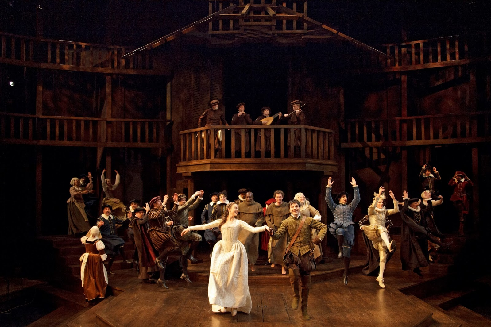

Part of the received wisdom on Romeo and Juliet is that it’s a tragedy that looks, for much of its length, as if it’s going to be a comedy. In this case, the received wisdom happens to be true. It certainly underpins the production at Stratford, an exhilarating start both to the new season and the new regime.

The comedy isn’t just a matter of individually humorous lines or even scenes, though Tim Carroll’s production is exceptionally adroit at discovering and delivering these. It’s a matter of how the play goes: that up until the deaths, half-way through the action, of Mercutio and Tybalt, maybe even beyond then, there seems no reason for there not to be a happy ending. The deaths of Romeo and Juliet themselves are caused less by their own personal qualities than by a series of external accidents.

This may well, as the purists are fond of saying, stop it from ranking with the greatest tragedies. It doesn’t prevent it from being a moving, suspenseful and, on this occasion, very involving play. For the first time in many years, I found myself desperately hoping that things would end differently, that Juliet would wake up before Romeo took the poison, that the Friar would get to the tomb on time.

The set (designed by Douglas Paraschuk) is Stratford’s original Tanya Moiseiwitsch arrangement of steps and balconies, with a few thatched additions on top that suggest both Shakespeare’s own Globe Theatre and the modern London reconstruction of it at which Carroll has been a frequent director. This production, like his work there, cleaves to what’s become known as Original Practices: an attempt, admittedly incomplete, to re-create some Elizabethan theatre conditions. It here involves putting the actors in 16th-century costume, keeping the house-lights on throughout, and dispensing with any furniture beyond the obligatory bed and tomb, both of which are solidly and beautifully realised. It also seems to involve having the actors not just address the audience directly but buttonhole them individually; I suppose Elizabethan actors may have done this, but it feels more like 21st-century wishful thinking.

The self-consciousness starts early with some minor Montagues and Capulets chatting us up in their own words. All the same, it’s a thrill when their language suddenly changes and we find ourselves, all at once, thrown into the midst of the play’s opening brawl. At the other end of the evening, with the play proper officially over, the company, deceased lovers included, break into a dance. This is presumably a nod to the Elizabethan custom of ending each play with what was called “a jig.” Its precise tone here is difficult to decipher, but it provides at the very least an ingenious way of getting the corpses off stage.

What goes between these extremities is freshly thought, freshly imagined, freshly told. The platform stage proves itself, yet again, an unrivalled base from which to launch a text and to explore the relationships of the people delivering it. It also encourages overlapping exits and entrances, which become increasingly frequent and increasingly exciting, and is especially helpful for the comings and goings all over the Capulet household on the eve of Juliet’s supposed wedding. The costumes also contribute to the domestic atmosphere; they evoke a society, a world. This isn’t the only way of doing Shakespeare, but it’s a valid and at this moment a revelatory one. It makes some of the overstuffed hi-tech productions of recent years look old-fashioned.

*Photography by David Hou. Full Company.*

It also makes great demands on the actors, which most of those here have the skill and experience to meet. Sara Topham’s Juliet may not exactly look like a fourteen-year old, but she conveys all the ardour and the joy and the suffering of one. A moment at which, desperate for reassurance, she collapses sobbing into the her nurse’s arms is heart-stopping. We’re assured that there are no lighting changes in this production so it must just have been in my mind’s eye that the stage darkened during Juliet’s nightmare potion speech (just as it seemed to lighten during the Prince’s ironic welcoming of daybreak at the play’s end.) Topham illuminates line after line of this familiar text that I could hardly remember hearing before. She also has a sense of fun: I loved her look of distaste when obliged to dance with Paris; while she and her Romeo, Daniel Briere, keep the balcony scene light until the last possible moment.

His performance is more problematic. In his opening scenes, mooning for the unseen Rosaline, he seems less in love with love that in love with words, which is fine; but he hardly seems to change even after he’s met Juliet. This may be intentional – you can make a case for him always being less mature than she is – but it isn’t very satisfying. He also has something of a moon face, not helped by the sombrero he’s required to wear in Mantua. Still, he isn’t the first Romeo to be more convincing when fighting than when loving.

The fights in this production (arranged by John Stead, like most fights) are terrific, and they give Jonathan Goad’s Mercutio, bitterly joking to the last, a great send-off; earlier he’s on the right vigorous lines but sometimes jumps the track. Kate Hennig’s Nurse is a wonderful combination of warmth and insensitivity; the breaking of her bond of trust with Juliet is superb, as is her discovery of the girl’s body.

Scott Wentworth enriches the play with a full-length portrait of Capulet, a henpecked tyrant who plainly has no time for his wife’s beloved Tybalt, and in fact is rather pleased to see the end of him. Tom McCamus’ Friar Laurence has a delightful line of holy patter that deepens sternly and impressively when trouble strikes.

Mike Nadajewski’s clown Peter is the best I’ve seen, his illiteracy becoming an excellently unforced running gag. And there could hardly be a better tragic-comic moment than that of Antoine Yared’s Paris, a well-meaning fop with a French accent conceivably inspired by his name, arriving at his fiancee’s deathbed, dancing what I take to be an ill-timed galliard. Talking of dances, the lovers’ first encounter at the ball is magically set up, she prancing merrily off stage and out of reach, then returning for their duet.

But the production is full of moments like that. Do you remember the audience in Shakespeare in Love, erupting in cheers at the end of this play’s first performance, as if they’d never seen anything like it before (as, historically, they hadn’t)? This production lets you know how they felt.
