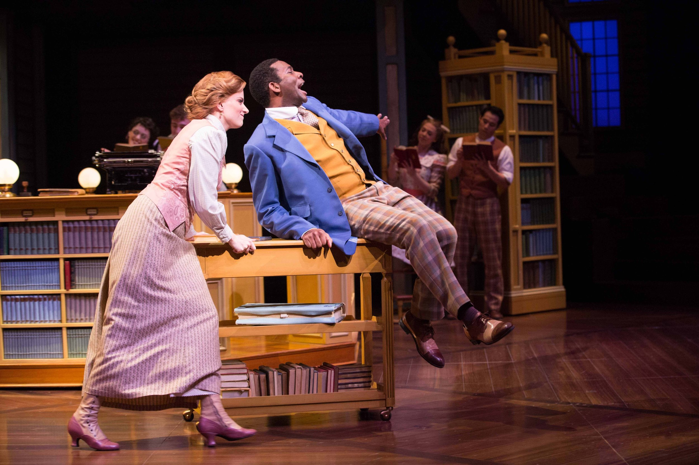
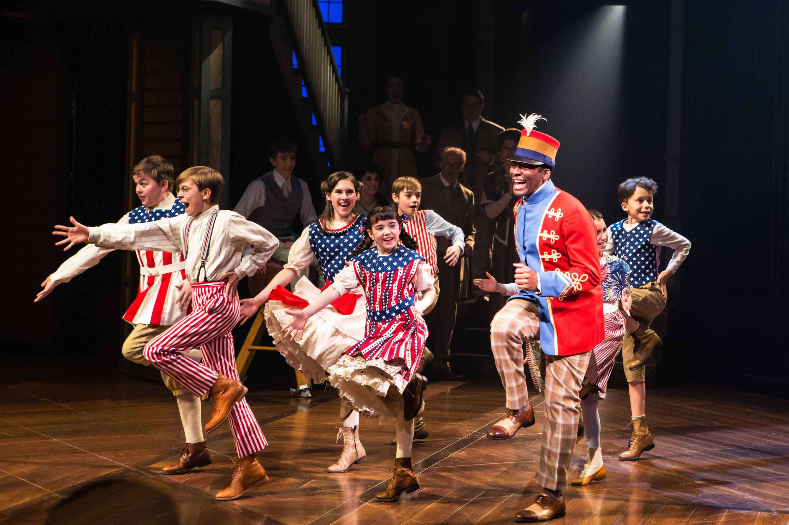
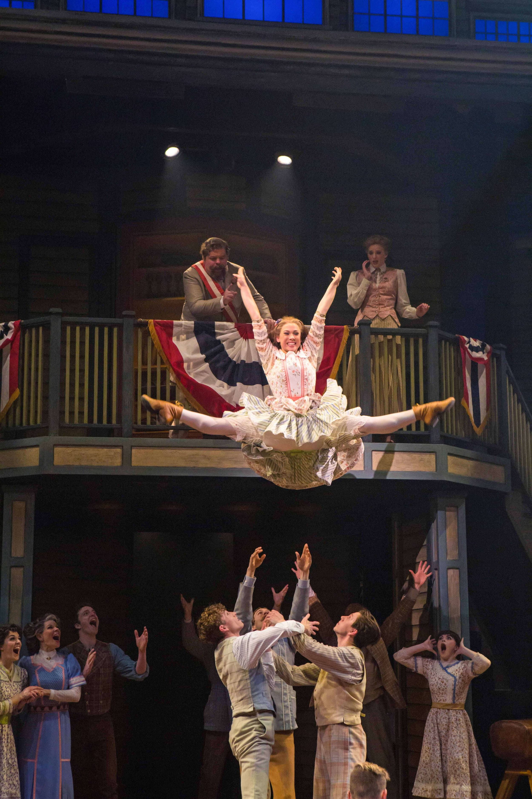
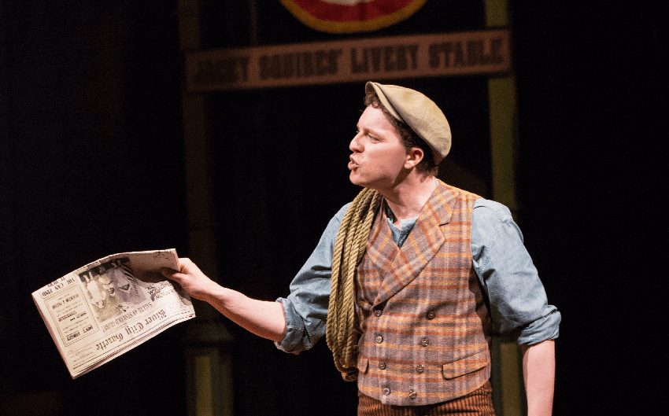

There are musicals that are great star vehicles and musicals that are great ensemble pieces. “The Music Man” may be unique in being both. Meredith Willson who wrote the show – book, music, lyrics, the works – was inspired by memories of his own boyhood in small town Iowa, in the early years of the twentieth century. His native Mason City became the musical’s River City, a sheltered fiercely proud community that he re-created on stage in all its civic pomposity, its genteel cultural aspirations, and its huddled masses of young people yearning to be free, or at least a bit freer than they are when we first meet them. Their unconscious prayers are granted when a travelling salesman comes to town. They’re the pigeons; he’s the cat.

He’s Harold Hill, self-styled Professor, whose accustomed shtick is to persuade folks that what their town needs, “to keep the young ones moral after school”, is to form them into a band, with himself conducting; he takes the parents’ money for instruments and uniforms, then skips town before his own complete musical ignorance can be exposed. That at least is how it’s always happened before. This time, of course, there are complications. He becomes genuinely interested in the least fortunate local kids: in a silent fatherless little boy whom he helps find a voice (well, this is a musical); in a supposed ne’er do well who loves, and is loved by, the mayor’s daughter.

Even more crucially, he falls for River City’s local librarian, who doubles as a music teacher (or maybe it’s the other way around). Harold’s previous strategy has been to love ‘em and leave ‘em, sometimes without even bothering about the lovin’ part. His preferred kind of woman is the experienced kind, as he blithely outlines in a sizzling patter number glorifying “The Sadder but Wiser Girl.” In Marian Paroo – Marian the librarian – he encounters one who is wiser but not sadder. She has romantic longings but she keeps them in perspective. At first offended by Harold’s brash persistence, she comes to respect the good in him. It sounds sappy but it works. And at least Harold, unlike another huckster who passes through and turns out to be his arch-enemy, doesn’t call her “girly-girl”.

*Photography by Cylla von Tiedemann. Danielle Wade and Daren A. Herbert.*

Harold Hill runs the show – in every sense. He’s one of the few male characters in a musical who does. In the new Stratford production, the festival’s third crack at the piece, Harold is played by Darren A. Herbert, who has done exceedingly impressive work in several Toronto musicals and at least one play (Soulpepper’s “Father Comes Home from the Wars”). He’s mainly played tough characters in tough shows, and that’s a quality that might have served him well here; “The Music Man” is after all a con-man, however charming. Herbert, though, seems concerned on this occasion to play charm above all else, and it comes over as sickly-sweet and oddly passive. Admittedly, no actor seems to have made this role wholly his own since its creator Robert Preston whose 1957 performance tops the list of theatre performances I wish I had seen. Preston, as the Broadway cast-album and the movie bear witness, didn’t have to play charm; he was charm, dangerous charm, expressed through wit, intelligence, ceaseless energy and a pulsating sense of rhythm. His syllables were super-charged; Herbert’s just lie there.

Two kinds of passion are missing here. One is the sense that Harold is his own greatest dupe; “in my head” he says when finally cornered, “there’s always a band.” And lo and behold, a band appears; he’s handed a baton and, magically, knows what to do with it. It would take a bigger Harold than we have here to make us believe in the delusion and relish its resolution. The other missing ingredient is romance. There’s no chemistry between Herbert’s Harold and Danielle Wade’s excessively unresponsive lady of the library.

*Photography by Cylla von Tiedemann. Daren A. Herbert and the company.*

If the relationship of these two reminds you of that between Sky and Sarah, the gambler and the Salvationist of “Guys and Dolls,” there’s good reason for it. Frank Loesser, that show’s composer was, though younger than Willson, his mentor in the writing of this, his first musical. (And his absence may partly account for the uninspired quality of Willson’s two subsequent shows). It was Loesser who encouraged Willson to reach back into his own youth for source material. And Loesser’s taste for characterful lyrics and unconventional song-forms must have guided Willson to come up with a one-of-a-kind score. Its opener, “Rock Island,” shows salesmen on a train, gossiping about the inhospitable Iowa territory and the notorious and mysterious Professor Hill, their words and bodies bobbing to the rhythm of the rails. The lyrics are absolutely tied to the story’s time and place, though the effect, without orchestral accompaniment, now sounds like an anticipation of rap. (Back in the day, they would have called it voice-percussion.)

Later on we get the irresistibly propulsive sales spiel of Harold’s “Ya Got Trouble,” talk-sing raised to its highest power; the contrasting insinuating seductiveness of “Marian the Librarian” (soft-shoe, as befits a library); “Shipoopi,” which has the metre of a square-dance if not necessarily the steps; the succession of barbershop ballads through which the professor neutralises his opponents by conjuring them into a close-harmony quartet; “Pick-a-Little, Talk-a-Little,” a ladies’ gossip chorus to balance the men’s; plus the frontier promise of “The Wells Fargo Wagon,” pulled on this occasion by a high-stepping horse that knows it’s in a musical, and the Sousa march of “76 Trombones.” “The Music Man” opened on Broadway in the same season as “West Side Story” and famously beat it in most of the Tony Award categories, including Best Score. This is generally thought to have been a miscarriage of justice but I’m not so sure. “The Music Man’s” score may be the more adventurous of the two. The hit ballad “Till There Was You” is the only song in it that sounds like standard 1950s Broadway; and I’d take it over “Maria” or “One Hand, One Heart” any day.

Most of the production numbers, in Donna Feore’s Stratford staging, raise the roof and bring down the house. At least that’s how it went on an opening night that was originally meant to be the second of this year’s festival, but that turned into the first when the previous evening’s scheduled performance of The Tempest was cancelled due to a bomb scare. So the mood at “The Music Man’s” opening was one that mingled celebration with defiance. It was manifest during the mandatory singing and playing of “O Canada” which on this night really meant something. The River Citizens leaped into life, and into a standing ovation, in “76 Trombones,” re-affirming Feore’s command of this stage and of her performers; over the last few years she has assembled a terrific troupe of acrobatic dancers.

*Photography by Cylla von Tiedemann. Megan Caines and the company.*

They do just as well in other numbers, though with diminishing returns; the show becomes increasingly about the performers’ skills – what you might call corps competence – rather than about the people they’re meant to be playing or the story they’re meant to be telling. An example: in “Shipoopi,” which is certainly exhilarating on its own terms, Feore has Harold and Marian blissfully dancing together. From the look of it, her defences are down and the two of them are a done deal. But that isn’t meant to happen until just after the number. The show isn’t so rich in narrative that it can afford to jump any guns.

The community was more lovingly evoked, even on the less capacious Avon stage, in the previous Stratford production ten years ago. That one was funnier too; Steve Ross is reliably delightful here as the mildly tyrannical mayor but his wife (Blythe Wilson) can hardly compete with memories of Fiona Reid, deliriously drilling her neighbours in the angular niceties of Grecian interpretive dance. There are, though, two outstanding supporting performances: from Denise Oucharek, real and true as the heroine’s Irish mother, and Mark Uhre who with his fine singing, sharp-edged acting and amazing long-legged dancing, shows himself, not for the first time, a major musical-theatre talent. He plays “The Music Man’s” buddy and helpmate. Which is both fitting and frustrating, as he would clearly make a great Music Man himself.

*Photography by Cylla von Tiedemann. Mark Uhre.*
