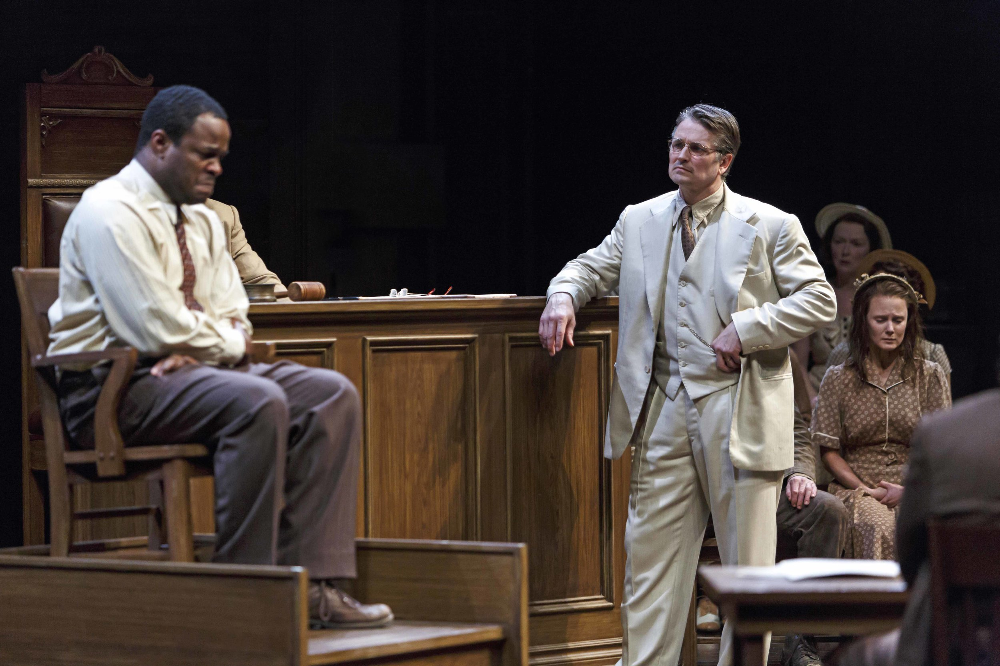
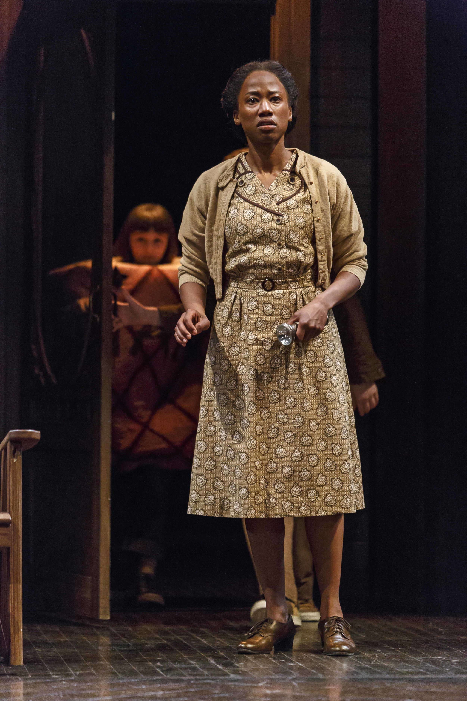

Nigel Shawn Williams makes an impressive debut as a Stratford director – on the main Festival stage at that – with a production of To Kill a Mockingbird that brings the semi-fictitious community of Maycomb, Alabama to full and detailed life. Staging and acting are fine; the evening packs a strong, emotional punch.

Dramatised versions of Harper Lee’s novel usually do. This is despite handicaps that are inherent in the novel, and accentuated in the officially approved stage adaptation (by Christopher Sergel). We have the story of the upstanding white attorney Atticus Finch who in the 1930s, right in the middle of Jim Crow territory, goes to bat for Tom Robinson, a black man accused of assaulting a young white woman by the name of Mayella Ewell. A problem is that it is presented as being Atticus’ story, Atticus’ drama, rather than Tom’s or even Mayella’s. A further complication is the novel’s literary perspective, and the attenuated way this plays out on the stage. There is a narrator: Atticus’ daughter Jean Louise, nicknamed Scout, who as a grown woman looks back on the traumatising time when she and her older brother Jem and their friend Dill had their lives and minds changed by the trial, which they sneaked in to watch, and by its terrible aftermath. The kids had every reason to believe Tom would be acquitted, so flimsy was the evidence against him and so scathingly eloquent Atticus’ defence. Atticus himself was less confident, knowing the territory. He was right, and the children learned one of childhood’s hardest and least comprehensible lessons: that, all too often, there ain’t no justice.

*Photography by David Hou. Matthew G. Brown, Jonathan Goad.*

Sad though this may be for them, it hardly compares with the anguish experienced by, for example, Tom’s wife. The real pain of the drama, indeed the real drama, seems always to be happening at one remove. Or at two, given the extra layer contributed by the use of a narrator. This may work in the novel, which I confess I have never read. (Blame it on my British upbringing. The book has never been the canonical schoolroom text in the UK that it seems to be in North America.) In the more concentrated form of drama, it seems like a waste of time, clogging things up and slowing them down. Why, to take an especially egregious example, are we meant to care about Dill’s being billeted on the Finches because of his own troubled home-life? It seems like a subject about which we are told either too much or too little.

The three pre-teens do gain an increased respect for Atticus himself, whom they had previously regarded as a hopeless and distant stuffed shirt. It doesn’t hurt that he also turns out to be a crack shot, despite his principled distrust of guns. Gregory Peck’s film performance as Atticus is generally regarded as the apotheosis of the quietly noble American; but the aura of Hollywood self-congratulation that surrounded it (Pauline Kael described it, acidly, as “a picture the industry can be proud of ”) kept me away from the movie as well. And, to complete my litany of ignorance, I haven’t read the novel’s sequel Go Set a Watchman, Lee’s only other book and one that she kept from publication until a year before her death in 2016. It apparently takes a less sympathetic view of Atticus than the one with which the world is familiar.

The word is that Williams would have liked to draw on this more complicated material for his Stratford production, but was denied permission by the estate. He has done his best to strengthen the hand he’s been dealt. He starts with explosive footage of the assassination of Martin Luther King in 1968 – eight years after Lee’s novel was published. The shock supposedly prompts Jean Louise to begin reminiscing, but it makes no long-term difference to how we receive the rest of the play. Some other alterations and elaborations have greater effect. The mob of locals who arrive at the jailhouse to lynch Tom Robinson before he can go to trial are dressed not in their working clothes, as the published script dictates, but in white sheets and hoods. This makes it all the more piquant, and all the more powerful, when young Scout, recognising their ringleader as a neighbour, calls him by name, thereby shaming him into going home and telling his troops to do likewise. It seems you can take the man out of the Klan if you only treat him like a human being. It would be nice to think that was true.

And of course we still get the excitement of a trial scene, plus the moral satisfaction of feeling ourselves to be on the side of the angels. Or, in the case of Jonathan Goad’s Atticus, of the archangels. Goad brings an innate likeability to Atticus but never trades on it. You can see why his children might be turned off by his stiffness, and then, after they’ve beheld him in action in the courtroom, why they come to admire him as a fighter for truth and justice. He conducts his case with patience and passion, backed up by a stinging vein of irony as he demolishes the rickety case for the prosecution. He has a couple of high-placed sympathisers: the judge (Joseph Ziegler, delightfully civilised) who shares his distaste for Tom’s unwashed accusers; and, perhaps more surprisingly, the town sheriff (a fine, careful performance by Tim Campbell) who emerges as the embodiment of worldly decency.

Worldly indecency is vividly represented by Jonelle Gunderson as the abused Mayella and by Randy Hughson as her father who, we are strongly led to believe, was the real abuser. They are poor whites clinging, spitefully or pitiably, to the conviction that their whiteness at least gives them someone to look down on, even as their poverty seems to deny it. In Mayella’s case, the pity (ours for her, that is) outweighs the spite; Gunderson brings a whole history of sullen martyrdom on stage with her. With Hughson’s papa Bob, toothless but biting, spite wins out, eventually spiralling into outright hatred.

Tom is movingly played by Matthew G. Brown, as a frightened intelligent man who knows only too well what he’s up against. One of the masterstrokes of Williams’ production is to upgrade the character of Calpurnia, the Finches’ black housekeeper, from the mere functionary she is in the script to a figure, as played by Sophia Walker, of real urgency and concern. She almost becomes a black narrator to balance all the white ones.

*Photography by David Hou. Sophia Walker.*

The three children are admirably played (by Clara Poppy Kushnir, Jacob Skiba and Hunter Smalley) and Irene Poole gives a tactful account of the older Jean Louise, only occasionally straying into recitation. The character of Boo Radley, the recluse who emerges as a saviour in the play’s last moments, remains as unaccountable and unaccounted-for as ever, and the title seems as cutely irrelevant as it always did.

This seems to be Stratford’s year for celebrating, or at least depicting, small-town Americana. Sharing the map with To Kill a Mockingbird’s Macon, Alabama and The Music Man’s Iowa (with its imaginary but iconic River City) is the Connecticut of Eugene O’Neill’s Long Day’s Journey into Night, the town unnamed but obviously far from grand. The Tyrone family, who spend their summers there, refer to it, repeatedly and with O’Neill’s customary linguistic grace, as “ this hick burg”. Not that we get to see much of it. The other two shows take panoramic views of their chosen communities. The Tyrones stay within their own four walls; and when one or other of them takes a trip into the outside world, we don’t accompany them.

They are of course stand-ins for O’Neill’s own family. He himself figures as consumptive younger son Edmund, sharing the stage with his actor-manager father, his wastrel elder brother, and his mother, the only member of the household who isn’t a heavy drinker. She takes drugs instead, and her descent into renewed morphine addiction gives the drama its spine. It’s the most shamelessly autobiographical of plays. How interested we would be if we didn’t know this is a nice question. Still, for all its special pleading, the play does make a universal statement about families, one that’s very well brought out in Miles Potter’s production. These people love one another, and they do their best to be nice, or at least tactful, to one another; the play’s first few minutes are sweetness and light. But they all have an inferno’s worth of demons on their backs, and pretty soon one of them will say something wounding, and another will respond, and so it goes, endlessly. The play comes by its great length honestly. And the last and most rule-breakingly naked of its four acts is one of the summits of modern drama. Nothing happens in it, except perhaps at the end: the characters merely talk, mainly one on one, exchanging memories, grievances, accusations, hopes, dreams. It’s mesmerising.

I have here to acknowledge a family connection of my own. The role of the Tyrones’ Irish maid is played by Amy Keating, who is the partner of my son. Scott Wentworth does very well as James Tyrone Sr., trying hard to be affable but constantly betrayed by his own guilt and his own meanness; though he doesn’t reach the tormented heights of some of his predecessors (William Hutt in an earlier, legendary Stratford production, Ralph Richardson in the movie) when he comes to contemplate his own lost greatness, sacrificed to easy money and the repetition of one star role. Seana McKenna as mother Mary falls into some familiar rhythms when admonishing her menfolk in the earlier scenes but her last speech, reverting to convent girlhood, is transcendent. Charlie Gallant as Edmund tactfully bides his time before coming to full anguished flower in the last act. And Gordon S. Miller, his face a map of dissipation and self-hatred, is a wonder as James Jr.
