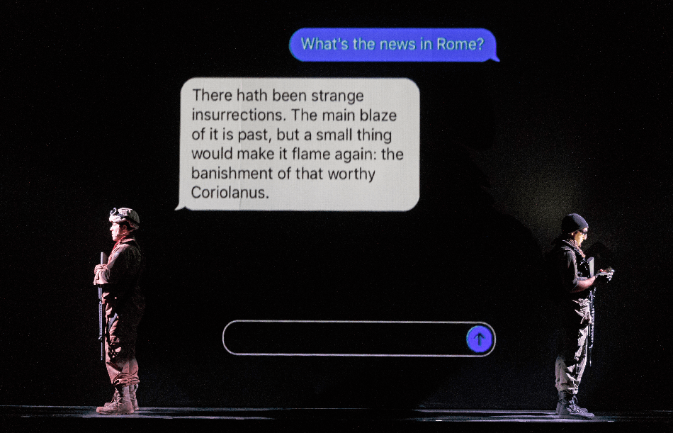
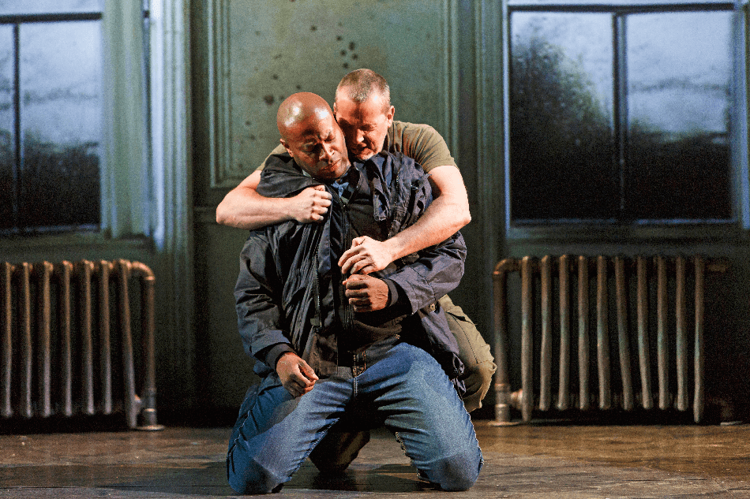
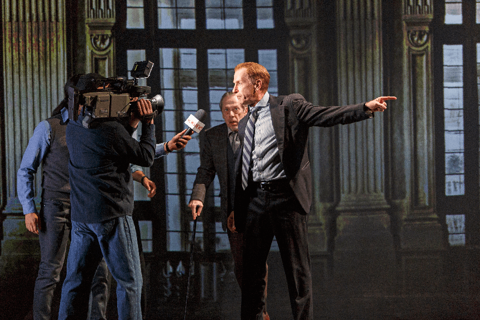

Shakespeare’s Coriolanus is a play both stern and magnanimous: critical of everyone, contemptuous of no-one. It’s the most explicitly political of the tragedies, certainly the one that’s most detailed about political process.

Robert Lepage, making his long-awaited debut as a director at Stratford, has staged it, as you would expect, in modern dress and with up-to-the-minute technology. In an interview in the program, he says that “nowadays public opinion is mostly represented…by mass media and social media”; and that’s how he presents the play’s political conflicts here. The results are eighty percent thrilling and twenty percent frustrating.

The thrills start early, with a trompe l’oeil whose nature it would be heartless to reveal. The words that go with it, though, can be noted. In a kind of impromptu prologue we hear a selection of the title character’s most intransigent lines, assembled from all over the play. They can’t have been hard to find. Intransigence could be this character’s middle name – not that he needs another one. This warrior-hero of the Roman Republic begins the play as plain Caius Martius; before the first of its five acts is over he will have gained the surname Coriolanus, bestowed on him for having conquered, apparently single-handed, the city of Corioles, stronghold of the Volscians, Rome’s current enemy tribe. Bred to the wars since boyhood, having been dispatched to them by his imperious and bellicose mother Volumnia, he has no talent whatever for civilian life. His friends want him to run for consul, the highest political office, because that’s what war heroes do, but he balks at soliciting the popular voice.

Part of this may be put down to an endearing modesty about showing off his war-wounds as tradition demands. But most of it is due to his unyielding contempt for “the people,” meaning everybody not of his own class. His bred-in-the-bone belief in Roman exceptionalism extends only to aristocratic Roman exceptionalism. Not that his fellow-nobles find him all that easy to get on with either; to them he’s someone to be admired and to be embarrassed by. To its credit, Lepage’s production makes no attempt to identify its central character with Donald Trump (currently the favoured facile method of importing “relevance” into a classic). Coriolanus is anything but a populist, and he vociferously loathes the poorly educated. He may not even be especially power-hungry.

The play as written begins with a demo; the citizens of Rome are out on the streets, complaining of hunger and blaming Martius for it. (“Let us kill him and we’ll have corn at our own price.”) To them enters Menenius Agrippa, smooth-tongued patrician, Martius’ friend and father–figure, who quietens them, somewhat, by telling them a story. (It’s the Aesopian fable of the Belly and the Members. The riotous crowd are the mutinous body-parts, rebelling against the senate – the belly – who in Menenius’ telling, have only the people’s interests at heart.) In Lepage’s staging, the scene is moved from outside to in. We are in a broadcasting studio, where a single spokesman is putting the citizens’ case and Menenius is answering it, or at least skating elegantly away from it. This works very well; modern dress, as it often does, provides a rationale for the scene, stops it from being generalised and anonymous. We get to concentrate on the actors, and the actors get to concentrate on the words.

The style and the discipline are maintained throughout. The staging might best be described as compartmentalised. Each scene unfolds in a small demarcated space, as if within a TV or computer screen, somewhat in the manner of Toronto’s VideoCabaret. But where VideoCab’s house-style is cartoon, Lepage’s here is documentary. It’s also far more fluid. VideoCab gives you one scene at a time; Lepage juggles and juxtaposes them. The British playwright Howard Brenton once said, memorably, that there are only two kinds of play: plays set in rooms and plays not set in rooms. Coriolanus, like most – maybe all – of Shakespeare, is emphatically not set in rooms. Lepage’s production is physically set in rooms, but psychologically it escapes them. The play’s scale remains. Lepage’s sets (he’s his own designer) hit the stage from all directions; from above, from below and – most often – from the side: sometimes from opposite sides simultaneously, so we get to visit two locations at once.

This comes in very handy as the politics thicken, as the politicians hunker down in their own offices or shuttle between them. The people are granted two tribunes (“to defend their vulgar wisdoms” says the protagonist, who’s revolted by the idea) who realise immediately that, if they are to have any power, they have to get rid of Coriolanus. Knowing they can count on his tactlessness, they provoke him into speech and behaviour so outrageous that he is banished from Rome. He heads off to Antium, home of his bitterest enemy, the Volscian general Aufidius, to whom he offers his anti-Roman services which are enthusiastically accepted. In this production he makes the journey by car, through a constantly changing landscape, depicted of course by projections. Projections, as we already know, are very much Lepage’s thing, though their use here is less spectacular than it was in his 887, in which it was sometimes hard to tell where live theatre ended and cinema began. Here the filmic elements are background; it’s the flesh-and-blood actors who command the stage.

They may not, though, command enough of it. The staging necessarily keeps them at a distance from us. That’s where the frustration comes in. One yearns – at least I did – for a scene to take the whole stage. For a brief moment early on it does seem that this might happen. A young boy, Coriolanus’ son, comes right downstage, clear of the rooms; we assume that he’s about to figure in one of the play’s domestic scenes. It turns out, though, that he’s there to cue in and control the siege of Corioles, or what the production lets us see of it. The play’s succession of battle scenes has been reduced to just one: an encounter between Coriolanus and Aufidius that treats them as toy soldiers and that ends in stalemate. It’s hard to see just what Coriolanus has done in the war to earn him his new title. The production suffers at this point from comparison with Ralph Fiennes’ film version of a few years back which anticipated Lepage’s interpretation in its contemporary setting and in its emphasis on media manipulation. It too had telling scenes set in news studios. (It was also able to show us what the devastation of a city really looks like. It was shot in Bosnia).

Even when we return to Rome there are challenges unmet. Lepage’s equation of politics with social media doesn’t quite convince. It hardly accounts in the real world for Trump’s rallies or for the mass protests against him. In the theatre it denies us crowd scenes. Where one seems unavoidable, in the scene of Coriolanus’ banishment, the opposing factions are not so much seen as refracted, the contending principals viewed from tricky camera angles. It’s clever but it doesn’t pull much weight.

Coriolanus was Shakespeare’s last tragedy, possibly written when he was already in semi-retirement, and unsure that he’d be able to make it to rehearsals. That would account for it having the most detailed stage-directions of any of his plays. “In this mutiny” reads one of them “the people and the tribunes are beaten in”. Later on, the tide will turn. (And then it will turn again.) What you get from these violent instructions and from the tense and thrusting dialogue that surrounds them is a sense, beyond that of any other play I know, of forces massing, of history on the move. There’s more to it than backroom deals. Though to be fair, no production that I’ve seen has managed to release all the turbulent power that lies, coiled, in the text.

There are some lovely touches here, sometimes in the smallest roles. A couple of senate-chamber flunkeys (“officers” in the script) offer cheerfully dispassionate assessments of Coriolanus’ pride and his inability to flatter. A scene, usually cut, between a Roman spy and his Volscian contact is delightfully restored as an exchange of text messages.

*Photography by David Hou. Emilio Vieira, Farhang Ghajar.*

The scene in which Coriolanus stands in the market-place sardonically begging the citizens’ “voices” is updated to show him going canvassing from door to door, and hating himself for it (though not as much as he hates them). The acrid tragi-comedy of this, though, is muted in Andre Sills’ performance, as are many of his other scenes. He hits all the right character-notes but they’re muffled. He doesn’t explode as he should when Aufidius at the end calls him “a boy of tears”, taunting him into self-destruction, though he’s been best, paradoxically enough, at depicting this man-child’s dependence on his mother. Puzzled and confounded by her advice to make nice with the plebeians, he forces himself to oblige but, inevitably, his temper betrays him. It’s a forecast of the climactic scene in which she comes to his tent to beg him to spare Rome from the destruction he has already visited upon Corioles. Lucy Peacock is a tremendous Volumnia, marshalling her arguments with unflagging strength and overpowering lucidity, but only getting through to him at the very last moment when she abandons oratory for despair and disgust.

But here comes the production’s greatest and most inexplicable flaw. It concerns another stage-direction, probably the most famous in Shakespeare: “He holds her by the hand, silent”. But here he can’t, because she’s already left the stage, taking her companion suppliants with her. (These include her contrastingly gentle daughter-in-law, Coriolanus’ “gracious silence” Virgilia, whom Alexis Gordon makes both sweet and strong.) His surrendering line – “o mother, mother, what have you done?”, the moment in which he in effect grows up – doesn’t mean much when it’s delivered to the empty air. We lose the awareness of both mother and son that she has signed his death-warrant. And as for her return to Rome, acclaimed by all but bowed down and silent with the consciousness of what she has done, that’s been cut as well. We lose, in fact, the tragedy.

We also in passing lose the ambiguous response (“I was moved withal”) of the watching Aufidius to the meeting of mother and son. This is a particular shame since Graham Abbey’s Aufidius is the evening’s other major performance, brooding and sonorous. Its bedrock is bitterness, rooted in the realisation that, though he’s much smarter than his arch-enemy, he can never hope to compete with him. Most productions play up the homoerotic element in their love-hate relationship, but this one takes it the furthest, celebrating their alliance with a bout of amorous wrestling as Aufidius rhapsodises about how he’s happier to see his former rival than he was to behold his bride on their wedding-day.

*Photography by David Hou. André Sills, Graham Abbey.*

They entwine again, less effectively, in the last scene when Coriolanus walks into the Volscians’ trap: a finale that here seems curiously half-hearted on everybody’s part.

The production does more exciting things with the hero’s environment than with the man himself. He doesn’t seem to be much for hanging around in bars, but for the other Romans, places of refreshment are their natural habitat. “Anger’s my meat” says Volumnia, after her son’s exile, and the production takes the hint by having her say it in a restaurant, a fashionable one where the newly triumphant tribunes have gone to celebrate. A measure of their (short-lived) success is old Menenius’ willingness to take a glass with them; Tom McCamus, almost too casual at his first appearance, eases into the self-described “humorous patrician” and is very fine in his heartbreak and disillusion when his adored former protégé dismisses him from his presence, his suit unheard.

*Photography by David Hou. Tom Rooney, Stephen Ouimette.*

But the performance that benefits most from the setting, and that does the most for it in return, is Tom Rooney’s as the tribune Sicinius. With Stephen Ouimette as his puffier partner, Rooney presents a born politico in whom calculation and conviction are impossible to tell apart. His glasses gleaming, his hair in perfect place, he’s a polished demagogue, both smooth and pugnacious: a natural for TV, a shoo-in for the senate and, yes, born or at least self-made for social media.
