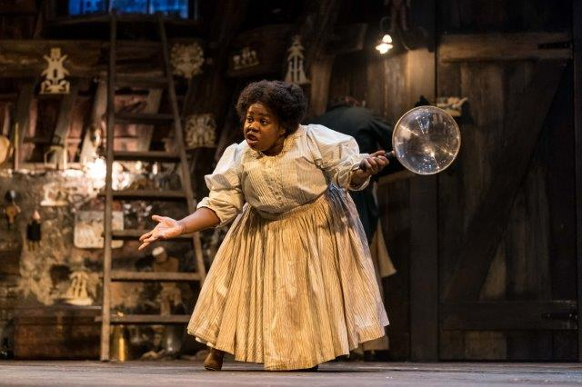
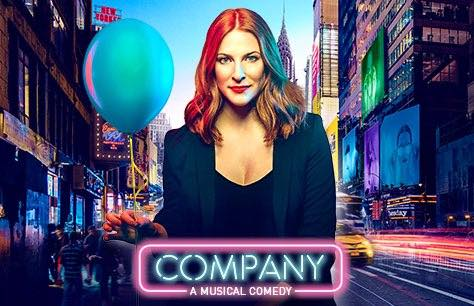

I recently spent a week in London. Here are my thoughts on some plays I attended at some of the city's most notable theatres, from the old Old Vic to the very new Bridge.

*Johnetta Eula’Mae Ackles in A Very Very Very Very Dark Matter. The Bridge Theatre 2018.*

Hans Christian Andersen was, by most accounts and for all his prowess at telling fairy tales, one of the gloomier Danes. Charles Dickens, despite his literary genius and his passionate attacks on his society’s greed and cruelty, was a late-life adulterer who treated his wife appallingly. These faults admitted, it’s still a bit of a stretch to hold these two writers responsible for the genocidal atrocities inflicted on the Congo by Leopold II of Belgium, a reign of terror that began some ten years after Andersen’s death and fifteen after Dickens’. That, though, is the connection proposed by Martin McDonagh in his latest play, playfully entitled A Very Very Very Dark Matter, given its world premiere at London’s new and shiny Bridge Theatre.

Of course he doesn’t mean us to take it literally. Andersen, who is the play’s principal character, and Dickens, who has a pungent supporting role, are there as exemplars of the European literary tradition, and by extension of European exploitation of other cultures. The fact that in their work they were so strenuously on the side of the angels makes them all the more suspect. The play’s central conceit is that, in addition to being hypocrites, they were plagiarists. A prologue (spoken by a disembodied Tom Waits at his growliest) asks, apparently rhetorically, what the prospects would be for a physically handicapped nineteenth-century African woman with the ambition to be a writer and the talent to make it happen.

The question turns out to have a non-rhetorical answer: she would find herself confined to a cage in Hans Andersen’s attic, a very small one as she’s a pygmy. He feeds her on carrots. She feeds him the ideas, indeed the very words, for his stories; he merely, over her strenuous objections, changes a few of the details. She especially resents his altering the title of the story that she called The Little Black Mermaid.

An entertaining opening scene shows our protagonist, an enthusiastic public performer of his own work (one thing that the historical Hans certainly had in common with the historical Dickens), holding forth to a worshipful audience, enjoying their admiration, and brushing off any potentially awkward questions. Jim Broadbent, in a role that might have been written for him and very likely was, supplies his own brand of slightly off-centre cockney cockiness, alternately shameless and shame-faced, sometimes both together. Who else could make a line like “I makey-uppy things” sound simultaneously like a boast and a confession? The rift within him widens when he returns home to the diminutive ghost-writer whom he insists on calling Marjory, whom he treats with what might best be described as amiable insensitivity. She is played by Johnetta Eula’Mae Ackles, an American actress making her professional debut; meeting all of her role’s specialised requirements and adding to them with a limp, she’s fully a match for Broadbent.

Soon enough, Andersen accepts an invitation to visit Dickens in England, outstaying his welcome by several weeks and only returning when he realises that Marjory will have run out of carrots. (This – the extended stay, not the carrots - is an amusing exaggeration of historical fact.) He discovers that Dickens used to have a Marjory of his own - the sister, indeed, of Andersen’s muse; her recent demise explains why The Mystery of Edwin Drood was never finished. The great Dane is also around to witness the departure, from the family dinner-table and the family home, of Elizabeth Berrington’s suddenly impatient Mrs. Dickens with the deathless declaration “I’m leaving you, Charles, and I’m taking two of the children with me”. Phil Daniels plays her husband, on a pleasingly sustained note of surly exasperation, though there are limits to the number of laughs that can be obtained from hearing a revered literary figure utter the word ”fucking” as an adjective. Hans, meanwhile, consistently refers to his host as Charles Darwin, which is pretty funny: the first time.

Which is the problem: there are plenty of laughs in McDonagh’s play but they don’t add up to much. Neither does anything else: a sad disappointment from the man who has seemed to be that rarest of things among contemporary playwrights, a great storyteller. After the edge-of-seat suspense of The Beauty Queen of Leenane and the thematic richness of The Pillowman (not to mention Three Billboards Outside Ebbing, Missouri) this play feels structurally and intellectually slack. The Congo connection arises because Marjory can see into the future and is desperate to escape from her Copenhagen captivity so that she may stop history from happening. A pair of sinister Belgians periodically invade her space and her keeper’s without making very much sense. The play’s satiric and historical halves simply fail to cohere, and neither is strong enough to save the evening on its own.

Matthew Dunster has directed an impressive-looking production, on a set by Anna Fleischle whose ceiling is hung with menacing marionettes. The Bridge Theatre itself is a large and handsome edifice, probably the most impressive, and also the most welcoming, to open in London since the National Theatre. It’s run by Nicholas Hytner, who comes direct from his own triumphant reign at the National and who deserves a space of his own if anyone does. His new home is a great place to visit: if, that is, you can find it. The surrounding signage is non-existent. There’s also a confusion of bridges. Tower Bridge is the one that gives the Thames-side theatre its name, but London Bridge is the nearest subway stop. Make your way there. After that, you’re on your own.

*Rosalie Craig in Company. The Gielgud Theatre 2018.*

Some years ago Stephen Sondheim remarked that Company, his landmark musical from 1970, might be beginning to “date around the edges”. In the show’s new London production at the Gielgud Theatre, Shaftesbury Avenue, that fear is decisively rebutted, in part by the composer himself who has rewritten some of his lyrics and some passages of the late George Furth’s book. Company, as originally presented, was the story of Robert, a 35-year old New York bachelor whose closest acquaintances – “those good and crazy people, my married friends” – were continually on at him about why he was still single. One reason the show’s creators chose that name for their hero is that it lent itself so easily to nicknames and diminutives – Bobby, Robbie, even, may heaven forgive them for I won’t, Robbo. That’s a device that the new version has had to forego; in this revival, the central character is a woman. Robbie is now Bobbie, no variants allowed.

The transformation works, beautifully. The show has often seemed to have a hole at its centre; the only actor I have seen turn this to advantage was Neil Patrick Harris whose Bobby had an amiable, glazed quality; he seemed, almost visibly, to shut down whenever anybody, friend or lover, got too close. Rosalie Craig’s Bobbie has something of the same air of bemusement, but she’s tougher with it. It has never been as easy to see the show through its central character’s eyes.

More visibly than any of her male predecessors, she’s up against social and biological pressures. It isn’t just her married friends who are puzzled by her singleness; it’s she herself. She’s also puzzled by her puzzlement: she’s a career woman, even if we’re never told what her career is (an omission that seems less worrisome in Craig’s performance than it has in previous incarnations). Why should she have a partner, just because everybody else apparently has, especially given what we see of their relationships? The pros and cons are definitively marshalled in the musical’s climactic number Being Alive. Its first half has Bobby/Bobbie bleakly describing the responsibilities of partnerhood (I think I may have invented a word); the second finds him/her embracing them; it goes from “someone you have to let in” to “somebody force me to care”. Craig makes the transition more dramatic, more personal and more moving than I have ever known it before.

And she's Alice in Wonderland; on a compartmentalised stage that can make her seem larger or smaller as it expands or contracts, she finds herself at one point contemplating a cake that might as well be saying "eat Me". Her friends have left a congratulatory display on her apartment door in the shape of a number 35 and it gets progressively bigger and more unwieldy. She struggles with it physically just as she does mentally with the milestone it supposedly represents. It’s all in her mind of course; what Marianne Elliott’s production makes brilliantly clear is that the show, with its three alternative birthday parties, is Bobbie’s instant replay of the choices and the people surrounding her.

Occasionally it gets too busy. Another Hundred People, the show’s dystopian hymn to metropolitan frenzy and transience, doesn’t have to be illustrated by a pair of frantic ballets, one on each side of it. Turning the original Bobby’s trio of girl-friends into the new Bobbie’s boy-friends adds an obscuring drag-act layer to the Andrews Sisters pastiche of You Could Drive a Person Crazy. A gender-reversal that does work, superbly, is the transformation of Amy, the about-to-be-bride who sings at breakneck speed that she’s not Getting Married Today into Jamie who does likewise when about to tie the knot with his lover Paul. Gay marriage being still a comparatively new thing, the pressures on Jamie are especially intense; regardless Jonathan Bailey’s performance is – and the adverb seems doubly appropriate - hysterically funny. The other stand-out supporting performance is Patti LuPone’s as the oldest of the show’s coterie of wives, the world-weary and worldly-wise Joanne; she turns The Ladies Who Lunch, the number immortalised by Elaine Stritch, from a wry social commentary into a cry of existential pain. The program states that the setting is “modern day New York” and the production makes us believe it. Company was always a great score; here it’s an outpouring of pure musical-theatre joy.

Bobbie’s biological clock is never explicitly mentioned, but of course it’s a tacitly understood factor. (And there’s a whole program-note about it.) The clock ticks louder in Stories, a confessedly autobiographical play at the National Theatre’s Dorfman Theatre. The author, Nina Raine, shows the efforts of a surrogate protagonist called Anna to select a suitable sperm-donor from among half-a-dozen candidates, one of them her ex-husband. Claudie Blakley gives a winning, witty performance as Anna (a tactful one, too; the character could easily come across as both complainer and control-freak) while Sam Troughton plays, very entertainingly, all six of her possibles. (Have I invented another word? Spell check seems to think so.) The play works so long as it confines itself to its immediate subjects, who include Anna’s own family; Stephen Boxer is appealingly wry and distant as, one assumes, the poet and critic Craig Raine, the author’s actual father. It stumbles, badly, when it attempts to expand its horizons, taking in a dying friend at one extreme and a child, to whom the titular stories are apparently being told, at the other.

London’s most storied theatre is the Old Vic which functioned, at a distant point in its history, as a kind of charitable music-hall, and more recently and most famously, as the capital’s Home of Shakespeare. Both traditions are nodded at in the Vic’s current incumbent Wise Children, the story of a sister-act whose unacknowledged dad was a Shakespearean ham. Those atavistic echoes, though, are all the show has going for it. Based on a novel by Angela Carter, it’s the work, as adapter and director, of Emma Rice who has a considerable local reputation as a prophet of popular theatre. Which on this occasion means a bit of song, a lot of melodrama, a confused story, a clumsy level of performance, and an overriding and overwhelming sloppiness.
