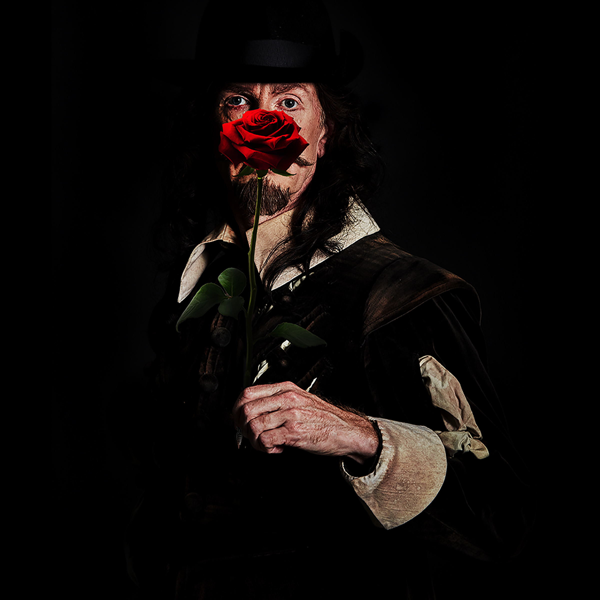
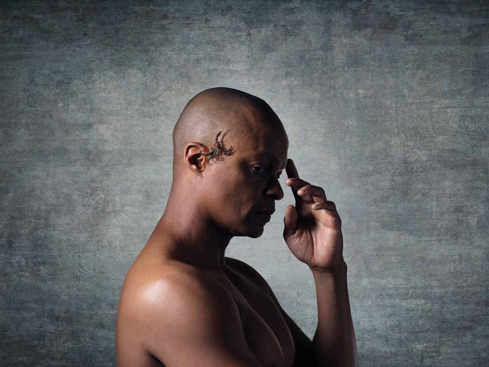
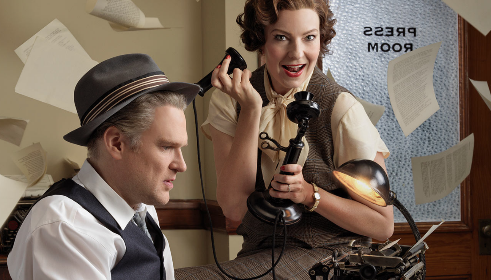

The Stratford Festival this year is doing three Shakespeare plays, which is par for the course. The Shaw Festival is doing two Shaw plays, which is less than used to be customary and less, at first glance, than was the case last year. First glances, though, can be deceiving. The three Shaw plays in last year’s bill were really playlets (although one of them, O’Flaherty VC ranks with its author’s best). One of this year’s offerings, by contrast, is long enough to count as two plays. Indeed it’s practically being advertised as such: Man and Superman with Don Juan in Hell.

*Gray Powell in Man and Superman. Shaw Festival 2019. Photo by Peter Andrew Lusztyk.*

The hellish part is, of course, a long dream sequence inserted in the middle of a crackling comedy of manners that can function without it, and often has. That’s not to deny the scintillating quality of the infernal debate itself; I have vivid memories of the Shaw’s last production with Ben Carlson giving a jet-propelled performance as John Tanner aka Don Juan. His virtuoso delivery of a long speech composed entirely of antitheses actually stopped the show: something I have otherwise only known to happen in musicals. Not that we hadn’t had fair warning; earlier in the evening Patrick Galligan, playing the chauffeur Henry Straker, had brought down the house with the line “I wish I had a car that could go as fast as you can talk, Mr. Tanner.” It’s fitting that Tanner should now be played by Gray Powell, Carlson’s natural successor at the Shaw in terms of speed, accuracy and intelligence. (The poster shows him looking very determined, all goggled-up in what is presumably a vintage car, apparently driving himself. What would the New Man Enry Straker have to say about that?) The rest of the cast looks fine too with Sara Topham as Ann Whitefield, the young lady who brings the superman to his knees and, perhaps most intriguingly, Martha Burns whom we see too little on our stages, playing the brigand-chief Mendoza who in Tanner’s dream becomes the Devil. A “luncheon interlude” is also advertised. Marathon performances often bring out the best in actors and audiences, not to mention caterers; certainly that was the case last time and the auguries seem good for the lightning to strike again.

As for the Shaw’s other Shaw: I once wrote that, though I considered myself a GBS enthusiast, I had my limits and that I drew the line at Getting Married. I added that this put me in the same position as most of that play’s characters; they draw the line at getting married as well. That goes both for those who are contemplating it and for those who are already in it. So the play is a complement to the biological chase comedy of Man and Superman. The difference is that Man and Superman has a plot, interrupted but not disrupted by its loquacious dream-sequence, while Getting Married whose one decisive action happens off stage, is all talk – and not Shaw’s best talk at that. Hence my long-standing resistance to the play, bolstered by a dull production I once saw in London. That said, I have seen two previous productions of it in Niagara that went some way to converting me; and there is good reason to believe that this year’s may make a third. Sidenote on continuity and inheritance: Martin Happer, one of the Shaw’s best youngish actors, who was man-about-town St. John Hotchkiss in the last revival, now moves up or over to the role of lovesick General Bridgenorth, while his previous character will be played by another consistently impressive junior, Ben Sanders. Another actor whom I persist in thinking of as young, Graeme Somerville, plays the unruffled Bishop in whose kitchen the action, for want of a better word, unfolds.

All the same the things I’m most looking forward this year are Rope and Sex. (Take that look off your face. I may just like monosyllabic titles.) Rope is the 1920s thriller by Patrick Hamilton, inspired if that’s the word by the Leopold and Loeb murder case of two years earlier in which two Chicago college students, born to wealth and to a conviction of their own superiority, killed a 14-year old boy, in the belief that they could conceive and execute the perfect murder. Hamilton’s play moves the scene to London, raises the ages of all concerned, and adds another ghastly wrinkle: they put the body in a trunk and then throw a party, which involves the victim’s father sitting unawares on the corpse of his son. Hamilton also wrote that other famous thriller Gaslight whose plot involves comparably sadistic practices, but Rope has always struck me as the better play. I have a personal bias, though, since I acted in it at school (I was the weaker of the two killers) and have always wanted to see it on a professional, or indeed any other, stage. Kelly Wong and Travis Seetoo are the two men who would be supermen (they’ve either read too much Nietzsche or too little), with Michael Therriault in the other key role of the poet who comes to supper.

As for Sex, I’ve read about it but I never expected to see it. (If you follow me.) Subtitled “a comedy drama” this 1926 piece was written, as a vehicle for herself, by Mae West, the sex-goddess as comedienne. (Check her out in My Little Chickadee, opposite W. C. Fields. They’re quite a pair.) She wrote it under a pseudonym, though her cover was soon blown; there was never any secret, though, about her identity as a performer. She played a prostitute, with the delectable name of Margy LaMont, who’s faced with one of those eternal existential questions: should she tell the man of her dreams The Truth? (The musical Sweet Charity, given a fondly remembered revival at Shaw a few seasons ago, inherited this theme, admittedly by way of Fellini.) Sex’s original production, advertised as “Sex with Mae West” was naturally a big Broadway hit. It also landed the author/star in jail, on charges of presenting “an obscene, indecent, immoral and impure drama” which would have made it an even bigger hit if the authorities hadn’t closed it down. But its reputation was secure, enough to underwrite a national tour a few years later. I have no idea whether the play is any good (the posh New York critics thought it not only immoral but “crude” and “inept”) but I suspect that doesn’t matter. I want to see it, especially with Peter Hinton directing and Diana Donnelly playing Margy. There’s a lot of cross-gender casting, with Julia Course playing Jimmy, Margy’s dreamboat, and Jonathan Tan playing Agnes, her pal and fellow-hooker. And there’s Canadian content: half the play is set in Montreal, apparently New York’s 1920s idea of the big, bad city.

Also promising is a play with a slightly longer one-word title: Victory by Howard Barker. Barker is one of the generation of British playwrights who came to prominence in the 1970s – Howard Brenton, David Edgar, Trevor Griffiths, David Hare, Snoo Wilson – but he has always stood apart from the others. He never participated in their joint-authorship projects, and he had his own tone and vision: less obviously focused on current politics, but more furiously apocalyptic. His plays could alternately buoy you up and grind you down. He can be very funny, and he probably writes better about sex than Mae West. I certainly had those mixed feelings when the play premiered at the Royal Court in 1983, directed by a pre-movie Danny Boyle, and with Julie Covington, an actress (and singer) with a wonderfully quizzical common-sense personality in the leading role of Bradshaw. That’s Mrs Bradshaw to most of us: widow of John Bradshaw, who presided over the trial at which Charles I was sentenced to death. His body, along with that of his boss Oliver Cromwell, was dug up and hung at Tyburn after the restoration of Charles II; the spine of the play is his widow’s quest to get him re-buried. (Barker has never made great claims to strict historical accuracy.) Over the years the play has come to be regarded as Barker’s best; it certainly presents him at full strength. Another cause for eager anticipation is that for his own production Tim Carroll, the festival’s artistic director, has corralled a cast that looks almost illegally strong: Martha Burns as Bradshaw; the two Toms, McCamus and Rooney, transplanted from Stratford (McCamus, a mad George III two seasons ago, is now a foul-mouthed Charles II); Gray Powell, Sara Topham, Patrick Galligan, Deborah Hay (as Nell Gwyn, an enticing prospect), Sanjay Talwar… Along with these promises comes a warning from the management: “This is the most offensive play you haven’t yet seen.” Oh, come on.

Presumably at the other extreme, though another one-word title, there’s this year’s musical (and it’s noteworthy that there’s only one), Lerner and Loewe’s Brigadoon. It’s a classic that’s also a novelty; we aren’t short of revivals of the same team’s My Fair Lady and even of Camelot but, famous title though it is, I know of no major Canadian revival of Brigadoon, while the last Broadway one was decades ago. It has a great score; I actually prefer its music, though not its lyrics, to those for My Fair Lady. Its book is more of a problem: two Americans, on vacation in the Scottish Highlands, stumble into a village that only comes to life once every hundred years, a winsome conceit if ever there was one. And of course one of the visitors falls in love with one of the natives, which is very impractical of him. (But then Alan Jay Lerner was a hopeless romantic as is proved by the fact that he got married eight times.) The way in which this dilemma is finally resolved has always struck me as a cheat, though I have to confess that when I saw that Broadway production I was less bothered by it than I expected to be. I was very bothered by a soubrette who killed every laugh in the show’s funniest song by playing it for anger instead of baffled innocence, but I trust that won’t happen here. The Shaw production boasts a “revised” book which may be a good idea, while also offering the “original choreography by Agnes de Mille” which is unquestionably a good idea. As is having the delightful Alexis Gordon make her company debut as the heroine.

What else? There’s The Ladykillers, based on the last of the great Ealing comedies that were Britain’s main contribution to world cinema in the 1940s and 50s. I’m normally sceptical about stage versions of famous films with incomparable casts (why not just download or rent the original?). But this one comes bearing glowing reviews from London (will I ever learn?) and has Damien Atkins, who seems to go from strength to strength, in the Alec Guinness role. So we’ll see. Then there’s The Horse and His Boy, a further instalment in the Shaw’s ongoing voyage through C. S. Lewis’ Narnia; horseplay has an impressive lineage in contemporary theatre, provoking scenic and choreographic marvels from Equus to War Horse. At lunchtimes, there’s Hannah Moscovitch’s breakout piece The Russian Play, a chance to see a new player take on a role that has hitherto been the inalienable property of Michelle Monteith. Diana Donnelly directs, which makes a neat double with her acting assignment in Sex. And there’s The Glass Menagerie, one prospect at which I cannot persuade my heart to race. That is no reflection on Tennessee Williams’ one autobiographical play (and first hit) or with the cast and production team assembled for it. But it does turn up a lot; both Stratford and Soulpepper have done it in recent years and done it well. And of course the play itself is good; the scene between Laura and her Gentleman Caller invariably tugs at the heartstrings. But I can’t help suspecting that its ubiquity owes a lot to its being, with only four characters and a simple set, cheaper to do than its author’s other, more luxuriant works.

*Tom Rooney in Cyrano de Bergerac. Shaw Festival 2019. Photo by Peter Andrew Lusztyk.*

Still, if you’re looking to shed tears, there could hardly be a more promising prospect than Edmond Rostand’s Cyrano de Bergerac, the classiest of all hard-luck dramas. The story of the consummate cavalier and poet, whose self-consciousness about his disfiguringly long nose prevented him from telling his love until the very last moment, speaks to the romantic masochist in all of us. Cyrano is the character actor’s dream romantic role, and it’s being played at the Shaw by Tom Rooney whose track record - in Ottawa, Toronto, and most of all Stratford – has been one of unbounded versatility and almost unbroken excellence. (His casting here was foreshadowed perhaps by his superb Don Quixote, the redeeming feature of Stratford’s Man of La Mancha.) This will be his Niagara debut, and it will also be that of his director, the comparably accomplished Chris Abraham. They have already had a productive working relationship on several shows, most recently on Stratford’s controversial Tartuffe. Other attractions include Deborah Hay as the brainy and beautiful Roxane, Cyrano’s unattainable beloved who turns out not to be so unattainable after all, but only when it’s too late. (Rostand really twists the knife; or, given his hero’s invincible swordsmanship, the rapier.) Two other noteworthy features; the play, usually a spectacular, is being given in one of the Shaw’s smaller houses, the Royal George; and it’s been “translated and adapted for the stage” by the deservedly ubiquitous Kate Hennig, the Shaw’s associate artistic director. Though I’m not sure what “adapted for the stage” means; wasn’t it written for the stage in the first place?

As to the matter of Kate Hennig’s ubiquity: as an actress, she’s already had a major Toronto appearance this year in A Doll’s House, Part 2; as a playwright, she has a new piece premiering at Stratford. This is Mother’s Daughter, the last instalment of her trilogy about the Tudor queens Mary and Elizabeth, Stratford’s greatest success in the new-play area in years. In The Last Wife we saw the two of them growing up in the household of their final stepmother Katherine Parr. In The Virgin Trial Mary had an enjoyable (for the audience) sideline role, as a supportive if generally disapproving counsellor to her decidedly bratty younger sister. In the new one those roles, from the looks of things, are reversed. It’s Bess’s turn to observe from the wings (or so I guess from the fact that her role is being doubled with someone else’s) and Mary’s to take centre stage. Sara Farb’s acerbic Mary in the preceding segments could be a hard act to follow but the excellent Shannon Taylor should be well up to it. And it will be fascinating to see how the play deals with “Bloody Mary”, the Catholic zealot celebrated for the number of Protestants she had burned at the stake; the blurb in the brochure, not to mention the title, hints that the bloodiness was the fault of her devout mother Katherine of Aragon, divorced first wife of Henry VIII, or at least of Mary’s devotion to her memory. There are two neglected Victorian works (Tennyson’s play Queen Mary and Harrison Ainsworth’s novel The Tower of London) that present Mary as quite a sympathetic young lady, apart from all that bigotry. Certainly her childless marriage to Philip II of Spain, a chilling figure by all historical accounts, would seem to merit sympathy, though apparently Philip doesn’t appear in the play; only one man does and it isn’t him. The supporting female line-up is formidable, and the director, as for the two preceding plays, is Alan Dilworth. We may even find ourselves yearning for a fourth helping with Bess enthroned: not that there’s any shortage of plays, movies and TV series about her already.

It can’t be a coincidence that one of Stratford’s Shakespeares this year is Henry VIII, a play that ends with the christening of the future Elizabeth I, and one of whose principal figures is Mother’s Daughter’s mother Queen Katharine. Her defiant trial and subsequent poignant death furnish two of the play’s four famous set-piece scenes; the others are the execution of the Duke of Buckingham and the fall (“farewell, a long farewell, to all my greatness”) of the man who framed him, Cardinal Wolsey. Interestingly, at least two of these are generally believed to be the work of John Fletcher; authorship theories about other plays may come and go, but this one is universally agreed to have been a collaboration. Other scenes present a vivid picture of Tudor court manners, dog enthusiastically eating dog. This is the only one of the history plays without even the rumour of a battle; the nasty things happen indoors. There have been only three previous productions of the play at Stratford and they have all been done on the main Festival stage, as might seem fitting for a play full of processions. This year, though, the physical scale will likely be even smaller than that of the Shaw’s Cyrano, as Martha Henry’s production is being staged in the Studio, which should give a chance to batten down on the characters and their intrigues: bloodless but merciless. Katharine gives Irene Poole a well-merited chance at a great Shakespearean female role; Rod Beattie gets to inhabit the two faces of Wolsey, known to his faithful associates as the great lord cardinal and to the aristocracy as “the butcher’s cur”; and Jonathan Goad has the title role. It’s also the longest role, and a tricky one, and an ambiguous one; the authors, probably nervous about how they present their late queen’s father without doing too much violence to history, seem to vacillate between criticising and celebrating him. Henry has an unhelpful habit of being absent from the big scenes. But he’s responsible for what happens in them and his conflicted presence has to be felt. He has to unify what could be a sprawling play.

*Michael Blake in Othello. Stratford Festival 2019.*

The season’s other two Shakespeare plays are on the Festival stage and far more familiar. Both as it happens are plays about jealousy, or at least plays in which jealousy figures prominently. One of course is Othello for which the auguries are excellent. The Moor is played by Michael Blake whose stature at Stratford has steadily increased, starting with his electric performance as the avenger in All My Sons. (He’s previously played Othello at Bard on the Beach in Vancouver.) Iago is Gordon S. Miller whose trajectory at Stratford has been even more heartening. I first really noticed him eleven years and two Othellos ago, playing Roderigo, a juicy performance of a juicy supporting role. He made a delightful gull. But he was never cast in any role more serious or more central than that until last season but one when he gave a superb tragic performance, though not without comic elements, as the doomed presumptuous Pentheus in The Bacchae. I wouldn’t say that his promotion from Roderigo, the villain’s dupe, to the arch-villain himself brings the wheel full circle, because I hope it has more revolutions to go, but it’s certainly satisfying. So are the prospects of seeing Amelia Sargisson, last year’s eye-catching Eve in Paradise Lost, as Desdemona and Laura Condlin in the plum role of Emilia. The director, following his success with To Kill a Mockingbird, is Nigel Shawn Williams.

Othello’s jealousy is deadly serious and has a deadly outcome. The jealousy of Master Ford, citizen of Windsor, suspecting his merry wife of deceiving him with Sir John Falstaff, is farcical in its development and peaceful in its resolution. (If they were doing The Winter’s Tale as well, we could have had the complete triptych of Shakespeare’s imaginary cuckolds.) Ford has occasioned some great comic performances in previous productions of The Merry Wives of Windsor, and Graham Abbey, after his virtuoso turn in Tartuffe, seems the ideal man to continue the tradition. Geraint Wyn Davies, who grew into an excellent Falstaff in Stratford’s last, rather erratic production of the play, returns to the role, having in the interim polished off the richer Sir John of Henry IV aka Breath of Kings. Brigit Wilson and Sophia Walker are the wives while Lucy Peacock, Mrs Ford last time around, is now Miss Quickly. “Mrs” and “Miss”, you will note, rather than the customary “Mistress” (but couldn’t Quickly be a widow?). The change accords with Antoni Cimolino’s directorial decision to set the play “in the 1950s, in a town not unlike Stratford, Ontario.” There’s good theatrical precedent for this; the Royal Shakespeare Company, some twenty years ago, mounted a highly-praised production set in the 1950s in a town not unlike Stratford, Warwickshire. On which topic: Wyn Davies appears in the brochure in respectable drag, and casting primly suspicious glances at the real wives from under a hair-dryer; he looks wonderful, and the script does indeed call on Falstaff at one point to dress as a woman, but I don’t see how they’re going to work in the dryer.

And on the subject of gender-reversal: Diane Flacks, new to Stratford, is playing the title role in Gotthold Ephraim Lessing’s Nathan the Wise, a remarkably humane eighteenth-century play set in twelfth-century Jerusalem. In that charged setting it envisions a reconciliation of the three Abrahamic religions: a more sensitive Merchant of Venice in which a rich Jew’s daughter falls for a Christian with the added complication that they’re all under Muslim rule. Lessing’s play (he was a great critic as well, by the way) has had a sparse but quite distinguished performance record in English; in my youth I saw a good production of it at the Mermaid Theatre, and more recently it was done, also well, by Soulpepper. So, good old reliable Nathan. I have never encountered any production of Lessing’s other notable play, the comedy Minna von Barnhelm. Anyone?

Meanwhile the Stratford program is buzzing with twentieth-century classics. Two of them may fairly be described, like The Glass Menagerie, as standbys: both done at least once before at Stratford and no strangers to other established companies in Canada. Or of course elsewhere. Private Lives seems to be Noel Coward’s most durable play, possibly rivalled by Hay Fever. (Though I have a personal fondness for Present Laughter and even, thanks to a scintillating Shaw production, Design for Living.) Geraint Wyn Davies and Lucy Peacock are the can’t-live-with-or-without-one-another couple in a production by San Francisco’s Carey Perloff. When I was living in England The Crucible seemed to crop up in regular rotation between the National Theatre and the RSC, far more than any other American play. I finally figured out why; it’s the one American classic that doesn’t require American accents. Also it’s a history play, which always commends itself to classical companies. And of course Arthur Miller’s Salem witchcraft drama packs an almost infallible punch, however you interpret it. From the brochure: “[John Proctor’s] refusal to take responsibility for his actions leads to an epidemic of fear and suspicion that engulfs the guilty and the innocent alike.” Umm, no; as Miller tells it the epidemic is sparked by the attempt of Abigail Williams and the other Salem girls to evade the heinous charge of having danced in the woods; John Proctor and his wife are collateral damage, only dragged into the inferno after it has started blazing. And just who are “the guilty” who get engulfed; does this mean there really were devil-worshippers among those hanged in Salem? (Actually, Miller thought there probably were, just as there really were subversives in the McCarthy-crazy America for which his play is a metaphor. But that’s in his preface, not his play.) Anyway, with Tim Campbell and Shannon Taylor playing them, I expect to root for the Proctors; and I expect to silently but admiringly hiss Scott Wentworth as the Reverend Samuel Parris who in history, Miller says, “cut a villainous path”. But you could hardly say he got engulfed.

Jonathan Goad, who might have made a good John Proctor himself, directs The Crucible, following his triumphant Toronto production of Annie Baker’s John. His acting peer Graham Abbey matches him by making his own Stratford directing debut with Ben Hecht and Charles MacArthur’s The Front Page, the Chicago newspaper play (need one say more?) that lit up Broadway in 1928 and did the same when it received its long-delayed British premiere some fifty years later. Part farce, part melodrama, part affectionate genre picture, part cynical social commentary, The Front Page has been cited by Tom Stoppard, no less, as his favourite American play. Well, he was once a journalist himself; he did concede, under pressure, that it might not be quite as fine as Long Day’s Journey Into Night. Stratford has commissioned a new adaptation from Michael Healey; his version, like the immortal film adaptation His Girl Friday changes the sex of one of the two main characters, only here it’s the other one. Ace reporter Hildy Johnson remains a man; his editor-boss Walter Burns is now a woman, first name Penelope. The movie of course didn’t have to change Hildy’s name to have her played by Rosalind Russell, starring opposite Cary Grant in maybe his greatest and certainly his fastest-talking role. Stratford has Ben Carlson and Maev Beaty, and for them I can’t wait.

*Ben Carlson and Maev Beaty in The Front Page. Stratford 2019.*

The Front Page has also been a musical in its time, under the title Windy City. Stratford’s own musicals this year have less august antecedents. Billy Elliot The Musical is the West End-then-Broadway hit based on the popular film. I don’t like it in either medium, so I’d better shut up, except perhaps to register my dismay at a show that purports to be a celebration of the dance but doesn’t actually trust it; come Billy’s big ballet number, a segment of Swan Lake with piped-in Tchaikovsky taking over from Elton John, it abandons the movement of the human body in favour of a mechanical effect, the hero flying around on wires. Maybe, though, that was just a gimmick of the original staging and will not feature in Donna Feore’s production at Stratford. A more cheerful prospect is that Feore also directs and choreographs Little Shop of Horrors, an obvious follow-up to the runaway success of last year’s Rocky Horror Show and a far better show. The actors, most of them also appearing in Billy Elliot, include Dan Chameroy, Steve Ross, Andre Morin and festival debutante Gabi Epstein: all first-rate musical performers though I wish that Stratford’s scheduling could permit them to act in plays as well.

Finally there are the new pieces. Mother’s Daughter is already accounted for. The Neverending Story is this year’s Schulich Children’s Play, occupying roughly the same place in Stratford’s repertory as the Narnia cycle does in Shaw’s. Encouraging signs: the adaptation of Michael Ende’s inspirational fantasy is by David S. Craig, past master of plays for the young; the director is Jillian Keiley who is nothing if not imaginative; and the cast features the excellent Qasim Khan. For the first time the festival premieres a play by Quebec-Lebanese dramatist Wajdi Mouawad, one that seems, like most of his plays, to concern a kind of quest and a deep family secret, and whose plot also includes a terrorist bombing, as did that of his most famous play Scorched. It might even complement Nathan the Wise; its central relationship is between a Jewish man and an Arab-American woman; their journey takes them from New York to Israel, a destination unavailable to Lessing. Alon Nashman, an old Mouawad hand, is in it, and so is Sarah Orenstein. Antoni Cimolino is in charge: the first instance I can recall of his directing a contemporary play at Stratford. So: great expectations.


