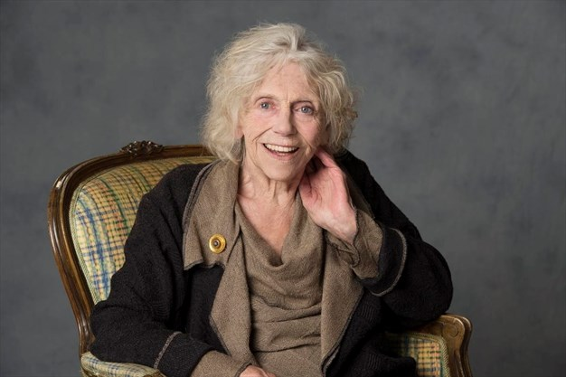

I first met Jennifer Phipps outside the Royal George Theatre in Niagara-on-the-Lake. I don’t remember the date but it must have been some time in the 1990s. I had gone there one lunchtime for a meeting with someone on the Shaw Festival staff who didn’t show. There emerged from the theatre this actress whom I recognised from having seen and admired several of her festival performances. I asked her if she had seen the person I was waiting for. She said she hadn’t, then looked at me curiously and asked my name. I gave it and she literally fell into my arms. And she metaphorically remained there ever after.

*Jennifer Phipps.*

I suspect that her initial warmth was at least partly prompted by a review I had written of her performance, a few seasons before, as Madame Arcati, the happy medium of Noel Coward’s Blithe Spirit. I had seen the role’s creator, Margaret Rutherford, whose enchantingly dotty performance, as preserved on film, I had thought definitive. But Jennifer – she liked to be called Jennifer and I always tried to remember that, though I’m afraid I lapsed into “Jenny” behind her back – had come up with an entirely new way of playing the role. Like Dame Margaret she treated her supernatural powers as the most natural thing in this or any other world; unlike her, she was a businesswoman with a brisk sense of her own worth. She commanded the stage whenever she was on it; her authority and authenticity seemed to extend way beyond it. You could imagine her walking confidently down the main street of the play’s English country town.

That was always the remarkable thing about Jennifer’s acting. She not only brought a character on stage with her; she brought that character’s place in the play’s society and, it sometimes seemed, her entire biography. In that regard she was the most remarkable actor I have ever seen. It didn’t matter how big or small the role was. Apart from Arcati my favourite of her Shaw Festival performances was of Emmy, housekeeper to Sir Colenso Ridgeon, in The Doctor’s Dilemma. In her one scene she conveyed that she had been babying this successful physician his entire life. It cast a new light on his actions throughout the rest of the play. I am sure it helped Blair Williams, playing Ridgeon, to give the best account I have seen of an often perplexing role.

As precise as she was with characterisation, Jennifer could sometimes be hair-raisingly vague with text; this became a legend, recounted with degrees of affection that may have varied according to whether the teller happened to have been on stage with her at the time. I remember seeing her play one of Oscar Wilde’s duchesses and wondering, come intermission, whether she was going to get through it. I confided my fears to another of our best actresses and a particular admirer of Jennifer’s. (The admiration was mutual.) “Don’t worry” she said “Jenny always comes through”. And so she did. She might embark on a speech as if uncertain of where it was taking her but somehow, miraculously, she had always made complete sense of it by the end. And so it was with a character. By the end of that afternoon (it was a matinee opening) we knew precisely who that woman was and what was her place in the world of the play.

In later years it was apparently hard to find roles for her at Shaw. She sat out whole seasons, and was obviously unhappy about it. She did have one splendid late hurrah in a leading role, playing the title character in a lunchtime production of J. M. Barrie’s The Old Lady Shows Her Medals; I’m sure she noticed, and probably relished, the irony of the title. Anyway it was a funny, touching and quite unsentimental performance. She was wonderful too in her last Shaw appearances: making more of the servant in Hedda Gabler than any previous actress is likely to have done, and providing the face and voice for a hologrammed Cheshire Cat in Alice in Wonderland, doing more justice to Lewis Carroll’s wit than anyone else in the cast.

And of course I’m glad (not to mention proud) that she gave one of her last great performances in The Last of Romeo and Juliet, my son Mitchell’s age-reversed production at Talk Is Free in Barrie. She played Mercutio (it was partly gender-reversed as well) and brought more magic to the Queen Mab speech than any other actor I have known. It was the speech as one had always dreamed it would be. The house was spellbound.

It was the only Shakespeare performance I saw her give. I wasn’t around for her seasons at Stratford. I would love to have seen her Mistress Quickly: the great stream-of-consciousness actress in the great stream-of-consciousness role. Her partnership with Martha Henry’s Doll Tearsheet must have been something for the ages. I wish too that I had seen her in The Merry Wives of Windsor when she and Domini Blythe were the wives and the Falstaff was Bill Hutt, another Phipps fan. (That too was mutual.)

She was as great an audience as she was an actor. I remember running into her four years ago at the first night of The Intelligent Homosexual’s Guide…, a Shaw Festival production with an almost insane number of fine interrelated performances. “That” she said, eyes shining, “is the kind of acting one lives for”. She was my date at many Shaw openings, and her enthusiasm for good acting was both generous and contagious. (As was also, I have to say, her disdain for its opposite.) Her conversation – in theatre lobbies, in restaurants, and in her own home – was funny, piercing, and affectionate, like her acting. She was legendarily hospitable, a quality of which my family and I were regular and happy beneficiaries. Her Niagara house was a local landmark.

I was fortunate to speak with her a couple of weeks before her death. She had been moved to a hospice and the painkillers made her sound groggy. But she was still in full command of the conversation, and seemed very cheerful in facing what she knew to be the end. I know I speak for many people when I say that Jennifer made you feel loved.
