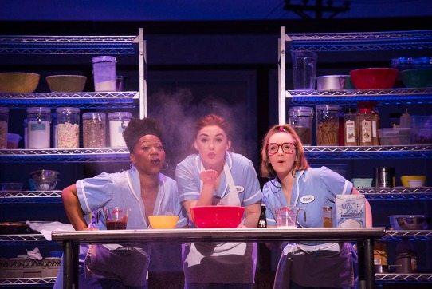

There are a few puzzling things about Waitress, the very entertaining musical that has arrived at the Ed Mirvish Theatre as its last stop on a long North American tour. One is its title, derived from the movie on which it is based (and which, I had better confess up front, I have never seen). Jenna, the show’s heroine, does indeed wait tables in a small-town American diner, but her main job, certainly her main talent, seems to be creating and baking pies of unsurpassable magnificence. I found it strange that the person who cooks the pies, surely a full-time job in view of those pies’ popularity, should also have to serve them but I can hardly claim to be an expert on employment practices at roadside cafes in what seems to be – though we’re never explicitly told - the fairly deep south.

*Melody A Betts, Christine Dwyer and Ephie Aardema in Waitress (2019). Photo by Daniel Lippitt.*

Anyway, the fact is that the show’s focus is on Jenna’s baking rather than her waitressing. It drives much of the plot, and also provides a governing metaphor. The pies even have a theme-song; it goes “sugar, butter, flour” and is repeated, somewhat hypnotically, at regular intervals. Jenna gives names to her creations that go beyond listing their ingredients. They reflect her state of mind at a given moment. “My whole life” she tells us in her opening number “is in here/In this kitchen baking” and then adds “What a mess I’m making”: a cute double meaning and a beautiful example of a hard clinching rhyme. Sara Bareilles’ lyrics, to her own music, don’t always reach that level of accuracy. (Rhyming isn’t compulsory in lyrics but if you’re going to do it, do it right.) All the same her score is one of the best to come out of the U.S. in recent years: far superior, like the whole show, to the earnest self-serious musicals in which characters stop the action dead to preach or orate at us. Bareilles’ score, a wonder for a pop-song writer making her theatrical debut, advances the action and digs, with varying degrees of rueful wit, into the thoughts and feelings of the people who are caught up in it. It proves once again that country music, to which I’m not especially partial outside the theatre, can work very well inside it; unlike rock it’s both character-and-narrative-driven. The songs do become more generalised in the later stretches of the evening. But even when Becky, HBF (Heroine’s Best Friend), sings an incongruously full-throated number about settling for a less than ideal man, she can puncture the audience-baiting bravura with the devastating image “I didn’t plan it/But the light turned red and I ran it.”

Becky at this point is comparing her own make-do situation to Jenna’s. Jenna is unhappily married to a man who thinks that his having rescued her from an abusive father gives him the right to be an abusive husband. Now she finds herself pregnant. (“I do stupid things when I drink. Like sleep with my husband”. “Honey” says Becky “we’ve all made that mistake.”) Earl, the husband, is a real charmer who reacts to impending fatherhood by threatening that his wife had better not love the baby more than she loves him. In Jessie Nelson’s book (from Adrienne Shelly’s screenplay) and Diane Paulus’ production the marriage, in two brief scenes, is presented starkly, painfully, and very believably. Earl isn’t sensationalised; he’s only about ninety per cent monster.

So Jenna finds relief in the gangling shape of Dr Pomatter, her young male gynaecologist. She brings a pie to her first consultation (she brings a pie to everything) and right away he is smitten. She appeals, in more ways than one, to the sweet tooth he had almost forgotten he had. It’s mutual. Despite, or because of, singing (twice) a fast-and-furious song called “Bad Idea” that’s far more approach than avoidance, they find themselves making love right there on the examining table. Curiously, the question of medical ethics is barely broached (another of the show’s puzzles); the fact of his being married proves more of an obstacle. So their relationship is constantly on the edge of being aborted. Or, to borrow the show’s own pervasive image: the pie they eat is bitter-sweet.

Christine Dwyer gives a lovely performance as Jenna; aching, flowering or merely settling, she’s sensibly radiant, vulnerable but finally uncrushable. Stephen Good is delightful as her nervous swain, tasting life in long-forgotten flavours, recoiling and then compulsively coiling again. One message of the show seems to be that a man in love will contort his body into the most demanding acrobatic postures a choreographer can devise. This goes for the doctor, and it goes triple for Ogie, an American Revolution buff who turns up as the chosen mate of Dawn, H2BF (Heroine’s Second Best Friend) and similarly historically minded; their romance, the most upbeat of the evening, progresses from nervous first date to happy pie-fed wedding, at lightning speed and before our very eyes. It also prompts some of Bareilles’ most flavourful songwriting, deliciously dished out by Ephie Aardema as Dawn and Jeremy Morse as Ogie. Aardema has the all-out funniest and possibly most perceptive number “When He Sees Me”, in which she pours out her terrors about meeting her yet-unknown admirer: “…a stranger who might/Talk too fast or ask me questions about myself/Before I’ve decided that/He can ask me questions about myself/He might sit too close or call the waiter by his first name/Or eat oreos but eat the cookies before the cream.” Morse’s peak moment comes at the nuptials when he proudly unburdens himself of what he announces as a “poh-oh-oh-oh-oh-em” entitled “I Love You Like a Table” (“My legs were carved for you”).

The establishment at which Jenna, Becky and Dawn serve and wait is called Joe’s Diner and there is indeed a Joe, pleasantly played by Richard Kline: a white-haired old gent who at first seems crusty but turns out soft- centred. Another of the show’s curiosities is that for much of the evening he seems to be just a customer, if perhaps more habitual than most; only towards the end, when he’s needed to tidy things up (metaphorically speaking) is his proprietorial status made clear. Up to then, the boss seems to be Cal, the burly head cook, who certainly acts, or is acted, as if he owns the joint. He is also the lover for whom Becky has run her red light, something we only learn quite late in the night; earlier on our most memorable sight of the two of them together has been more in the zone of industrial conflict, with Melody A. Betts’ Becky squaring rebelliously up to Ryan G. Dunkin’s hulking Cal: a confrontation rendered more piquant by the fact that her eyeline is just about level with his midriff. As the more toxic male Earl, Jeremy Woodard effectively alternates needy with menacing. Dawn Bless is a laconic stand-out as Dr Pomatter’s nurse, continually intruding on the physician-patient trysts with a raised eyebrow that signals disapproval, tolerance and complicity, all at the same time.

Jenna has dreams of entering and winning a baking contest in the presumably nearby metropolis of Springfield (which, as in The Simpsons and probably in homage to it, could be nearby anywhere). This plot-strand proves rather frustrating, ignoring the Chekhovian dictum that if you bake a pie in the first act, you should eat in the last. Or something like that. Sometimes the musical suffers by being too much like a musical. It’s fun when a trio of incipient moms welcome Jenna to pregnancy in a number that begins with a knock-knock joke and is actually called “Club Knocked Up”. It just seems mannered when they hang around, shadowing her every future move. It’s similarly distracting when the diner’s clientele turn themselves into a corps de ballet every chance they get. Not everything has to be danced. The sound-system, as so often with touring shows, is muddy. I had to consult the cast album to confirm my enthusiasm for the lyrics, though even there the words are too often buried under over-busy arrangements.

Talking of lyrics: there’s already a classic musical involving waitresses. This is The Most Happy Fella (1956) in whose opening song, “Ooh! My Feet!”, the HBF tallies up her vocational aches and pains, reaching a spectacular pinnacle of colloquial compactness and internal rhyme with “This little piggy feels the weight of the plate Though the freight’s just an order of Melba toast”.

Well, nobody expects Sara Bareilles to turn overnight into Frank Loesser.
