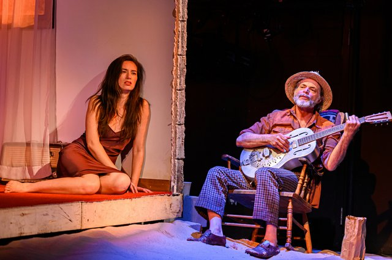

The plays in Soulpepper’s new season arrange themselves into a few, sometimes overlapping, categories. There are plays with one-word titles. There are plays with three or four characters. And, biggest category of all, there are plays that the company has done before.

Sam Shepard’s Fool for Love fits into two of those slots: it’s a four-hander and it’s been here already. (It also has a fairly short title.) I first saw it off-Broadway in 1984 and found it something of a revelation. Up to then, I had always thought that Shepard’s followers were so many sheep. But here at last was a play that lived up to its author’s reputation. Here was a genuine piece of American mythology, but one that signified something beyond its own sweaty setting. Here were passion and humour and compelling characters. This impression remained with me through subsequent productions in England and Canada. But now, fourth time around, it’s beginning to fade.

*Cara Gee and Stuart Hughes in Fool for Love 2019. Photo by Dahlia Katz.*

The play remains a tour-de-force of atmospherics. In a sleazy motel room in the Mojave Desert, May and Eddie, two presumed former lovers, battle it out, “it” being their relationship past, present and possible future. Eddie is a rodeo cowboy, or at least aspires to be one; anyway he dresses the part, complete with accessories, flourishing first a gun, then a lasso; the latter, though not the former, gets used. May lives in the motel, though she hates it. Eddie wants her to come with him to Wyoming, but she says, vehemently, that she can’t stand the place. She can’t stand Eddie either; or so she tells him, also vehemently. Briefly: she wants him to leave, he wants to stay. And though he makes frequent departures, he always comes back. As is clear from the behaviour of both of them, there’s a bond.

Frank Cox-O’Connell’s production does well by the play’s trappings. Lorenzo Savoini’s set is suitably cramped and seedy; Simon Rossiter’s lighting switches tones as required; and Andrew Penner’s sound design keeps the backing track of Western songs insistently in our ears. Shepard’s distillation of American language still stabs and sparkles. At least, some of it does. Cara Gee as May has a few blessedly quiet moments but most of the time she shouts, as if volume were a passport to power. It’s true that May spends much of the play being angry, but there must be ways of portraying this that don’t exclude subtlety or modulation. (Program-notes suggest that May’s predicament, her isolation and her rage stem from her being part-indigenous; but the program, and maybe her costume, are where the idea remains.)

So audience sympathy – not necessarily the same thing as approval - goes to Eion Bailey’s Eddie, playing a harried but persistent defence against May’s monotonous attack. It unbalances the play but that’s hardly his fault; the script gives him the chances and he takes them, fluently and with a wry humour. The relationship lacks its perverse erotic charge but there is wit in the careful way Bailey transfers his Jim Beam from bottle to glass.

A senior Soulpepper actor remarked to me on the way out that all he could ever remember about this play is that there are these two people in a motel. I have the same problem, if it is a problem; it does have the beneficent effect of making the play’s big reveal come as a surprise every time. Though it is possible that the play might actually seem richer, the May-Eddie dynamic more explosive, if we knew their secret all along. Its cover is blown by a character who exists outside the main action’s conventions of time and place. This is an Old Man who sits on a rocking-chair in a corner of the stage, bottle in hand and guitar on lap, just below and beside the main setting. As May and Eddie hurl their memories at one another, he chimes in with his own, which may enrich or contradict theirs. Stuart Hughes, a fine Eddie in the play’s first Soulpepper outing, now graduates logically to the senior role, an equivocally trustworthy narrator who’s part Ancient Mariner, part Wedding Guest. As his amour-propre is challenged by what he hears, he shifts from mellow reminiscence to aggrieved fury. In this production he even forsakes his spectator’s perch to get up and mess with the principal couple in their own space: a move that I found striking at the time but on consideration seems like a mistake.

Some of May’s resentment is directed at a presumably older, presumably richer entanglement of Eddie’s, known as the Countess. She’s followed him to the motel but contents herself with parking in the lot and blowing out his truck’s windshield with her shotgun. May has her own more docile romantic possibility a guy or man (Eddie takes a sarcastic pleasure in parsing the contrasting implications of these two words) named Martin. Him we do meet; stumbling into an emotional inferno, expecting only to take his girl to the movies, he becomes the audience’s representative on stage: not unlike the conventional husband and wife of Noel Coward’s Private Lives, only nicer. It’s a rewarding role to have and Alex McCooeye plays it delightfully, his immense height coming in hilariously handy as he tussles with Eddie, who’s far more taunting and aggressive with May’s bewildered admirer than he would ever dare be with May herself. By conventional standards of contact and conflict, the scene between these two guys (or men) is the most enjoyable in the play. By the play’s own implicit standards, though, it’s only an interlude. For the most part Shepard’s writing remains compelling but in an abstract kind of way, style outpacing content. I did not, in the end, care.
