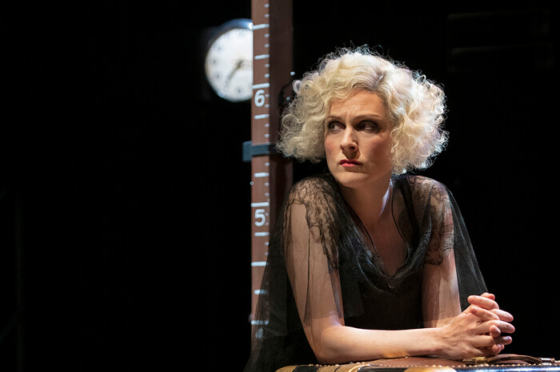
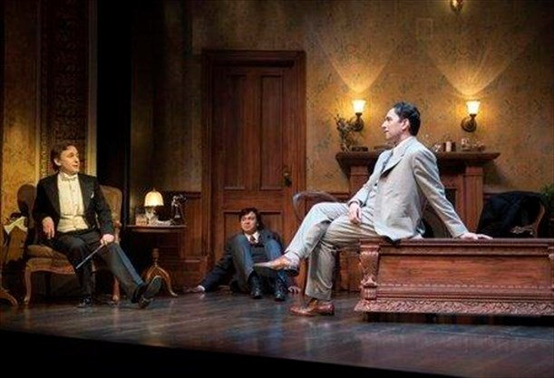
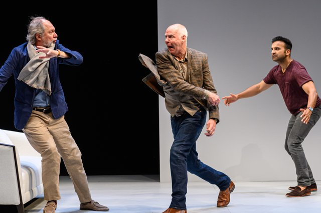

*Diana Donnelly in SEX (2019). Photo by David Cooper.*

Mae West was a personality rather than an actress. Diana Donnelly is an actress, and a very good one; so, when playing West’s own role in West’s own 1926 play unblushingly entitled Sex, she has to do a certain amount of treading water. She also, like everybody else in the Shaw Festival’s production, has to cope with the fact that, as a playwright, West was a primitive. Her writing swings from comedy to melodrama and back, whichever seems handiest at the time. That isn’t necessarily a terrible thing. Some of Sex is funny and much of the melodrama is gripping, especially in the last act which hinges on a coincidence so outrageous as to be irresistible.

The sex in Sex is mostly for sale. The play’s protagonist, Margy LaMont, is an American prostitute who, when we first meet her, is working the expatriate beat in sin-soaked Montreal. Later, advised by an English naval admirer to “follow the fleet”, she transfers her activities to Port-of-Spain, Trinidad, where she meets, and falls in requited love with, a very young man of very good New York family. He takes her home to meet and impress the folks; and all hell predictably breaks.

The play’s outspokenness, starting with its title, landed its author in court (and briefly in jail), thereby adding to the already substantial success of the original production. Forcibly closed in New York, the show took to the road to reap the benefits of its notoriety. It also served as its author/star’s passport to Hollywood, where she became a sex symbol while simultaneously ridiculing the whole idea. That process was already underway in her theatrical years. There are lines in Sex in which Margy seems to detach herself from her own sordid surroundings and desperate personal situation, lines that seem fashioned for the patented Mae West drawl. Donnelly makes no attempt to infringe on the patent, so some of the text merely hangs in the air. What she does, very well, is close in on Margy’s determination, expressed sometimes through desperate anger, sometimes through sceptical humour. She is a woman who knows she is trapped in a dead-end existence, and is resolute to use all of her wits to escape it. She also has a vulnerability and even a tenderness.

What keeps Margy on high alert is the looming presence of her pimp-cum-boyfriend Rocky, played with the right smooth brutality by Kristopher Bowman. Rocky lures to his and Margy’s den an upper-class married American woman, nervously slumming it in Canada, drugs and robs her. Margy, returning home from a night out, is not amused. She takes a particular dislike to the doped society dame who, when the law arrives, attempts to clear herself at Margy’s expense. As the play proceeds the lady moves from being Margy’s prime antagonist to her reluctant confidante. Donnelly and the also-good Fiona Byrne play an intriguing double war game: enemies across class lines, allies against men.

The production, by the director currently known as Peter Hinton-Davies, echoes, if it doesn’t quite mirror, the divided nature of the play itself, presumably by design rather than accident. Design indeed is paramount: Eo Sharp’s setting for the first-act Montreal brothel consists mainly of piled-up suitcases, presumably symbolising the characters’ transience. The move to Port-of-Spain gets us a little closer to realism, or at least to recognisable exotica; Trinidad is presented here, somewhat anachronistically, as the land of Carmen Miranda. The songs and dances fit with West’s debonair idea of dramaturgy, though they do seem to go on for a long time and, for the most part, are not terribly well performed. The last act, taking us to the plush homestead of Margy’s marital dreams, is given the most conventionally realistic setting, and finds both play and production at their sharpest.

There are two cases of cross-gender casting. Julia Course plays Margy’s naïve and impetuous intended and plays him very well, but it still feels like an impersonation. Jonathan Tan, by contrast, is real to the bedraggled bone as Agnes, Margy’s sick and doomed co-worker: a memento mori for Margy, for the play, and for us. Andre Sills’ naval lieutenant is totally becalmed by his English accent. The ever-reliable Ric Reid contributes two invaluable performances, alike only in their precision and economy: as a thoroughly venal Montreal cop and as Margy’s genial prospective father-in-law in whom he finds layers of subtext that might have pleasantly surprised the author herself. The play’s ending is fascinating. From one angle, it’s a cop-out; from another it’s totally believable. Either way, it satisfies.

*Michael Therriault, Travis Seetoo and Kelly Wong in Rope (2019). Photo by Emily Cooper.*

Also at the Shaw: Rope is as tight as Sex is loose. Patrick Hamilton’s 1929 thriller (this seems to be a fertile time for twenties revivals) is an Anglicisation of the notorious Leopold-Loeb murder case from five years previously. Leopold and Loeb were two American rich kids who murdered a fourteen-year old boy to prove – to themselves anyway – their superiority to bourgeois moral standards. In exchange Hamilton gives us Wyndham Brandon and Charles Granillo, two Oxford undergraduates, also well-heeled to judge from their ability to maintain a comfortable London flat, who have chosen as their victim an inoffensive fellow-student. They have no personal reason to kill him. The pointlessness is the point.

The play begins immediately after the murder, one of the killers exulting in the deed, the other already exhibiting if not qualms then certainly fears. They have gone their American models one better, depositing the body in a trunk in their living-room, and then inviting people over to eat supper off of it, the guests including the slaughtered boy’s father.

Like Hamilton’s other famous play Gaslight, Rope is a thriller that plays on the audience’s nerves by playing on those of the characters. There’s no suspense as to who the killers are; the question is who will find them out and how. The sleuth-on-the-spot turns out (this is hardly a spoiler) to be Rupert Cadell, the boys’ philosophy tutor, who might even be held – and may even hold himself – to be partly responsible, having schooled them in the superman theories of Nietzsche. He is alerted by the one physical clue they have carelessly let slip past them, and by their respective demeanours: Brandon’s all too cocky, Granillo’s all too nervous. The net takes its time to close but it does, inexorably.

Jani Lauzon’s production boasts some excellent performances. Kelly Wong’s Brandon is all suave arrogance, social and intellectual. Even better is Travis Seetoo’s Granillo (Granno to friends) whose evening-long disintegration may be measured by his alcoholic intake. Michael Therriault may overdo the Wildean dandy in Rupert, whose cane doubles as a swordstick; his intellectual tones are almost too careful, too mincing. But his final mixture of anger and guilt is very strong. There are two not-too-bright young things at the party, a man and woman whose increasing mutual attraction provides the hosts with additional fuel for unmerited derision; Kyle Golemba and Alexis Gordon play them delightfully, his diffidence enchantingly countered by her confidence. Peter Millard is the unsuspecting father whose future torment Rupert accurately judges to be the greatest atrocity of all; Patty Jamieson plays his almost speechless sister, a one-joke role from which she fashions a whole person. A play long impatient for revival has its impatience rewarded.

*Diego Matamoros, Oliver Dennis, and Huse Madhavji in Art (2019). Photo by Dahlia Katz.*

Soulpepper enlist in the one-syllable title stakes with Art. Yasmina Reza’s play is now a quarter-century old, so it’s hardly news that its real subject is friendship. Serge buys, at an outrageous price, an all-white painting that may just possibly have a few white lines crossing its surface, depending on who’s looking. Marc, his long-time buddy and self-described mentor, is shocked at the profligacy and pretentiousness. Yvan, third wheel, wants to please both and so pleases neither, a predicament reflected in his abject uncertainty regarding his imminent wedding. It all happens in Paris, which explains a lot.

For much of Philip Akin’s production I was surprised by how well, in Christopher Hampton’s sparky translation, the play has worn. Oliver Dennis’ Marc had me from his opening monologue, spitting out the word “art” with a hatred that far transcends contempt. He later sprays the same scorn on the words “modern” and “deconstruction”. It’s hard not to sympathise with him.

Diego Matamoros’ Serge doesn’t fight back, at least not initially. He merely looks with a modest kind of rapture at his new acquisition, and smiles in benevolent bafflement at anyone who could disagree with him about it. Later, though not too much later, his patience wears as thin as his chum’s and the two even come, amusingly, to blows. By this time, though, the play has begun to outstay its welcome. The trouble lies partly with its limited frame of reference, and partly with the performance of Yvan. In some respects Huse Madhavji is cunningly cast. The play implies, without ever positively stating, that Yvan, the nervous outsider, is younger than his two amigos; for one thing they’re already married (and in one case divorced) while he is just about to take the plunge. Madhavji is a newcomer to Souplpepper while Dennis and Matamoros have probably racked up more company credits than any other actors. Unfortunately, his inexperience registers as strongly as their experience. He conveys his character’s predicament well enough but he’s physically and vocally jerky, notably in his long and hilariously convoluted speech about the impossibility of wording a wedding invitation that will reconcile the irreconcilable demands of both families. This prose aria has been known to stop the show and, to be fair, it did get some applause on the night I saw the show. But, to be honest, I can’t understand why, unless it was a tribute to the actor’s gallantry. Audiences are funny that way.

But the play itself has run out of steam, and the production has trouble bringing it to a climax. The last time Art was done in Toronto I wrote that Paris must be “the only place in the world where people dispute with the same passion, the same flippancy, and virtually in the same breath, on the meaning of life and where they’re going for dinner”. Maybe it’s true too that the French male has more intense notions of friendship than do the men of other countries, at least once the latter are past their college years. Here the issue isn’t even politics or sports, the two subjects that might conceivably enrage your average North American guy to the point of fisticuffs. Of course Art here (and how that capital letter would enrage Marc) is just the pretext. You may end up wishing that it were the text.
