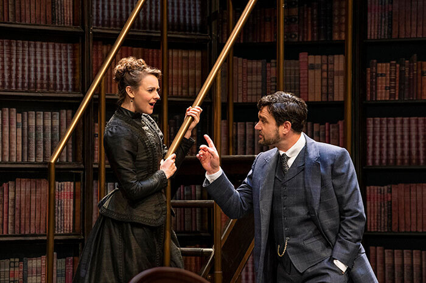
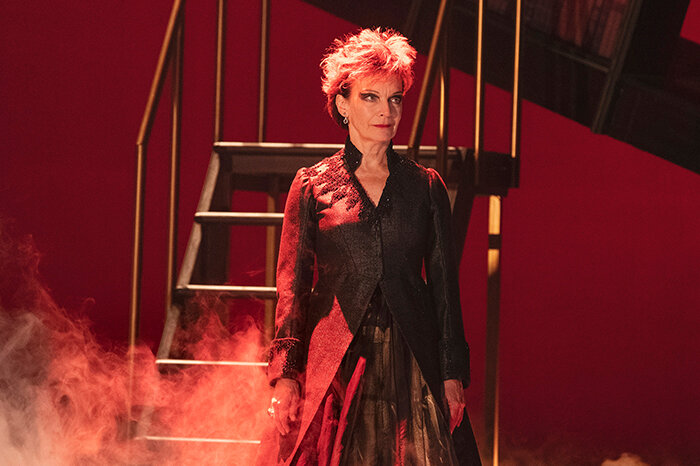

“A father, a father for the superman” cries Dona Ana de Ulloa, thereby providing the only link between the main action of Bernard Shaw’s prime romantic comedy Man and Superman and the long and loquacious dream sequence embedded within it and commonly known as Don Juan in Hell. She does it, I should add, at the very last minute, when left on an empty stage at the close of the infernal interlude. She calls out to the heavens, which in the circumstances is ironic but fitting.

*Sara Topham and Gray Powell in Man and Superman (2019). Photo by Emily Cooper.*

Dona Ana is the dream equivalent of Man and Superman’s heroine Ann Whitefield. Ann has her sights set on the hero John Tanner who remains blithely unaware of the fact until half-way through the action and spends the rest of it trying to get away from her, succumbing at the last. “Shall I call you by the name of your famous ancestor, Don Juan Tenorio?” Ann asks him teasingly; though if Jack, as everyone calls him, has ever been a Don Juan there’s no sign of it in the play. Perhaps it’s a phase he’s outgrown.

This is certainly true of his infernal alter ego. Don Juan in Hell might be regarded as a fanciful sequel to Mozart’s Don Juan opera Don Giovanni. Here are Juan, his Spanish name restored, reunited in the afterlife with Ana, the woman he failed to seduce and whose father died defending her honour. Here too is that father, in the guise of the posthumous Statue who walked in on Juan at a banquet and despatched him to damnation, now making his entrance to the same Mozartean accompaniment. He was actually sent to Heaven but, as a sensual man, he finds Heaven insupportably boring. Juan, in his reformed state, feels the same negative way about Hell, the sensualist’s paradise. (You’ve heard of the Rake’s Progress; he’s a rake progressed.) The Statue’s earthly counterpart is Roebuck Ramsden, cultured Edwardian gentleman and Ann’s guardian along with Jack Tanner: an arrangement that infuriates both men. Once dead, the two men get along very well; the Statue would probably say that they were both men of the world, whichever world you take that to be.

Completing the Hellish discussion group is, naturally, the Devil, whose earthly avatar is Mendoza, a Spanish brigand. He and his fellow-bandits had waylaid Jack in the Sierra Nevada, where he was in headlong flight from Ann after recognising himself as her marked-down prey. (His phrase.) The Devil, who talks nearly as much as Juan and actually has the single longest speech, worships pleasure (he’s quite the aesthete) and deplores mankind’s propensity for destroying itself. Juan champions the life of the mind and mankind’s capacity for renewing and improving itself. At the last moment he comes up with a phrase to describe this drive for perfection. He calls it the Life Force; the person who will embody it will be the Superman; which is where we came in. It’s interesting that the Shaw Festival should have programmed this play in the same season as Rope, which shows us two young men who fancy themselves supermen with murderous results. Who was it said that one touch of Nietzsche makes the whole world kin?

So, back on the terrestrial plane and in the present day (i.e. 1905) Ann, without articulating it, selects Jack as the father of her Superman, or at least as her personal link in the evolutionary chain. Jack, self-described radical socialist and author of The Revolutionist’s Handbook, finally embraces her as the embodiment of the Life Force. This is the climax of their last duet, an appropriate phrase since in Kimberly Rampersad’s production the lights are changed before each of their scenes together, setting each one off as if it were a number in an opera. It’s very effective. An earlier gesture to the play’s musical roots is the idea of having its opening dialogue performed as recitative; the actors are mercifully able to carry this off but the concept, if that’s what it is, seems half-hearted and isn’t followed through.

*Martha Burns in Man and Superman (2019). Photo by Emily Cooper.*

There is an operatic feel to the look of the show, or at least at a cavernous one. The play begins in Roebuck Ramsden’s study, but though Ramsden is doubtless a well-read man it seems unlikely that he could have got through all the contents of the bookshelves that in Camellia Koo’s set designs stretch as high and as wide as the eye can see. When the play moves to other locations, the shelves go with them, even out of doors. So do a pair of high and handsome library steps, that prove ideal for the two leads to scamper up and down when trying to impress or elude one another. The books and the steps even turn up in hell: a comment perhaps on the all-pervasive bookishness of Shaw’s world and underworld and their inhabitants. A peculiarity of these otherwise wide-open and underfurnished designs is that they work better for the play’s comparatively naturalistic sections (the ones that make up the standard-order Man and Superman) than for the hellish dream and its prelude in the Sierra. There is just too much space for the participants to come fully to grips with one another and with one another’s ideas.

Rampersad’s production in fact lacks the flair and the visual unity of Neil Munro’s staging of fifteen years ago. It is though, for the most part, very well acted. Gray Powell as Tanner doesn’t drive through his role with quite the deadly accuracy and whirlwind velocity of Ben Carlson’s 2004 performance; like Carlson (whose natural successor he is) he stops the show with his most virtuoso outburst but he doesn’t – at least he didn’t at the performance I saw – stop it quite as joyously. His Jack is a little less sure of himself, and I wasn’t always sure whether it was the character or the actor who was stopping to think. But his is still a winning performance (in both senses of “winning”), especially effective in showing the fear behind the bravado. Sara Topham is a splendid Ann, demure in demeanour but keeping in reserve a ringing decisiveness that lets you know – and lets him know – that her quarry is doomed.

Martha Burns does the Devil/Mendoza double and has problems with both. The Spanish accent she adopts for her argumentative brigand muffles what she is saying, though she isn’t helped by a messy orchestration of her followers’ parody of political debate; the text identifies one of them as “Rowdy Social Democrat” but here the rowdiness is universal, irrespective of party. As a female Satan Burns looks very fetching; you can easily imagine horns sprouting through her handsome black hair. But this Devil lacks both the force and the suavity to function properly as her own advocate. Also, the change of gender has her delivering her Shakespearean appropriation “the Prince of Darkness is a gentleman” as “the Duchess of Darkness is a lady”. Does it matter? Yes, except to the tone-deaf.

David Adams is excellent as Ramsden and even better as his statuesque surrogate. Kyle Blair is perfect, both sad and sweet, as Octavius, the young poet who pines who pines hopelessly for Ann but is doomed to be rejected as an unpromising Superparent. Octavius has a sister, Violet, who shocks friends and family by announcing an apparently illicit pregnancy but turns out to be a model of mercenary respectability; Courtney Ch’ng Lancaster plays her fiercely, with Jeff Irving admirable as her secret American husband and Tom McCamus rollingly commanding as his millionaire dad. Sharry Flett repeats her Mrs Whitefield from the previous production; she has grown into the role though I still wish she could make more of her delight at finding that someone (i.e. Jack) finds her daughter as manipulative as she does. Tanja Jacobs is a fearsome ramrod as Miss Ramsden, Roebuck’s sister and housekeeper, here bearing a marked resemblance to Aunt Lydia from The Handmaid’s Tale, TV version. Sanjay Talwar completes the line-up of principals, making a lovely perky comic foil to Powell’s Tanner as his chauffeur, the New Man Enry Straker.

Add it all up, it’s a marathon well run.
