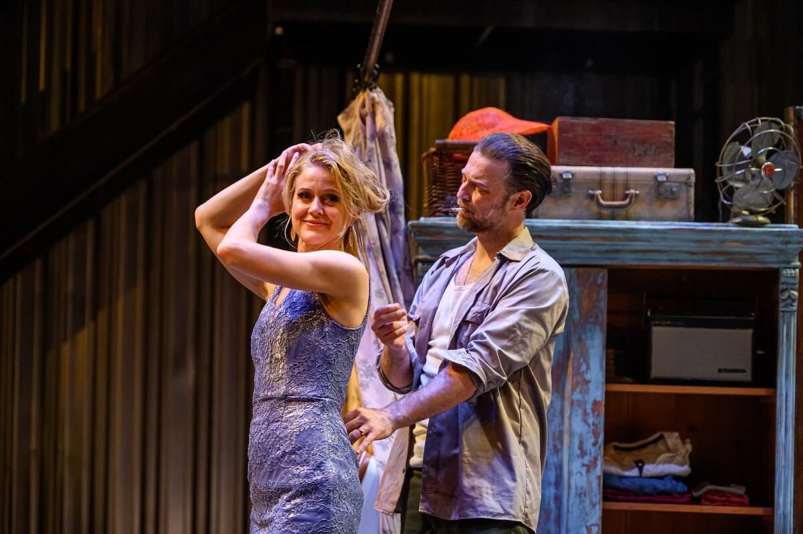
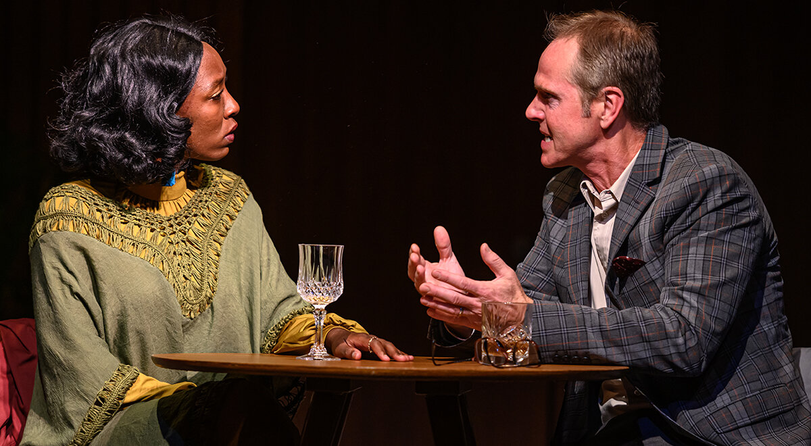

New Orleans today is a city that acts as if it’s trying to live up to its own legend and, infuriatingly enough, succeeds. There really do seem to be musicians on every corner, or at least on every street. This is one of the aspects of the present Crescent City that Weyni Mengesha has seized on in her triumphant new Soulpepper production of Tennessee Williams’ A Streetcar Named Desire. Here it’s every corner of the play, every break between scenes and many a heightened moment within them, that’s alive with the sound of music, performed live. Some of it sounds like traditional Preservation Hall jazz. Some sounds more raucous and jangling.

It contributes to a subtle pushing forward of the play from its post-war roots. In perhaps the most obvious update (and it’s still a gentle one) Blanche DuBois turns up at her sister Stella’s French Quarter apartment carrying more than psychological baggage; she’s trundling a suitcase on wheels, something that certainly wouldn’t have been available to her back in 1947. The landscape, or townscape, that greets her is starker, less solid, than we are accustomed to from previous stagings of the play. Its most striking feature is a back wall of what looks like corrugated iron. The domestic settings in front of it look solid enough; Lorenzo Savoini’s setting is a fascinating contrast of the familiar and the forbidding, reason enough for Amy Rutherford’s Blanche to look and sound off-kilter from her first appearance: half eager, half afraid. She’s arrived in a highly atmospheric production.

*Amy Rutherford and Mac Fyfe in A Streetcar Named Desire (2019). Photo by Dahlia Katz.*

But then this is a highly atmospheric play, like most of the prize products of the brief golden age of American drama that followed on the heels of World War Two. One thing those plays have in common is that they were all directed by Elia Kazan, and I suspect that the details of his original productions, rife with sound and lighting cues, have been preserved in the published scripts. Those blueprints, however elaborated, ensure that the plays nearly always work. I have seen three previous productions of Streetcar – two in London, one in Toronto - and they have all, like this one, been first-rate, with terrific emotional impact. So while applauding Mengesha’s production I feel sceptical of claims that it shows the play in a whole new light, or illuminates its sexual and racial implications in a way that no previous productions have done. That claim is constantly being made for new stagings of oldish plays and musicals; the Broadway production of The King and I that played in Toronto last year is an example, widely commended for bringing out things that have always been there in the show as written and have been perfectly visible in earlier revivals. As far as Streetcar is concerned, an audience anytime would have had to be pretty dumb not to recognise both the vulnerability and the covert snobbery of Blanche DuBois and the brutishness and thoroughly overt resentment of her bother-in-law Stanley Kowalski: whenever the production was staged and whenever it was set. It might even be claimed that the more dubious aspects of Blanche’s clinging to her old Southern heritage would have hit closer to home in the 1940s than they do now. Mengesha’s production blazes, not because it’s updated, but because it’s alive.

My three previous Blanches have been Claire Bloom, Fiona Reid and Glenn Close: all of them very fine. I can now add Amy Rutherford to the list. Of them all Bloom still seems to me the greatest: a performance that nobody at the time suspected she had in her, and that left you at the end feeling that you had beheld Blanche in every aspect of her being. Reid showed, not for the last time, that she could be devastatingly wounded as well as hilariously brittle (and Blanche can be funny at moments.) Close was unusual because her innate toughness made the character seem less of a predestined victim, thus making her decline additionally disturbing. All, I need hardly say, were immensely moving at the last when Blanche, in devastated shock after being raped by her brother-in-law, proclaims her belief in the kindness of strangers: to the people who are taking her off to a mental hospital.

Rutherford certainly draws the tears at this point; she seems psychologically naked, at the end of a long process of wearing aggressive or defensive masks. (Though there is a school of thought, once espoused by the playwright himself, that holds that Blanche is not as broken as she seems and would soon find a way of charming herself out of the asylum.) She inhabits the character from that first conflicted stranger-in-town appearance,. Later she’s especially adept in distinguishing Blanche’s illusions from her genuine beliefs; she is, as she should be, borderline infuriating when fantasising about a rich admirer, passionate when asserting her belief in the finer things like art and music. This is a speech that can often play like a set-piece; in this performance it arises naturally and excitingly from the scene as a whole. You believe it, and you respect her for it.

That speech famously ends with the exhortation “don’t hang back with the brutes”. The particular brute she has in mind is of course Stanley, and the identification can be a problem for the actor playing him. Tradition has led us to expect a kind of heavyweight Neanderthal. Very few Stanleys have measured up to that stereotype, not even the role’s creator (on stage and film) and most famous exponent Marlon Brando. Brando indeed was faulted by some for being so lyrical and sympathetic that the audience couldn’t help siding with him against Blanche, thus unbalancing the play. Mac Fyfe, this production’s Stanley, is hardly a heavy, but he does justice both to Stanley’s fits of legitimate exasperation, especially when aimed at his sister-in-law’s habit of tying up the bathroom for hours on end, and to his crudity and cruelty. He only falls short when telling Stella about the behaviour that got her sister run out of her home town, a scene that he plays in an oddly low key, neither triumphant nor vengeful enough. Fun fact: Martin Shaw, who was Stanley to Claire Bloom’s Stella and was also faulted by critics (myself, I confess, among them) for being too lightweight, came to the role fresh from playing Dionysus in The Bacchae, just like Fyfe. Though Fyfe, if I can trust my old and new memories, was the more compellingly Dionysiac of the two.

If Blanche and Stanley are dangerous roles, Stella is a safe one; to put it another way, every actress who plays her seems to emerge triumphant. Kristen Thomson, in Soulpepper’s previous production back in their extraordinary second season, was perfect, sensible and sympathetic and troubled. Leah Doz, who plays Stella here, is close to the same standard, and is notably good at showing her divided loyalties and the effort it takes to maintain them. It’s largely through her eyes that we see and feel for Blanche in her last extremity, incidentally bolstering my growing conviction that the characters who really move us in a tragedy are not the protagonists but the onlookers who suffer with and for them; they’re the ones who show us how to feel, when to cry. Mitch, the shy guy who briefly promises to be Blanche’s salvation (“sometimes there’s God so quickly”) does the same thing in a more complicated way; he, with his mind poisoned against her by Stanley’s revelations, directs our sympathies by turning away. Gregory Prest, himself about as sympathetic as an actor can get, beautifully conveys the mixed emotions of a man hating himself in the effort to hate her, though he does seem a rather delicate flower to be part of Stanley’s poker-playing gang. Talking of delicacy, not to mention luxury casting: Oliver Dennis, who was Mitch the first time around, turns up at the end of this one as the doctor, and proves to be as kind a stranger as any enforced mental patient could hope to depend on.

There is also vigorous work, to say the least, from Akosua Amo-Adem and Lindsay Owen Pierre as the couple upstairs, whose fights and reconciliations are a reflection of the graver dynamic below. This casting, with her black and him Hispanic, must also count as an update; it’s unlikely that in 1940s Louisiana they would have been allowed in the building. It’s sobering to realise that in the play as written the victim of racism is Stanley, whom Blanche denigrates as “a Polack” and who understandably resents it. Kimberly Purtell’s lighting, Debashis Sinha’s sound design, and Mike Ross’ music direction all contribute mightily to a superbly orchestrated production.

*Virgilia Griffith and Ryan Hollyman in Betrayal (2019). Photo by Dahlia Katz.*

Streetcar is the inaugural offering of Weyni Mengesha’s reign as Soulpepper’s artistic director. The preceding interregnum period, under Alan Dilworth, concluded with a revival of Betrayal, on which I would like to cast a brief backward glance, partly for extra-curricular reasons. Harold Pinter’s reverse-chronology sonata for eternal triangle was decently acted, especially by Jordan Pettle as the questionably wronged husband, though even some of his poisoned darts seemed blunted; the play as a whole arrived muted, possibly because the scenes, dotted around the composite set, never seemed to have enough space to establish themselves. What really arrested my attention though was the program’s declaration, largely echoed in the press, that the play is “widely considered [Pinter’s] masterpiece” and, what’s more, was greeted as such as its London premiere in 1978. Well, it wasn’t. Back then, the London critics generally scorned it as a conventional and colourless middle-class adultery drama, trying to get by with technical tricks. I should know; I (shameful confession number two) was one of those misguided reviewers. That we were misguided was proved by subsequent revivals, revealing the play to have some of its author’s most elegantly poisonous dialogue and characterisation. All the same, calling it his masterpiece seems odd to those of us who remember The Caretaker, whose characters haunt and whose language, from the days before Pinter embraced gentility, really sings. Also I recall that, some eight years before Betrayal, Pinter had given us another, even more mysterious triangle drama (one man, two women this time) called Old Times. This really was hailed as a masterpiece by the critics (not me that time; I was far too young) but since then seems to have fallen off the map. Maybe Soulpepper should let us have another look at it; the company’s record with Pinter has generally been pretty impressive, not least with Little Menace, the evening of sketches that was one of the interregnum’s finest achievements, featuring some of the best acting seen in Toronto. And long before that there was a previous fine Soulpepper production of Betrayal; the new one, unlike Streetcar, didn’t measure up to its predecessor. Indeed it left me feeling empty, and even wondering whether we philistine reviewers might not have been right the first time.
