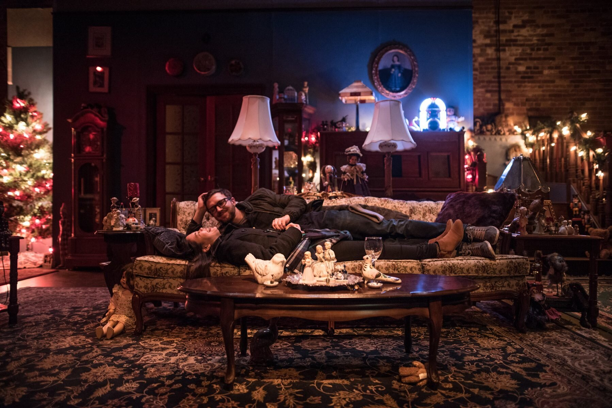

*Philip Riccio & Loretta Yu in John (2017). Photo by Dahlia Katz.*

I’m enough of a curmudgeon to believe that decades begin with years ending in “1” and finish with years ending in “0”. But everybody’s making “best of the 2010s” lists right now, so I don’t see why I shouldn’t join in. I equally don’t see why I should confine myself to ten choices, or even to twenty. So here is my Top 40 – actually my Top 42, with a few others snuck in as parentheses: a catalogue of shows, in Toronto and environs, that made me laugh or cry or hold my breath, and that still glow and shimmer in my memory. All of them featured outstanding performances, more than I can name. Several featured whole stagefuls of them. I love great ensemble shows, in which the actors play with, play off, and enrich one another. And there’s a special thrill when the actors are known quantities, rearranged in new combinations. (For more on this, see the paragraph on Assassins.) And yes, there are worthy productions that are excluded, sometimes because of a conflict of interest.

BLASTED (Buddies in Bad Times, 2010) So the decade began with a blast, Brendan Healy inaugurating his reign at Buddies with a terrifying, unrelenting realisation of the late Sarah Kane’s vision of apocalypse, with David Ferry extraordinary and Michelle Monteith uncanny. (These two reunited two years later to equally scary effect in Soheil Parsa’s too little-seen production of Ionesco’s The Lesson.)

FERNANDO KRAPP WROTE ME THIS LETTER (Canadian Stage, 2010) Another inaugural production: Matthew Jocelyn kicked off his regime at CanStage with what proved to be probably his best production. The German Tankred Dorst’s fable of wealth, power, lust and how they enable one another promised a future of broad Euro-inflected theatricality that never quite materialised. (It also promised a future of plays with long titles, reinforced the same season by The Cosmonaut’s Last Message To the Woman He Once Loves in the Former Soviet Union, an even better play – by the Scots David Greig – but less well done.)

THE CHERRY ORCHARD (Shaw Festival, 2010) The decade’s best Chekhov, with the Irish director Jason Byrne applying the same magic touch that he had previously brought to Company Theatre’s A Whistle in the Dark and Festen. As in those shows, everyone in this one shone.

SOUTH PACIFIC (Touring production, 2010) My least favourite of the Rodgers and Hammerstein Big Four came up remarkably fresh and immediate in this revival from Lincoln Centre, New York. Bartlett Sher’s production really summoned a world at war. Carmen Cusack got to the strengths and the inherited limitations of “our heroine”, Nellie Forbush, the little girl from Little Rock; making sense of the character, she made sense of the show. And the Four Seasons Centre, home of opera and ballet, showed itself an ideal home for musicals; shame there hasn’t been a follow-up.

ASSASSINS (BirdLand/Talk Is Free, 2010) My favourite Stephen Sondheim musical tends to be the one I’ve just seen. Adam Brazier’s production revealed this one as a masterpiece: a piercing look, unsentimental but never gloating, at what has historically ailed the U.S.A. John Weidman’s book joined with Sondheim’s score in anatomising the American dream and its murderously frustrated dreamers. One great number, Another National Anthem, said it all, as well as being a textbook example of great ensemble theatre: a stageful of recognisable (and superbly recognised) individuals, acting and singing as one.

THE PRESIDENT (Shaw Festival, 2011) This lunchtime treat was a revival of a production from 2008, but it was still the funniest show of the decade. One wanted it to go on for ever. Equally one wanted it to end so that the cheers and applause welling up inside could be released. A terrific directorial debut for Blair Williams and a great (and I mean great) central performance by Lorne Kennedy.

WHEN THE RAIN STOPS FALLING (Shaw Festival, 2011). A gift from Australia. Where to begin? A crazily inventive, sanely compassionate, fiendishly constructed play (Andrew Bovell), an immaculate production (Peter Hinton), superb acting (everyone, though if there had to be a prize, it would go to Graeme Somerville as a man consuming and consumed by his own guilt – our final glimpse of him outside the charmed circle occupied by everyone else may be the most haunting image of the year). Why has the Shaw never revived it? Or brought it to Toronto?

WINDOW ON TORONTO (Soulpepper, 2011). Total enchantment. Starting as a studio special, it came into the main repertoire as half of a double bill, with no loss of magic. The world, or at least the city, seen from a food-cart in Nathan Phillips Square. A non-stop succession of debonair and dumbfounding quick-changes, executed by a young cast apparently having the time of their lives and certainly giving us ours.

OUR CLASS (Studio 180, 2011) Studio 180’s near-best: a snapshot of the Holocaust and its aftermath, searching, ironic, judicious.

TEAR THE CURTAIN (Electric Company/Canadian Stage, 2012) Kim Collier’s best. Highly entertaining.

ELEKTRA (Stratford, 2012) The Stratford Festival’s first non-Shakespearean production, in its second (1954) season, was Oedipus Rex, and the relationship with Greek tragedy has been regularly and rewardingly renewed ever since. Sophocles’ Elektra - in Anne Carson’s translation and directed by the authentically Greek Thomas Moschopoulos - was one of the best, stark and uncompromising, especially in Yanna McIntosh’s ruthlessly unsentimental performance in the title role. Elektrafying. Even the choruses worked.

CYMBELINE (Stratford, 2012) Antoni Cimolino’s richly-cast production took this kaleidoscopic late Shakespeare – a play that bounces back and forth between super-sophisticated and folksy-naïve – just as it comes, and made a feast of it. The end brought tears of joy.

CLYBOURNE PARK (Studio 180/Canadian Stage, 2012) Theatre 180’s very best, and the best new American play not to have been written by Annie Baker or Stephen Adly Guirgis. Bruce Norris provided an acrid and very funny companion piece/sequel to A Raisin in the Sun. Michael Healey gave the performance(s) of his life.

THE SMALL ROOM AT THE TOP OF THE STAIRS (Tarragon, 2012) A strong contender for best Canadian play. Carole Frechette’s witty and scary take on the Bluebeard story, immaculately directed by Weyni Mengesha, immaculately acted by all concerned, especially Nicole Underhay and Sarah Dodd.

CAROLINE, OR CHANGE (Acting Up Stage [as it then was]/Obsidian, 2012) Lighting the Menorah, though it isn’t in the Torah. Who knew Tony Kushner could write lyrics? His words and the protean Jeanine Tesori’s music propelled the rare new American musical that was neither tiresome spoof nor tiresome sermon. Conflicts interracial, interfaith, and intergenerational bouncing off one another with hardly a misstep. Robert McQueen’s production was peopled (and machined, some of the acted objects being inanimate) by another of those flawless Toronto casts. And it’s about to come back: of necessity without Michael Levinson, whose child performance was phenomenal, but still with Deborah Hay who was bewitchingly bewildered as his transplanted stepmother.

THE PENELOPIAD (Nightwood, 2012) The all-Canadian all-female staging of Margaret Atwood’s riff on the Odyssey left the previous British-Canadian one in the dust. Unlike its predecessor, it knew about wit. Yet another perfect cast in Kelly Thornton’s production, with Kelli Fox’s horizon-scanning Odysseus seeming to function simultaneously as the man and as the prow of his ship. Back on land, Megan Follows in the marathon narrating role of Penelope never missed an emotional beat, never mistimed a joke, never (to use the appropriate Odyssey metaphor) dropped a stitch. She was a joy. Why do we see her so seldom?

ANGELS IN AMERICA (Soulpepper, 2013) More Tony Kushner. Much more: two whole evenings. This satirical-mystical-polemical epic has grown, if anything, with the years; at any rate I preferred this production to the National Theatre (UK) original. Albert Schultz’s production recalled Soulpepper’s greatest ensemble days. Great interwoven performances from Damien Atkins, Diego Matamoros, Nancy Palk…the list could go on to the end.

LADY WINDERMERE’S FAN (Shaw Festival, 2013) Peter Hinton’s second Niagara masterpiece (his other Festival productions have been less than), a visual and aural feast. Working on a large canvas, he opened up Wilde’s comedy scenically and sociologically while drilling into it emotionally.

MARY STUART (Stratford, 2013) Schiller’s somewhat-historical drama is the classical repertory’s premier showcase for duelling divas. But it’s also a gripping tragedy, as Antoni Cimolino’s tense and meticulous production demonstrated. Besides,”diva” is a demeaning term for Lucy Peacock (Mary Queen of Scots) and Seana McKenna (Elizabeth I); what they are is superb actresses. And they both seem to keep growing.

NEEDLES AND OPIUM (Ex Machina/Canadian Stage, 2013) Robert Lepage’s typically dazzling piece about Miles Davis, Juliette Greco, Jean Cocteau and a lesser-known Canadian actor, came back with Marc Labreche in Lepage’s old role (and every bit as good as he must have been) and Wellesley Robertson II as Davis: two superlative performances in a superlative (so what else is new?) production. Also very funny in an off-hand Lepage way, especially about Parisian hotel phones.

OTHELLO (Stratford, 2013) Stratford’s best Shakespeare of the decade. And a surprise on several counts. It’s a play whose recent record, at Stratford and elsewhere, has been discouraging. It was at the Avon, which doesn’t usually work for Shakespeare. It was Chris Abraham’s first try at directing major-league Shakespeare. But he made the stage work (great credit to Julie Fox’s brilliant set-designs) and he made the story and the characters work, with Dion Johnstone and Graham Abbey digging deep into Othello and Iago, and solid support all down the line. Footnote 1: The only comparably exciting Othello I’ve seen happened about the same time, at the National Theatre in London, with Rory Kinnear a marvellous Iago. Footnote 2: Abraham’s Stratford Taming of the Shrew, with Ben Carlson and Deborah Hay, was almost in the same league, but not quite: too much unfunny slapstick.

THIS IS WAR (Tarragon, 2013) The prolific Hannah Moscovitch’s best play since East of Berlin, maybe her best ever, was a departure for her, at least in the theatre; her work on CBC radio’s Afghanada covered some of the same ground. An examination of men and women at war: complex, cunningly constructed, and, in Richard Rose’s production, impeccably staged and performed.

LONDON ROAD (Canadian Stage, 2014) Talk about ensemble. We have an amazing number of fine actor-singers, and Jackie Maxwell corralled eleven of the best for this verbatim musical (now there’s a concept) about the effect on an English provincial community of serial killings on the eponymous local street. The cast, navigating what must be a hugely difficult score, demanding operatic precision if not operatic range, were a community in themselves. From the very first word/note, you knew you were home.

AN ENEMY OF THE PEOPLE (Tarragon, 2014) This English translation of a German updating of a perennially pertinent Norwegian classic worked splendidly the first time, with Joe Cobden as the doctor naïve enough to think his community would thank him for exposing its moral and ecological rot, and even better the second, with Laura Condlln giving a gender-reversed account of the same role. An uncommonly lively production faltered only when it tried, in an earnest audience-involving rewrite of the big public-meeting scene, to be most immediate; funny how often that happens. You want topicality, get a load of the title: that Ibsen was a crafty one.

LUNGS (Tarragon, 2014) The best imported British play. Duncan Macmillan’s dazzling, and dazzlingly economical, dissection of a modern environmentally-conscious marriage, with an ending that brings on unsentimental tears. The title is double-edged; so is nearly everything else. In Weyni Mengesha’s production, Lesley Faulkner (why don’t we see her more often?) and Brendan Gall rose magnificently to the fearsome challenges, textual and logistical, with which their author presented them.

THE CHARITY THAT BEGAN AT HOME (Shaw Festival, 2014) St. John Hankin, acidic and suicidal Edwardian, was England’s great lost playwright: sharper than Shaw, wilder than Wilde. Christopher Newton, the Shaw Festival’s director emeritus, had been working his way through Hankin’s sardonic “Three Plays with Happy Endings”; and, it turned out, had saved the best for last. He mounted a superbly orchestrated production of a play that keeps its audience continually off balance. And it had Fiona Reid, supreme comedienne, hilarious virtuoso of phrasing, mistress of the intellectual double, no triple, no quadruple take. (And maybe more: in one sublime sequence, I lost count.)

TARTUFFE (Soulpepper, 2014) Moliere’s greatest hit – or at least, the one that turns up here most often – was given an incomparable production by Laszlo Marton, who pushed both the play’s farce and its incipient tragedy as far as they could go, without letting either overwhelm the other. It also played subtle games with time-frames. Diego Matamoros and Raquel Duffy got to give the great Tartuffe and Elmire that they had auditioned for in the less fortunate Royal Comedians, and Oliver Dennis was an Orgon of and for whom you could feel really afraid. (Though to be fair, Graham Abbey was funnier – gloriously so – in the, to put it gently, less subtle production at Stratford a few years later. Abbey, by the way, played half a notable Hamlet in the park at Newmarket; half is all I can vouch for since when I saw it the second act was cancelled due to a technical malfunction. A shame he never got to play the Dane at Stratford. He must have been away when it was his turn.)

THE PHYSICISTS (Stratford, 2015) Talk about your comedy-thrillers: Friedrich Durrenmatt’s fifty year old play about the ineradicable consequences of human knowledge has only grown wittier and scarier with the decades. “What has been thought cannot be unthought”. In Miles Potter’s knife-sharp production, Geraint Wyn Davies, as a man paying the costs of his own genius, gave maybe his finest performance. Which is saying something

THE INTELLIGENT HOMOSEXUAL’S GUIDE TO CAPITALISM AND SOCIALISM WITH A KEY TO THE SCRIPTURES (Shaw Festival, 2015) And talk - again – about ensemble. For the third time in this period, a Tony Kushner script set a stage ablaze with superb acting. A dozen actors, all of whom would deserve listing, interacting intoxicatingly well, while also taking time out for some scintillating solos. The orchestration was flawless; this was Eda Holmes’ finest hour (actually four hours) as a director at the Shaw - though her Arcadia and Cat on a Hot Tin Roof weren’t too shabby either.

THE ALCHEMIST (Stratford, 2015) With The Beaux’ Stratagem and The School for Scandal, Antoni Cimolino has established himself as a master director of classic comedy. But the best of all was Ben Jonson’s carnival of chicanery, a great play but, to judge from all but one of the previous productions I’ve seen, fiendishly difficult to make both comprehensible and funny. This one was a riot.

BLOOD WEDDING (Modern Times/Aluna Theatre/Buddies in Bad Times, 2015) Another, even more impossible classic realised. Thank you, Soheil Parsa. And Federico Garcia Lorca.

887 (Ex Machina/Panamania/Canadian Stage, 2015) The apotheosis of Robert Lepage. A show that made technological wizardry look – or at least feel - easy. Lepage, the sole performer in this autobiographical piece, strode in and out of his own images, with enchanting assurance. And when it came to his culminating delivery of a measured, angry poem he showed himself, most unfairly, to be as great an actor as he is a director.

COME FROM AWAY (Mirvish, 2016) I never thought it could work, once the initial situation had been established. But it did. Two inspired decisions: The doubling of the native Newfoundlanders with the stranded post-9/11 airline passengers to whom they found themselves playing host; and – the corollary of that – the unflagging drive of Christopher Ashley’s production, hardly ever stopping for applause. In a musical that’s revolutionary. (And, though maybe in defiance of the show’s basic conceit, the second, all-Canadian cast was better than the American-Canadian one that first landed.)

FATHER COMES HOME FROM THE WARS, PARTS I, II, III (Soulpepper, 2016) For the third time: Weyni Mengesha. And another fruitful American epic. And another great ensemble cast: Dion Johnstone, Darren Herbert, Lisa Berry, Oliver Dennis, Gregory Prest…oh, just take it from there. Suzan-Lori Parks’ play (plays?) riffs (riff?) wittily, movingly and exhilaratingly off Greek epic, Greek tragedy, American history, the American present, Shakespeare and more. And it all adds up. Now, whatever happened to Parts VI-IX?

THE REALISTIC JONESES (Tarragon, 2016) “I don’t know what is going to happen to us. But, you know, what are you going to do?” In Will Eno’s play, his best to reach us so far, American family drama met the Theatre of the Absurd, with results more stimulating than most of either. The Tarragon production was better, certainly funnier, than the one on Broadway (whose audience, at least at the performance I saw, didn’t know what to make of it).

INSTRUCTIONS TO ANY FUTURE SOCIALIST GOVERNMENT WISHING TO ABOLISH CHRISTMAS (Coal Mine, 2016) Another contender for best Canadian play, though it only reached Toronto five years after its premiere in Montreal. Michael Mackenzie’s play is the rare two-hander in which the characters’ relationship doesn’t simply repeat itself. (For some reason duologues tend to be more static than monologues.) It’s a play of ideas that makes the ideas flesh. And it was nice to see Ted Dykstra and Diana Bentley, moving spirits of the consistently excellent Coal Mine, playing together and playing so well: dynamically in fact.

INCIDENT AT VICHY (Soulpepper, 2016) Two mercilessly exciting productions of Arthur Miller plays arrived at virtually the same time. One was Martha Henry’s Stratford All My Sons; the other was of a play less familiar but both intellectually and emotionally riveting. Ten men, most of them Jews, sit in line in occupied France, waiting to learn their fate; we know what it will probably be, which makes the suspense all the more unbearable. As the two men at the end of the line, a hardened realist and a gentle idealist, Stuart Hughes and Diego Matamoros were played a superb duet. Alan Dilworth’s production was a companion-piece to his equally compelling Twelve Angry Men. But that play always works. This one had what jazzmen call the sound of surprise.

BOTTICELLI IN THE FIRE (Canadian Stage, 2016) As Jordan Tannahill’s Botticelli said of Leonardo da Vinci, this was the real deal. Anachronism here was the point, rather than a gimmick. It was a livewire piece, given a livewire production, with Salvatore Antonio, Christopher Morris and Nicola Correia-Damude especially sparky. It shared a double bill with Tannahill’s Sunday in Sodom which was jokey rather than witty but had its moments. The evening also introduced us, courtesy of a CanStage/York U. training scheme to two promising directors, Matjash Mrozeski and Estelle Shook.

THE CURIOUS INCIDENT OF THE DOG IN THE NIGHT-TIME (National Theatre/Mirvish, 2017) Sheer magical stagecraft, and emotionally involving as well. This visitor from Britain’s National Theatre was directed by Marianne Elliott, also responsible for such major events as War Horse and the gender-reversed West End production of Stephen Sondheim’s Company. And, I’m pleased to note, she’s the daughter of one of my favourite English directors, the late Michael Elliott.

PRINCE HAMLET (WhyNot/Theatre Centre, 2017) Ravi Jain’s best work. “No, I am not Prince Hamlet nor was meant to be.” Chew upon that. The title served notice that this wouldn’t exactly be Shakespeare’s play, but in fact Jain’s adaptation, with no rewriting but much textual juggling, was more responsive to and illuminating of its original than many more conventional stagings. Much cross-gender casting but no gender-changing; Christine Horne, thoughtful and sardonic, wasn’t Princess Hamlet.

THE BOY IN THE MOON (Crow’s, 2017) David Storch (shatteringly natural) and Liisa Repo-Martell gave amazing spontaneous-seeming performances as the real-life parents of a severely disabled son. Heartbreak tinged with hope, and at times devastatingly moving. Emil Sher’s adaptation of Ian Brown’s memoir was directed by Chris Abraham; lighting (Kimberly Purtell and Andre du Toit) was a major atmospheric plus.

JOHN (Company Theatre, 2017) Simply the best.

And that’s as far as I’m going now. Some thoughts on some shows at decade’s end are coming shortly. Watch this space. Meantime, a few footnotes:

1) Shows I’m sorriest to have missed: Krapp’s Last Tape with the late and much loved Bob Naismith; Cyrano de Bergerac with Tom Rooney

2) Great musicals abroad: London – The Scottsboro Boys, Kander and Ebb’s last and best, the hard-hitting theatre-as-metaphor show they had always been trying to write. New York – The Bridges of Madison County, much better than the movie, another Bartlett Sher production, with a terrific score by Jason Robert Brown, and a heartbreaking but quite unsentimental performance by Kelli O’Hara;

And Hamilton. Of course.

3) Opera: the Canadian Opera Company consistently offer some of the most exciting theatre in town; I’m thinking especially of Dialogue des Carmelites, and of Otello and (especially) Falstaff, which came near to making the Four Seasons Centre Toronto’s Home of Shakespeare.
