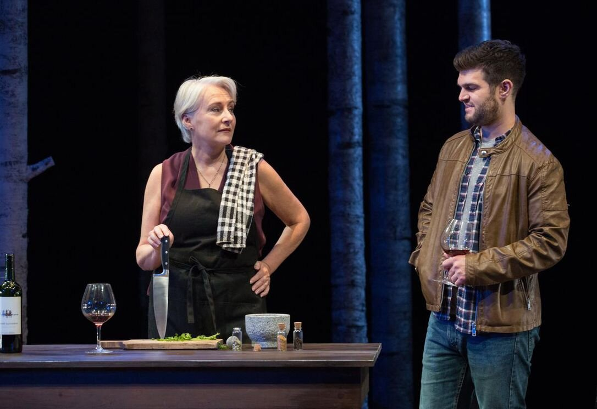
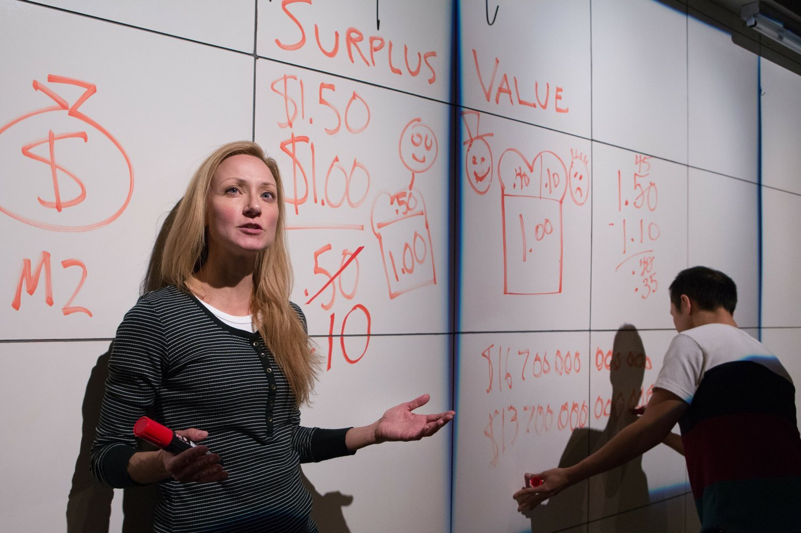
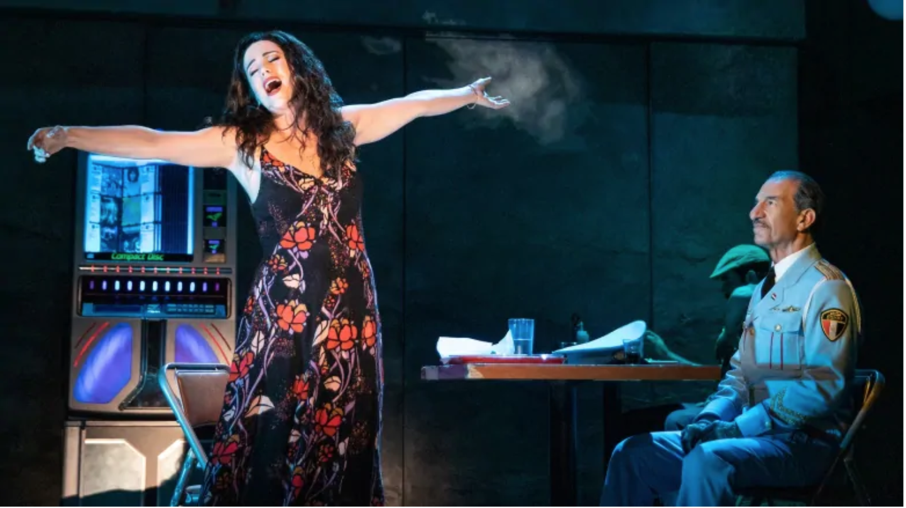

Seana McKenna in Yaga looked as if she were having the time of her life. It seems only fair. She was giving the audience the time of theirs.

*Seana McKenna and Will Greenblatt in Yaga (2019). Photo by Cylla von Tiedemann.*

McKenna’s roster of great performances, at Stratford and elsewhere, includes several successes in comedy. They were the work of a fine actress of impeccable technique. But they were technical. They didn’t come off as the expression of a natural clown, with the comic spirit in her bones. But in Yaga she was that spirit incarnate. She radiated joy, joy in what she was able effortlessly to accomplish. (Rather, she made it seem effortless; that’s the point.) This doesn’t mean that her technical mastery went into abeyance; on the contrary it glistened. But it came buttressed now with the priceless qualities of the understated and the unexpected. At one point in Kat Sandler’s play McKenna, playing an apparently legendary witch of Eastern European provenance, flicked off very fast and almost under her breath her opinion of some dwarfs who had once aroused her displeasure. The moment, catching me off guard, had me choking with laughter. Its memory can still make me chuckle.

Baba Yaga, to give her full title, was only one of five characters whom McKenna played in the course of the evening. She may not, strictly speaking, have been the protagonist, but she was the only person in the play who never got to interact with any of the others; all her speeches were monologues, directly pointed at the audience. They were the delirious highlights of the evening and of her performance. The role that found her closest to her normal comfort zone, and probably the most important one in terms of lines and plot-function, was that of a science professor (expert on witchcraft) in which she was admirably dry, dismissive and quizzical. But there were more kicks to be had from seeing McKenna break new sociological ground as a waitress at a diner (also dry and dismissive) and a truck driver (really a gas), and to see her topping it all off with a touching but never sentimental portrayal of a dementia victim.

Her two fellow cast-members, Claire Armstrong and Will Greenblatt, also played multiple roles, though with less virtuosity; Greenblatt’s changes were mainly of headgear, and the relevance of one of Armstrong’s characters remained, through no fault of her own, obscure to the point of bafflement. Blame the script. Sandler directed a vivacious production of her own play, one that got less entertaining as it went on. Part comedy, part thriller, part feminist spin on witchcraft, it ended up defeated by its own complications. The mystery thread gradually took over the proceedings, making them impossible to follow. The end parts managed to seem both rushed and drawn out. But there was always McKenna.

*Shannon Currie in The Jungle (2019). Photo by Cylla von Tiedemann.*

While Yaga was flying on the main stage, another outstanding female performance was lighting up the Tarragon’s back space. I’m referring to Shannon Currie in The Jungle, the taut and engrossing fable by Anthony MacMahon and Thomas McKechnie that borrowed a title and the germ of an idea from Upton Sinclair’s celebrated muckraking novel of 1905. Sinclair famously claimed that, in exposing the atrocious conditions in Chicago’s meat-packing factories, he had aimed at his readers’ hearts but ended up hitting them in their stomachs. The Canadian 2019 Jungle, presenting two young Torontonians trying to survive in precarious dead-end jobs, had its audience reacting not as consumers but as sympathisers (and likely, in many cases, as fellow sufferers). Currie played an illegal immigrant from Moldova; Matthew Gin played the second-generation Chinese Canadian who becomes her boyfriend and eventually her husband. Like the actors in Yaga, the two here played multiple roles. Or rather, they periodically stepped out of character to deliver tight little lectures, with wall-chart illustrations, on Marxist theory and its relation to the gig economy. Not the least striking aspect of these interludes was the revelation that Currie’s impeccable Moldovan accent (at least it had me convinced) was not in fact her natural voice. More important, though, was the conviction she brought to the scenes she played in character. In these she emphatically didn’t lecture; she stuck to the emotional facts. As she and her partner opted, independently of one another, to join the system they couldn’t beat, she conveyed despair, affection, strength and rage, all leavened by humour, while never acting in excess of the situation or of her relationship to the person she was talking to. She steered triumphantly clear of that all-pervading theatrical plague, the Curse of the Rising Inflection: the delivery that suggests that the speaker is personally furious at the person addressed, irrespective of their relationship and however innocuous the lines might actually be. For some reason, performances of which this is the defining note often attract rave reviews, though I’ve noticed that other actors are seldom fooled by them. Some of this anchorless aggression crept into Gin’s performance in The Jungle, though in his case the lapses came across as querulous rather than angry. For the most part, though, he was very good.

A further example of emotion kept triumphantly, even devastatingly, within the bounds of character and situation was Chilina Kennedy’s performance in The Band’s Visit, one of the fine series of off-beat musicals, heralded by Waitress, that Mirvish Productions brought us in the latter part of last year. Those who prefer to swim in the mainstream are currently being served by the same producers’ nostalgia trip through the greatest hits of what I like to call the Andrew Lloyd Schonberg era: Cats, Phantom, Les Mis, Miss Saigon – the era, that is, of singers wearing their lungs on their sleeves. When Kennedy played Evita at Stratford, she did something revolutionary: she played a particular woman rather than some generalised idea of rock-musical style. The same dramatic fastidiousness, allied to traditional showbiz smarts, informed the rest of her musical work at Stratford and Shaw (her Maria in Stratford’s West Side Story ranks as one of the best Juliets I’ve seen), and it lit up the jukebox bio that was Beautiful. Part of the appeal of her Carole King in that show was her depiction of joy bursting out of its shell. In The Band’s Visit the shell never really cracked; her achievement, most uncommon in a musical, was to show us a strong woman’s feelings, repressed through habit, but still luminously there and, as is proper in a musical, coming through most of all in song.

*Chilina Kennedy and Sasson Gabay in The Band's Visit (2019). Photo by Matthew Murphy.*

The subtlety of The Band’s Visit, a show about stranded Egyptian musicians finding unexpected sympathy in a small Israeli town (as if in a less demonstrative Come from Away) probably hurt it at the box office, but it was the best musical of the bunch. It was closely followed though, both in sequence and quality, by Girl from the North Country, a show that shouldn’t have worked. Dramatically it was an apparently self-sufficient collection of interlocked Great Depression melodramas whose distinguished author, Conor McPherson, elected to set them in Duluth, Minnesota. That’s the place, and within ten years of the time, where Bob Dylan was born, and it was the pretext for McPherson to intersperse the play with Dylan songs, mostly of tangential relevance to the dramatic context. McPherson himself, in his notes to the original (London) cast CD, rather gave the game away by saying that Dylan’s songs are so evocative that you can fit any one of them into any situation. By all the rules a song that fits anywhere is a song that fits nowhere; and there were times in this show when the lack of explicit connection between what was sung and what was spoken felt frustrating. Even as commentary, it was often vague. (And just who, among the female characters, was the girl from the north country? It could have been almost any one of them.) Yet, somehow, the script, the songs and the uniformly excellent performances fused to create a mood, one of smoky emotional and economic desperation leavened by a wit that veered from to savage: as if a minor Eugene O’Neill play had been given wings. McPherson’s dialogue and characterisation were nearly always on the money, and Dylan’s music was something of a revelation; I had never realised before how beautiful his melodies could be. (All right, so I’m decades late to the party. Sue me.) The heart-rending “I Want You” was especially affecting, though this may have had something to do with our knowing for once exactly who was wanted and by whom; here, for once, song logically followed scene, almost as if in a musical. In fact, Girl from the North Country must count as another jukebox musical, though one raised to a higher power.

Piaf/Dietrich is really another jukebox show, but again of superior cultural pedigree; after all many of its songs, and both of its subjects, were European: beat that for class. In fact, this was rather a ragged show, with a flashback structure that never flashed. It began by describing a rift between its two illustrious subjects, previously the best of buddies, and then never got around to explaining it, dramatizing it, or even referring to it. We went back to what the show assured us was their first meeting; Marlene comes backstage (in New York, yet) to prostrate herself before Edith’s talent and also to tell her to clean up her act (metaphorically at least). And there the relationship rested; it kept repeating itself, reinforcing my growing conviction that two-person shows are generally more static than one-person shows. (Yes, there were supporting characters in this one, but they were very supporting, even if one of them was Noel Coward.) But none of this really mattered, given the central performances. Louise Pitre was incandescent; the voice, the spirit of Piaf seemed to possess her from her first note, but this was still a creation, not an impersonation. Jayne Lewis had less opportunity as Dietrich, cast for most of the evening as sensible counsellor to her friend’s compulsive and compelling self-destruction; she also had to fight the handicap of being a better singer, as opposed to performer, than the woman she was portraying. But she did fine. There was, amazingly, no hint of professional jealousy between the two legends; in this respect they emerged as superhuman.

(A parenthesis on Anastasia: a show that seemed parenthetical in itself, occupying a halfway house between Mirvish’s big old ones and small new ones. It’s a staged version of the animated movie - Disneyfied if not actually Disney – about the most celebrated of the many women who claimed to be the Romanov princess miraculously spared from the Bolsheviks’ massacre of the Tsarist family. The action moved from the once-and-future Saint Petersburg, where Anna was discovered and groomed by a couple of left-over aristos, to Paris where she convinced the exiled Dowager Empress of her bona fides but then gave it all up in favour of true love. That’s what the show said. As Anna and her team arrived in the French capital, to give out with a euphoric number entitled “Paris Holds the Key to Your Heart”, I was left with the feeling that it must have worked very well as a cartoon. Cast with live actors, doing their best, it seemed hopelessly and haplessly opportunistic, grabbing at every cliché as it passed, and totally confused as to how grim a fairy tale it wanted to be. That the adaptation should be the work of the Ragtime team – Terrence McNally book, Stephen Flaherty music, Lynn Ahrens lyrics – almost defied belief. Joy Franz, from the original cast of Into the Woods, came out of it best, doing dignified work as the Dowager. Which returns us to our main theme…)

“Quiet Please, There’s a Lady on Stage” is the title of a song Peter Allen wrote about his mother-in-law Judy Garland. It’s also the umbrella label of a valuable series of concerts at Toronto’s Koerner Hall, featuring female singers. I saw two of these shows towards the end of the year, featuring three ladies between them. The first had Catherine Russell opening for Lizz Wright. Russell, the daughter of a bandleader, has carved out a niche singing generally offbeat songs from the 1930s, songs with a wily beat and with the witty or at least good-humoured lyrics that characterised the era. “You’re Not the Only Oyster in the Stew”, a song associated with (though not written by) Fats Waller, showed at her best, sly and vivacious. She also delighted me by uncovering another wry anti-love song of the period, one that to my amazement was new to me, “You Can’t Pull the Wool over My Eyes”; the title pretty much says it all. She’s a very good, captivating singer, if not quite a great one. Lizz Wright is a great singer; or so I thought during her first song: a slow, mesmerising version of “The Nearness of You” that she sang standing straight-up and stock-still as pulses stopped and breaths were suspended. After that, she got busier and, to my taste, less interesting, as one blues or gospel or R&B number succeeded another, commandingly but indistinguishably. I had, to my surprise, much the same reaction to Dee Dee Bridgewater, who had an evening to herself plus musicians, including a couple of back-up singers. Here lay part of the rub. Bridgewater is a commanding jazz or jazz/pop singer with eclectic tastes and talents. Her albums include tributes to Kurt Weill, Ella Fitzgerald and Billie Holiday (whom I once saw her act as well as sing, superbly, in a play at the Donmar Warehouse in London), so I guess I was hoping for an in-person repertoire that would draw on these and comparable sources. Her latest recording, though, is called Memphis – Yes I’m Ready, and it’s inspired by the town in which she was born and by its blues and soul traditions. Her concert was, more or less, her album live, and it’s probably my fault rather than hers that I found it monotonous. Bridgewater is one of the best singers of her sixty-something generation, and her skill and authority remain unquestionable, but I also thought this performance to be too strenuously a show, full of chat to the band or to the audience that sometimes came off as self-mocking but not often enough.
