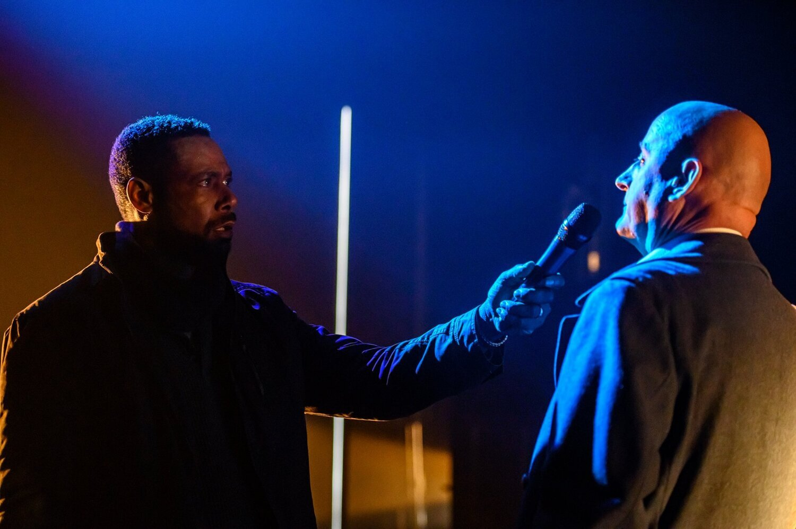

Jim Mezon plays Julius Caesar, in the play that bears his name, as a man of supreme assurance. He never bothers to hide his feelings or his opinions. This Caesar, when informing Mark Antony of his preference for being surrounded by fat people rather than thin ones, makes no attempt to keep it confidential. He actually seems to enjoy being overheard by Cassius, who’s Exhibit Number One on his list of skinny suspects, and watching him – or, in this production, her – seethe and writhe. Meanwhile Brutus, friend to both, stands by, uncomfortable but unreadable. The lines of force between the four characters are drawn exhilaratingly tight, the tensions at breaking-point. In scenes like this, and there are quite a few of them, Chris Abraham’s production (a joint presentation by Groundling and Crow’s) is the most exciting Shakespeare seen in these parts since the same director’s Stratford Othello.

We are brought very close to the action, physically and emotionally. The audience sits on four sides of the playing area, so we have Theatre in the Square, or Cockpit Theatre, or perhaps – given the amount of cross-gender casting – Cock and Hen Pit Theatre. This is a modern dress production, one in which Caesar is disposed of with revolvers instead of daggers, but it isn’t a nagging or hectoring one. It might well seem just as immediate if the actors were wearing togas. Contemporary parallels keep pricking the mind, but they’re never forced. We’ve all read of the production in Central Park a few years back in which Caesar was costumed and made up to look like Donald Trump, a simplistic notion that has always seemed to me to be paying the president an unmerited compliment.

*Dion Johnstone & Jim Mezon in Julius Caesar (2020). Photo by Dahlia Katz.*

The production’s most aggressive updating occurs outside the text, most of it before the first scene and after the last. We enter the theatre to find ourselves staring at and through a wire cage. Within it, in either a steal from or a tribute to Robert Lepage’s Coriolanus, sit a trio of newscasters who fill us in on the Roman political situation, with especial reference to Caesar’s defeat of his rival Pompey; we also learn something about the feast of Lupercal, information that’s illustrated, not too happily, by the appearance outside the box of a couple of actors wearing grotesque animal heads. But the stuff about Pompey is really helpful.

So it’s bemusing that the production proceeds to omit the play’s official first scene, the only one in which Pompey is actually mentioned. That scene shows a couple of pro-Pompey tribunes upbraiding a troop of pro-Caesar citizens for their fickleness and sending them slinking home. Cutting it makes for confusion in the next scene when we’re told that Marullus and Flavius (now who would they be?) have been “put to silence” for defacing Caesar’s statues. More seriously it deprives us of our first encounter with the Roman citizens whose reactions to the rival post-assassination speeches of Brutus and Antony in the Forum mark the turning-point of the play. Actually in this production we never do meet them, not really. Abraham refers in his program-note to “the invisible citizens” but they aren’t invisible in Shakespeare. Given his small if starry cast, it makes sense for Abraham to cut most of the crowd’s lines and have those that remain issue from a few voices dotted around the auditorium; he isn’t the first director to take this approach and he makes it work better than most. But it’s a shame to lose lines like those that so perfectly capture the fickle turning of popular sentiment: “If thou consider rightly of the matter, Caesar hath had great wrong.” “Has he masters? I fear there will a worse come in his place.” That last creased-brow sentence could come straight out of a vox pop TV show. The slimming-down does work scarily well, though, for the crowd’s lynching of Cinna the poet (Walter Borden, piercingly bewildered); he perishes at the hands of a few shadowy figures and it’s harrowing.

Zack Russell is credited with supplying additional text, so we must attribute the new prologue to him. He’s also presumably responsible for word-substitutions in the official script, most of them unnecessary. Why, for example, is the ailing conspirator Caius Ligarius (Walter Borden again, and just as distinctive) upbraided for wearing, not a “kerchief” but a “muffler”? The old word isn’t that obscure; the new one makes him sound like a car. Russell returns full-strength, after a few minor interpolations, for an epilogue in which all the actors return to tell us what happened to Rome after the battle was lost and won. They also take us back a few centuries to the birth of the Republic that now sits on the edge of destruction; most of this reminiscing is done by the long-deceased Caius Martius Coriolanus, played here in another Lepage homage and/or in-joke by his recent Stratford impersonator Andre Sills. The second half of Julius Caesar is notoriously anti-climactic, and it’s understandable that a director should want to send us home with a punchier conclusion, but this one is just talk. Besides it should be possible to make the written ending more powerful, more ominous, than it appears in most productions. Suppose Antony, rather than paying rote tribute to Brutus as “the noblest Roman of them all”, were to deliver the words a bit shell-shocked, as if it had only just struck him that this was the end of an era? Suppose Octavius Caesar, who ever since his first appearance has been coolly undercutting his older colleague, were to make his appropriation of Brutus’ funeral honours sound like an icy coup de grace: “Within my tent his bones tonight shall lie”? We should sense that this is the future Emperor Augustus. It shouldn’t take a rewrite man to tell us.

Julius Caesar is in fact a very dark play, one in which idealism leads to murder and to the defeat of everything the killers profess to stand for, and one in which a mob orator determines the future of a city. This production, at least in its first half, gets that excitingly right, its brooding menacing spirit owing something to Lorenzo Savoini’s set, more to his lighting, and most of all to Thomas Ryder Payne’s sound design. Caesar himself, often thought an impossible role, has in recent years occasioned a surprising number of notable Canadian performances: Geraint Wyn Davies, Allan Louis, Seana McKenna. But Mezon is the finest of all, a figure so confident in his authority that he has no need to be grandiloquent. His boasts actually make sense, and he can also be quite the domestic animal, consenting with an affectionate kind of condescension to his wife’s entreaties to stay home from the Capitol until flattery lures him, laughing, to his doom.

Dion Johnstone, thoughtful and bespectacled, is a fine Brutus whose principles visibly crumble even as he persuades himself that he still has them. Moya O’Connell plays Cassius more for spitfire envy than for twisted idealism (Caesar was right about that too); their temptation duet, rigorously charted with she feeling out his weak spots and feasting on them, shows the production at its best. So does Brutus’ scene with the other woman in his life, his wife Portia; Michelle Giroux endows her pleas (though here they’re more like demands) to be taken into her husband’s confidence with a conviction in which passion reinforces reason. It’s a shame that she should be deprived of her second scene, one in which she waits agonised for Brutus’ return from the Capitol; it proves that he did indeed tell her everything, and it prepares the way for her later suicide. But maybe it wouldn’t square with the production’s belief, outlined in that spurious epilogue, that she was motivated by anger rather than concern. It’s probably for the same reason that Brutus’ obviously heartfelt “you are my true and honourable wife” has been cut. Portia is also either the beneficiary or the victim of a brief interpolation explaining who her father Cato was. It doesn’t seem worth stopping the play for.

Giroux does though get to execute a smart double as the very minor senator Popilius Lena who for a second has the conspirators believing that they’ve been rumbled. I have never seen this moment so well done. Indeed the whole lead-up to the assassination, every nerve-end exposed, is brilliantly done, as is the killing itself. The first half ends, as in most productions, with Antony’s rabble-rousing funeral speech; though I sometimes wonder if it might not make sense to save it for the start of Act Two, which could use the lift. Anyway, Graham Abbey plays it from inside another cage; we see him through lateral bars that lend him and his words an ironic perspective. You never know where you are with Antony; is he calculating, or sincere, or both? Abbey opts for both. “Lend me your ears” is the desperate plea of a man straining to be heard. When he first describes the killers as “honourable men” I really thought he meant it. Gradually he realises the power of his words and of those words in particular

The highpoint of the play’s second half is usually taken to be the quarrel of Brutus and Cassius. It’s a great anthology piece. But in context it always seems to disappoint, perhaps because the friendship the two keep invoking has never actually been dramatized; they’ve been too busy conspiring. The gender-change doesn’t help; it’s one thing for a woman to play a man as a man (why not?); quite another for her to play him as a woman (why?). The dynamic is different, and the textual changes always sound awkward. When this Brutus addressed this Cassius as “sister”, I felt that it might have worked better if they had both been women. The battle scenes are efficiently done but by this point much of the spark has gone out of the performances.

However: if you want a definition of luxury casting, consider the deployment of Diego Matamoros in four minor roles, all done definitively. First, he’s the primary reporter in the new introduction. Later he switches between the smooth-tongued conspirator Decius Brutus and the other Brutus’ servant Lucius; in one scene this involves him in numberless quick changes as he scurries on and off announcing himself. Admittedly Lucius is meant to be a boy; I wasn’t quite sure at what age Matamoros was playing him, but I believed anyway. In between, for one scene only, he’s Cicero, encountered being imperturbable while walking home through a truly scary storm. In just a couple of short speeches he captures all the dry laconic intelligence that history and the other characters ascribe to him. It’s all there for the mining but I’ve never seen it done before. For once, when Cicero’s death is announced, it actually means something.
