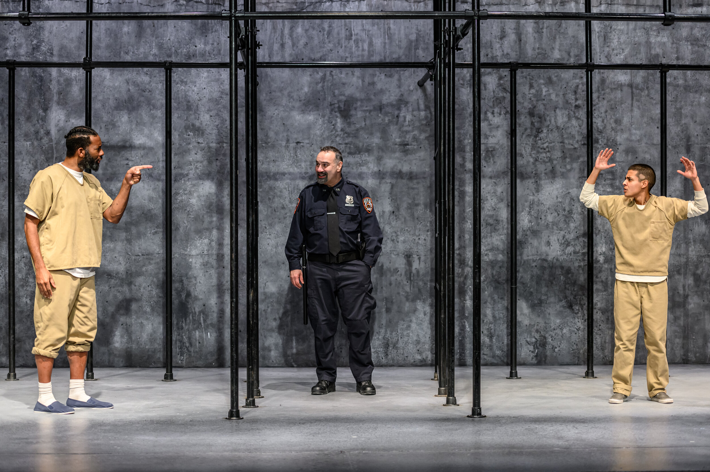
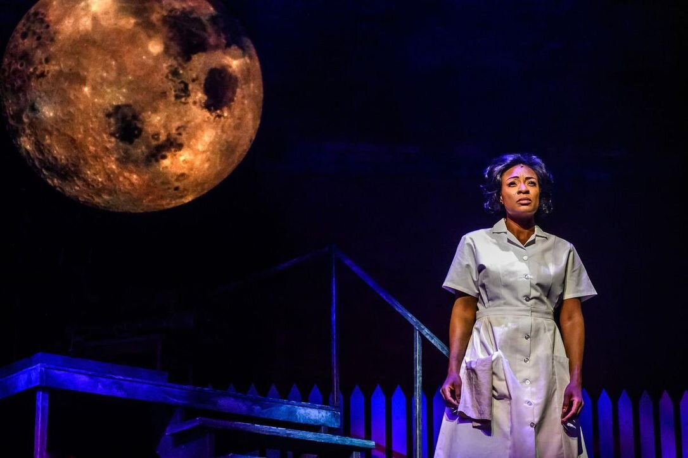

*Darren A. Herbert, Tony Nappo & Xavier Lopez in Jesus Hopped the ‘A’ Train (2020). Photo by Dahlia Katz.*

Angel Cruz, awaiting trial on a murder charge, is having trouble remembering the Lord’s Prayer. He stumbles repeatedly on the word “hallowed”; he tries “Howard be thy name” but somehow that doesn’t sound right. It doesn’t help that his fellow inmates, unseen but very much heard, keep yelling obscenities at him to try and get him to stop.

Lucius Jenkins, a convicted murderer doing time on New York’s notorious Rikers Island, could probably recite the Lord’s Prayer backwards. At any rate he can reel off the titles of all the books of the Old Testament in reverse order without missing a single prophet. What’s more he can do it while jogging in place. Lucius is serving a life sentence while facing the possibility of extradition to Florida where “life” means death.

Angel is thirty and Latino; Lucius is in his forties and black. They are the joint protagonists of Stephen Adly Guirgis’ Jesus Hopped the ‘A’ Train. The play jumps back and forth chronologically but the meat of it is a series of dialogues between the two prisoners in the adjacent open-air cages into which they are released from their solitary cells for one hour each day (which is why Lucius’ jogging has to be done in place). Angel was on trial for killing a cult leader, name of Reverend Kim, who had ensnared Angel’s best friend Joey. His defence is that he shot the reverend in the ass, which shouldn’t have been fatal, and it wasn’t his fault that, after a seeming recovery, the guy had gone ahead and died an unrelated death on an operating table. The jury didn’t buy it, apparently because both Angel and his state-appointed lawyer came off as over-confident.

Lucius doesn’t buy it either, and his aim in their conversations is to persuade Angel to acknowledge his guilt and come to Jesus. He’s a born-again Christian whose rebirth took a long time; he didn’t find God, as he says himself, “till I was forty-two; a suicidal, multiple homicidal drug addict starin’ down at Death Row”. Angel, who seems to have had a conventionally religious upbringing that he can’t quite shake, nevertheless resists Lucius’ admonitions; what right does someone guilty of far worse crimes than his own have to preach at him?

The ‘A’ Train comes in on one of the play’s other tracks. Angel tells his lawyer how he and Joey used to play on the subway rails when they were kids, and that on one occasion they miscalculated and found themselves down there with the train hurtling towards them. “We was paralyzed in a way that I juss can’t explain, till somethin’ blew us apart, jus’ blew us, and we landed safe….Joey said, ‘Jesus hopped the A train to see us safe to bed’.” It’s worth remarking, though, that this particular variety of religious experience never surfaces when Angel is talking to Lucius, giving him no chance to either accept or demolish it. We’re left with the feeling that both men, despite their different levels of faith, can invoke God as and when it suits them; as Lucius himself says “God just happens to be a very damn convenient individual.” But the argument between the two of them never really progresses, so the play feels static. Jesus Hopped the ‘A’ Train is an early Guirgis play, and it seems now like a way-station or perhaps subway stop en route to his masterpiece The Last Days of Judas Iscariot in which this Catholic-raised playwright (how lapsed, I don’t know) poses questions of sin, guilt, redemption and damnation on a panoramic world-historical scale.

What Jesus Hopped does have going for it, from the title on, is its language; the author cooks up a heady streetwise brew of piety and profanity, especially in Lucius’ speeches, both as a soloist and in duet. Darren A. Herbert seizes on them superbly, describing great verbal parabolas, never losing shape or meaning, never missing a beat – which seems appropriate in a text that sometimes sounds like hip-hop without the accompaniment. The script cheats, I think, in withholding until late the full atrocious extent of Lucius’ crimes. Angel’s we know from the start, so the field seems tilted against him. The imbalance is reinforced in Weyni Mengesha’s Soulpepper production by the disparity between the performers; Xavier Lopez is a good Angel but Herbert, who may be playing the devil, is great.

Angel and Lucius talk only to themselves or to one another. There are three other characters who each get to address the audience. Two of them are jailers, one nasty, one nice. The play is only incidentally an attack on the penal system – it stands self-condemned really – but Tony Nappo does a fine measured job as the warder Valdez whom it is tempting to describe as sadistic, except that his actions never quite follow through on his threats and insults (which admittedly are plenty humiliating in themselves). Valdez hates Lucius, perhaps with good reason; D’Amico, Valdes’ opposite number, likes Lucius and brings him Oreo cookies, a gift perhaps less innocent than first appears. Anyway his charity gets him fired, and so skilled and sympathetic is Gregory Prest’s performance that this news registers as one of the cruellest blows of the evening.. But he does return, to us if not to Rikers, for an expository speech that’s as affecting as it’s necessary.

Finally there’s Angel’s lawyer Mary Jane who, despite Diana Donnelly’s best efforts, never quite jibes with the rest of the play. She has her own conflicts, about how and whether to defend him, but they’re shown to us almost entirely in her narrative monologues, rather than in her interactions with him, so they play as distant. (And her standard English sounds pallid against the prevailing street speech.) She, like everybody else in the play, has her own agenda; but so does practically every character in practically every play, so that hardly makes a theme.

The jailhouse locale, with its contrasts of blinding light and oppressive dark, is summoned powerfully by Kevin Lamotte’s lighting and economically by the set designed by the ubiquitous Ken MacKenzie. On three successive nights I saw three plays with MacKenzie sets: Sweat, Casimir and Caroline, and this one; I liked his work on Casimir the best.

*Jully Black in Caroline, or Change (2020). Photo by Dahlia Katz.*

Jully Black, singer, makes a momentous acting debut in Caroline, or Change, revived from their 2012 production by the Musical Stage and Obsidian companies, with the same production team but a mostly new cast. Much of Black’s acting is in fact done through her singing, this being an almost through-sung show; you can hardly tell where Tony Kushner’s lyrics end and his sparse dialogue begins since both are rhymed, near-impeccably as regards both sound and sense.

The first notes sung are Black’s and they shiver your spine, not through volume but through intensity and restraint. She plays Caroline, the black domestic in a white Jewish household in 1963 Louisiana, where the basement in which she spends most of her time doing laundry is, we are metaphorically told, not just underground but under water. Black communicates with her body as well as her voice; her stance, her movements, are measured and composed. Caroline is patient and, it seems, traditionally pious, with anger simmering underneath. Thee rage comes to a boil in a second-act solo with which Black, perhaps even more than her fine 2012 predecessor Arlene Duncan, sets the theatre alight without ever resorting to the kind of self-indulgent audience-baiting histrionics designed to persuade theatregoers that they, too, got soul.

The show’s title is famously double-edged. It’s set in a time of change, the year of the first Kennedy assassination. But there’s also the small change that Noah, the boy of the house traumatised by the recent death of his mother, keeps leaving in his pants pocket and that Caroline conscientiously puts aside before proceeding with the washing. Rose, Noah’s new stepmother, suggests that Caroline keep the change, both to teach Noah a lesson and because she knows that Caroline, husbandless and with three kids of her own at home plus a longed-for son serving in Vietnam, could use the money. At first Caroline proudly rejects the offer; later, when a twenty-dollar bill turns up in Noah’s trousers, she takes it. Bitter strife ensues. The key word’s two meanings make another powerful pun, a structural rhyme to go with the verbal ones.

Some things in Robert McQueen’s production are less effective than before, some of them reflecting weaknesses in the show itself. It’s harder than ever to know that the anonymous singing and strutting figures who invade Caroline’s basement are meant to represent her washing machine and her radio. The fact that the basement is largely invisible in this re-staging doesn’t help, while the Motown trio doing radio duty seem more than ever like left-overs from Little Shop of Horrors. I could also do without the even more magically real figure of the Moon, majestically though Measha Brueggerosman sings her. The love-hate relationship between Caroline and Noah (Evan Lefeuvre), the love coming largely from his motherless side, is less sharp and less consequential than it was before. But Jeanine Tesori’s purposefully eclectic score, directed by Reza Jacobs, still sounds great and the general acting level is, if anything, even higher than before.

Deborah Hay, one of two holdovers from eight years ago, replants her frazzled Rose, trying to do right by everyone while secretly seething at all of them; this is a performance in which comedy and pain are perfectly balanced. Damien Atkins does wonders with her musician-husband who, unable to make contact with his son, retreats into playing his clarinet. The Jewish element, culminating in a riotous Hanukah sequence to klezmer accompaniment, is altogether strong, with Oliver Dennis and Linda Kash as the paternal grandparents continually appearing in quiet anticipation at the front door, and with Sam Rosenthal as the maternal one, an unreconstructed New York leftist who sees in the rising spirit of black protest the echoes of his own battles from the 1930s and who only wishes that they would be more militant about it. His hopes find something of an echo in Caroline’s friend and neighbour (Alanna Hibbert in the other repeat performance and an admirable one); more of one, though not quite as much as he’d like, in Caroline’s firebrand daughter Emmie, incandescently played by Vanessa Sears. It’s she who has the last words and the last tune, an epilogue billed as Emmie’s Dream. The dream is contrasted with Caroline’s reality; we last see her, without illusions but back in her old job, quiescently on her way to church. The show’s choice of titles is also a choice of paths. You can be Caroline; you can be change. I imagine that Kushner, who drew the play from his own Louisiana childhood, loves Caroline (he’s apparently still in affectionate contact with her original) but advocates change. But he doesn’t judge.
