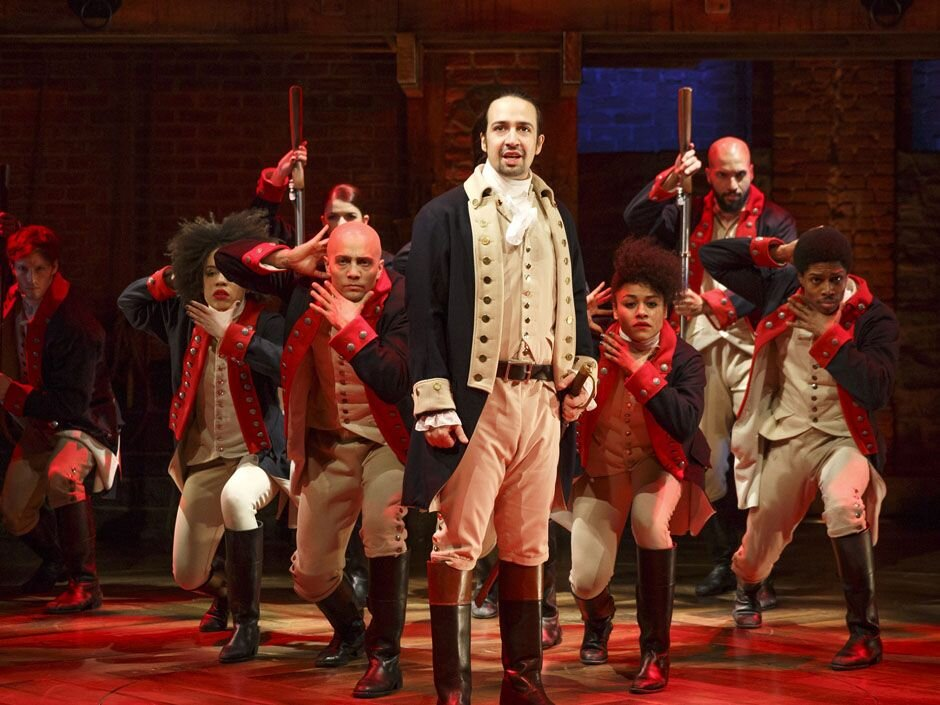

Since 2016, when Hamilton: An American Musical opened on Broadway, I have written about the show three times. Here, in chronological order, are those three articles. The first, after seeing it early in its New York run, is an examination of the piece itself and its place in the history of the musical. The second is a review of the original cast album. The third, written especially for this site, looks at the touring production that arrived in Toronto in February 2020.

*Lin-Manuel Miranda and the original cast of Hamilton at The Public Theatre (2015). Photo by Joan Marcus.*

The historic role of the American musical has been to tell stories about America. They don’t have to be true stories; they can be rooted in national legends or they can just reflect united states of mind. But, every so often, Broadway hosts a show that puts on stage some crucial part of the nation’s own recorded past. It’s doing so now, to huge acclaim, with Hamilton, a musical biography of one of the less celebrated of the founding fathers. Less celebrated up to now, anyway: Lin-Manuel Miranda’s show, with a score built on hip-hop rhythms and hip-hop wordplay, may be turning him – or re-turning him - into a household name.

Miranda, a 35-year old whose own lineage is Puerto Rican, wrote the show’s book, music and lyrics; he also plays the title role. To find a similar quadruple threat, you have to go back to one of the musical’s own founding fathers: to George M. Cohan, who flourished at the beginning of the twentieth century. (Actually Cohan went two better than Miranda; he directed and sometimes produced his shows as well.) The two share more than versatility. Cohan’s best-remembered songs include “Give My Regards to Broadway”, “The Yankee Doodle Boy” (‘I’m a Yankee Doodle Dandy’), and “Over There”, the definitive First World War whoop. His stock-in-trade was a jaunty jingoism; he was famous for draping an American flag around himself while performing. Ethnically, he was an outsider: Irish-Catholic, though his surname inevitably led some people to think he was Jewish. In fact, he and Miranda, at opposite ends of the musical’s history to date, are among its few major Gentile composers.

Cohan didn’t write historical musicals (though one of his shows was called George Washington Jr ) and his patriotism was never what you would call subtle or ironic. Miranda’s is, obviously, both. But his show is very much a celebration of America. Its national symbol is not a flag but a banknote. Alexander Hamilton, Washington’s aide-de-camp in the War of Independence, later became America’s first Secretary of the Treasury, the face on the ten-dollar bill. Or, as he himself sings or raps it in the show, he’s a ‘Ten-dollar Founding Father/Without a father.’ Hamilton really was an outsider: born out of wedlock, on the Caribbean island of Nevis to a French mother and Scots father. Or, as Aaron Burr, America’s third Vice President and Hamilton’s historical and theatrical nemesis, puts it, ‘the orphan, bastard son of a whore and a Scotsman.’ Burr was of old Puritan stock; how, he bitterly wonders, could so blatant an intruder as Hamilton, have got so far, so fast?

The musical’s answer seems to be: by being blatant. And it exemplifies its own theme. ‘Immigrants!’ exult Hamilton and his fellow revolutionary warrior the Marquis de Lafayette, ‘we get the job done.’ It’s a line that rocks the Richard Rodgers Theatre. The American musical itself is largely the creation of immigrants (if seldom of first-generation immigrants like Secretary Hamilton). One of the key American shows is Fiddler on the Roof; which of course is set far from America, but which depicts people who, as the curtain falls, are making their refugee way to a country in which they will eventually fashion entertainments like the ones we’ve been watching. Fiddler was the first major show in which Jewishness was a subject rather than a code. It gave us Jews played by Jews, or by actors who could pass. Hamilton gives ethnicity an extra, dizzying spin. Its characters, basically the men who made the American revolution and the women who loved them, are white. Only one of the performers is.

Miranda, a charming and funny performer in his own right, is Hispanic. Most of his colleagues are Black. That includes the actor playing Burr, and those playing the fine Virginian gentlemen James Madison and Thomas Jefferson. The show makes sparing mention of slavery, but the subject looms and the casting bites; Daveed Diggs, the rapper-turned actor who plays both Lafayette and Jefferson, is terrific. In the matter of racial casting as commentary, the show’s most obvious antecedent is the 1976 Stephen Sondheim-John Weidman masterpiece Pacific Overtures, whose subject was the American “opening up” of Japan to Western trade and culture in the nineteenth century, and whose style was a hybrid of Japanese and Broadway traditions, As the undeclared conquest continued, the staging and the music became more westernised. The cast was all Asian, and so were most of the characters. But the same actors also played the American and European invaders, and they presented them in stylized Kabuki fashion. The audience was jolted into a new look at its own history: just as in Hamilton.

The resemblances between the two shows are sometimes closer than I’d expected. A highlight of Pacific Overtures is the magnificent “Someone in a Tree” in which four outsiders offer contrasting, partial accounts of what may have gone on at a closed treaty conference. The most exciting number in Hamilton is “The Room Where It Happens”, in which Burr, like a frustrated Iago, rages about all the high-level wheeler-dealing from which he is shut out. Like its predecessor, this song grows in intensity as it proceeds, spurred on by its staging; the reviews of Hamilton hadn’t prepared me for the brilliance of Andy Blankenbuehler’s choreography, an almost ceaseless but never excessive swirl, precisely keyed to the beats.

The one character for whom the staging stands comparatively still, the only one who habitually gets the stage to himself, and the only one to be played by a white actor – in this show’s terms, the outsider – is King George III who periodically appears to tell his ungrateful former subjects how much he loves them and how much they’ll miss him when he’s gone. (He may have a point. The audience certainly welcomed him every time he came back.) In the meantime, he has a nice line in purring, playful threats: ‘When push comes to shove/I will send a fully armed battalion/To remind you of my love’. Compare Sondheim’s British envoy, buttering up the reluctant Japanese, Gilbert and Sullivan style:

‘We don’t foresee that you will be the least bit argumentative –

So please ignore the man of war we brought as a preventative.’

Miranda has his own shout-out to G&S – George Washington calls himself the very model of a major-general and rhymes it with ‘men are all’ which Miranda has claimed, accurately, to be a truer rhyme than Gilbert’s ‘mineral’ -, but his King George sings in a different style: like a genteel pop star from, fittingly enough, the British Invasion. So the score isn’t all hip-hop.

As Sondheim himself has pointed out, part of Miranda’s strength is his awareness of musical-theatre tradition: the mutual reinforcement of words and music. The classic American musical grew up alongside the classic American popular song, flanked by jazz. Immigrants, or the children of immigrants, got the job done, revelling in the American language both verbal and musical, bending it to their will. For about fifty years, theatre music and popular music were practically synonymous. Rock changed that, downplaying lyrics or making them impenetrable, either way rendering them useless for telling stories or developing characters. Rap can seem similarly self-enclosed, but it’s generally rooted in specific people in specific circumstances (like country music, which can also work theatrically), and it can move from soliloquy to conflict – or, at least, to warring soliloquies. Miranda’s earlier show, In the Heights, pointed the way, and Hamilton follows it, finding in hip-hop’s insistence a mirror for the assertive irreverence of the revolutionaries themselves. ‘I’m not throwing away my shot’ cries Hamilton at the show’s start, and the image pursues him and us until it resolves itself in the duel that ends his life: shot by Burr. That’s the overarching pun in a show that’s full of them. The rhymes can seem relentless and my own ears rebel at the ones that aren’t true, but mostly Miranda uses the form to restore the musical to its lost tradition of wit: the tradition that was almost destroyed by the humourless pop operas and hardly restored by the spoof shows whose only joke is themselves. Miranda, like the Sondheim of Pacific Overtures and Assassins, applies the lightest of touches to the weightiest of subjects, without ever cheapening them, and with real music going on underneath.

One other, related, thing: Hamilton is a New York musical, as the smartest shows have traditionally been, ever since Cohan sent his regards to Broadway. New York is where Hamilton, before getting embroiled in war and politics, began his career as a lawyer, and it’s the place to which the show keeps returning. It’s the town that shows like Guys and Dolls, to take the most exalted example, have turned into a mythical place, a city that, by laughing at itself, has created its own legend: a core part of the larger national legend. Hamilton itself knows this, knows its place in the tradition, in all the traditions. It says so in its full title which, as displayed on posters and program-covers, is deliciously double-edged. The title is Hamilton: An American Musical.

The musical Hamilton is a phenomenon. That’s evident at the Richard Rodgers Theatre in New York, and also on the cast album, a double CD on Atlantic., There are phenomena among American musicals and there are hits and there are classics; the categories are not identical though they can overlap. Phenomena are shows that create box-office frenzies and are also felt to have changed the form in some way. Examples are Show Boat, Oklahoma!, A Chorus Line, Hair, Rent: honourable mentions to My Fair Lady, which was nobody’s idea of a game-changer but which conquered the world by doing the expected things with extraordinary grace and assurance, and to West Side Story which really did shift the ground under Broadway’s feet but was only a modest commercial success on its first run.

Phenomena don’t necessarily endure. Hair has proved to be ephemeral and the same may well prove true of Rent. On the other hand, take Guys and Dolls and Gypsy, two shows that bookend a decade (Guys and Dolls was first staged in 1950 and Gypsy in 1959) and that also go pleasingly together on alphabetical lists; they even share a subtitle, both being billed as “A Musical Fable.” When they first appeared they were greeted merely as good shows, at a time when good shows seemed plentiful; they have turned out to be the most revivable musicals of all. They’re classics. Then there are the shows for which Stephen Sondheim wrote music and lyrics and which slice through the categories; some made small profits in their first productions, others lost, but collectively they are thought to constitute a revolution. And they keep coming back, even to Broadway.

Commercially Hamilton, the hip-hop show about a Founding Father, is clearly a phenomenon. To call it a hit is almost to insult it; tickets for its New York run are changing hands at thousands of dollars apiece. (The cheapest unscalped seats go for $130US.) Could it become a classic? I think it might. Like Hair and Rent, its rock predecessors, it uses a current pop style; unlike them it doesn’t give the impression that its creators decided on the style and then went looking for a story on which to hang it. (Hair never found one.) Hamilton feels as if the story came first. Lin-Manuel Miranda, who wrote it – book, music, lyrics – and stars in it, says in interviews that he read Ron Chernow’s biography of Alexander Hamilton and knew immediately that he wanted to musicalise it. He also says that hip-hop (“my generation’s music – it’s only a little bit older than me”) was the way to do it, because it’s an outpouring of words, and that Hamilton’s life and career, his whole energy, were built on words: they made him and they destroyed him.

Here it seems obligatory to quote the first words of the score:

‘How does a bastard, orphan, son of a whore and a/Scotsman, dropped in the middle of a forgotten/spot in the Caribbean by providence/impoverished, in squalor/grow up to be a hero and a scholar?’

The lines are sung, spoken, rapped by Aaron Burr, the man destined to kill Hamiton in a duel. They convey information, at high but comprehensible speed, about their subject and also about the man who says them. Burr was vice-president; Hamilton had been secretary of the treasury, founder of the American financial system, George Washington’s right-hand man in peace and war. Burr and Hamilton had been occasional allies, life-long rivals. The biographical number is taken up by two more of Hamilton’s enemies, Thomas Jefferson and James Madison, as well as by Hamilton’s wife Eliza and by George Washington himself. Love him or hate him, they all speak his language. We don’t hear from the man himself until Burr asks ‘what’s your name, man?’, and Miranda himself steps forward and says, with unassuming confidence, ‘Alexander Hamilton’. The night I saw the show, a week after the opening, we all broke into applause. Partly this was because the moment, built up so cunningly, was so quiet yet so devastating when it happened:.an anti-climax that was also a climax. Partly it was because the buzz around the show had prompted us to cheer the man who created it. He deserved it.

The moment still comes through on the CD, which makes up in presence and clarity for what it loses in visual appeal. (Hamilton is an exceptionally well-staged show, economically spectacular. Even bits that look merely frenetic on YouTube pan out when seen whole.) It will probably still be a good show without Miranda, but it will not be quite the same show. His charm and his energy suffuse it. Still, the most important part of that energy is its passion for its own narrative, and that will survive. Every number forwards the story. In this very important way Hamilton is not so much an innovation as a return to first principles; it’s a rebuke to the pop-operas like Les Miserables in which the songs solemnly tell us things we already know and the story has to be conveyed in the tuneless bits of quasi-recitative that come between them. Another thing Hamilton has, that those things lack, is humour.

This is most obviously present in the three solo appearances of King George III, singing in carefree early-Beatles style, at first about how much the rebellious colonials will miss him when he’s gone, and later about his reaction to Washington’s resignation: ‘I wasn’t aware’ sings the hereditary monarch ‘that was something a person could do’. And he concludes ‘They will tear each other into pieces. Jesus Christ, this will be fun!’ (I suspect a hat-tip here to Sondheim’s Company: ‘It’s not so hard to be married/And, Jesus Christ, is it fun.’ ) George’s numbers are set-pieces, but other laugh-out-loud moments come, in the musical’s best tradition, from apparently innocuous lines dropped into the right context: Hamilton’s first flights of oratory elicit the deadpan response: ‘let’s get this guy in front of a crowd’.

There’s great wit, too, in the casting; with the notable exceptions of the Hispanic Miranda, and of Jonathan Groff who plays the king, this show about the beginning of America has a Black cast. Jefferson, the slave-owning founder recently returned from ambassadorial duties in France, has the most infectious r&b number in the show, “What ‘d I Miss” (‘I’ve been in Paris meeting lots of different ladies/I guess I basic’lly missed the late eighties’). The score, contrary to some of the composer’s assertions, is at most only fifty per cent hip hop; it can even change styles within a single song. Daveed Diggs, who plays Jefferson, doubles as Lafayette whose ‘immigrants: we get the job done’ may be, coming from this composer, the show’s most resonant line Its greatest traditional theatre number, surging and torrential, is “The Room Where It Happens”, the jealous Burr’s outsider’s complaint about the political deals that get made behind closed doors; it’s a perennially topical subject, and Leslie Odom Jr’s Burr actually comes over better on disc than on stage. So do the more romantic or contemplative songs involving the hero’s wife, mistress, and adored sister-in-law; or maybe it’s just that they’ve grown on me. Other fine and adventurous composer-lyricists have appeared in the last couple of decades (Adam Guettel, Jason Robert Brown) but none have broken through in the way Miranda has. A Chicago production is currently in the works, but there`s no word on when we might expect to see the show in Canada. The CD is great but it isn`t the same. Take it from me: you wanna be in the room where it happens.

In case you haven’t heard: the musical Hamilton begins by asking of its central character how ‘a bastard, orphan, son of a whore and/a Scotsman, dropped in the middle of a forgotten spot in the Caribbean” could “grow up to be a hero and a scholar?’ The question is posed, rapped, by Aaron Burr whom we may assume, if only in retrospect, to be motivated by jealousy; at any rate he proves to be the hero/scholar’s lifelong rival and ends up killing him in a duel. Burr’s question is answered by other early American worthies, hip-hopping us through the protagonist’s youthful biography; we may note, though probably not on first hearing, that the one who mentions ‘slaves being slaughtered and carted away’ is Thomas Jefferson who should certainly have known. Jefferson is played by a Black actor; in fact all the characters save one in this chronicle of the birth of a nation are played by hyphenated Americans, Black, Latin or Asian: a casting conceit that is by turns ironic, bitter, and uplifting.

The opening number builds and builds and so does the tension. Then it’s released. An unassuming and previously invisible young man, in response to Burr’s needling question ‘what’s your name, man?’ says or rather sings, quietly, ‘Alexander Hamilton’. And it brings the house down. Partly because, after all that noise, it is so quiet.

It manages – he manages – to sound bashful and assured at the same time. I wouldn’t say that bashfulness is a feature of the show as a whole but assurance most certainly is. Seeing it for the second time, I was impressed above all else all by its authority. It always seems to know where it’s going and how to get there. You hear it in Lin-Manuel Miranda’s score which draws on multiple pop sources and turns them into show music. You see it in Andy Blankenbuehler’s brilliant innovative choreography which, like the music, hardly stops; gyrating or battling bodies take over every inch of David Korins’ plain and adaptable set, which is in the ramped and timbered style that used to be obligatory for productions of Shakespeare’s histories. Hamilton ends by asking of its now-deceased protagonist ‘who tells your story?’ In Thomas Kail’s production, everyone and everything does.

The story told is of war and peace, war before the intermission, peace after it; though peace turns out to be, as was said of diplomacy, war by other means. We watch Hamilton covering himself with glory as George Washington’s aide-de-camp in the American War of Independence; we then see him navigating the trickier shoals of partisan politics before there were even parties. He establishes the new country’s financial system, getting little thanks and fierce opposition in his lifetime and fulsome tributes after he’s gone. On another level, finance is what undoes him; he falls victim to a blackmailing scheme, precipitated by his extreme susceptibility to beautiful women; we’ve been told early on that Martha Washington named a feral tomcat after him. (‘That’s true’ says our hero in one of the few, and thereby effective, spoken lines that dot the evening.) And we’ve seen him paying court to two of the rich and intelligent Schuyler sisters, of whom one becomes his lifelong confidante while the other becomes his wife. The show gives us a third sister as well, but she seems to be there mainly to complete the trio. “Look around” sing the three sisters as they venture, star-struck but clear-eyed, into glamorous dangerous New York when it was actually new. They reprise the phrase in various contexts throughout the evening, and it seems more haunting, musically and verbally, at each recurrence.

Repetition and expansion bind this show together. There are three duels spread out across the evening, culminating in the fatal one between Hamilton and Burr. (No spoiler there; Burr ‘fesses up in the opening number.) The fact that ‘Burr’ rhymes with ‘sir’ furnishes a running gag that becomes less funny, more ominous at each repetition. The show starts with rap, and keeps returning to it, but to call it a rap or hip-hop musical is to underestimate it. Rap has obviously nourished Miranda’s talent for meaningful wordplay but that talent spreads here through multiple styles, occasionally overreaching itself as in Angelica Schuyler’s ‘You want a revolution? I want a revelation’ which is pop-song glib. The score is rife with verbal homages to earlier theatre composers, from Noel Coward (likely unconscious) to Rodgers and Hammerstein (definitely conscious). Of the three most immediately effective numbers one is infectious rhythm-and-blues: Jefferson’s “What’d I Miss?”, on his return from Paris to join America’s first cabinet and to make trouble for our hero. King George III’s “You’ll Be Back” is, with delicious irony and as everyone has noted, pure British Invasion, musically a virtual paraphrase of All You Need Is Love though with a lyrical bite that’s far beyond it. (I never believed The Beatles meant that song seriously anyway.) And “The Room Where It Happens”, Burr’s musical paroxysm over being perpetually left out, is a traditional Broadway show-stopper, with a percussive thrust that Frank Loesser or Cy Coleman might have claimed for their own, though with politicised lyrics that echo the Sondheim of Pacific Overtures (an acknowledged inspiration) and Assassins.

Somewhat unconventionally, all three of these knockout numbers appear in the second half, two of them for the first time, George’s as a reprise that, as reprises should, tops its previous iterations. (On Washington’s retirement from power: ‘I wasn’t aware that was something a person could do’. Though he should have checked his English history; at least one of his predecessors had abdicated, admittedly under duress.) In fact I found, this second time around, that the second act, with its mordantly rendered political in-fighting and its poignant person tragedies, wore better than the first with its battles and its hope.

The show as a whole, though, is less enjoyable in the road-company production that’s come to the Ed Mirvish than it was in New York. This may have to do with the subject-matter seeming less urgent than it did in its country of origin. (The producers tactfully acknowledge this by dropping the subtitle “An American Musical” for Toronto and presumably for other un-American locations.) But it has more to do with sound-and-performance levels. On the Toronto first night the reception, for a show so eagerly awaited, was surprisingly tepid; people applauded when they were supposed to but they didn’t go wild; there was the statutory standing ovation at the end but just one curtain call. With only one preview behind them the orchestra swamped the singers while also sounding pretty swampy itself. In a show as verbally dense as this one, that’s a serious handicap. As for the performers: obviously it isn’t Joseph Morales’ fault that he isn’t Lin-Manuel Miranda. I was lucky enough to see Hamilton a week or so into its Broadway run when it was just on the verge of becoming a phenomenon. So when Miranda as Hamilton let out that opening line of his, the house fell apart; we were saluting both the character and the creator, thrilled to be on their team. And how often is the author also the star? We applauded Morales too, and in fact he gets the blend of modesty and assurance in that line exactly right, but of course it can’t be the same. Morales has abundant boyish charm, and it carries him through the opening scenes when Hamilton is the new kid in town, but he can’t muster the confidence, the charisma, for when he becomes a powerful man among men. Jared Dixon’s Burr is okay, though “The Room Where It Happens” lacks its proper dynamism; Marcus Choi’s Washington is better than okay, better in fact than the Broadway original. There are also a couple of outrageously overdone performances that come near to destroying great material: Warren Egypt Franklin, self-admiring and vocally incoherent as Jefferson, does in fact destroy “What’d I Miss?”; Neil Haskell doesn’t destroy King George’s three numbers, since they’re indestructible, but his flouncing around certainly spoils them.

The English king, admonishing the ungrateful colonials not to ‘change the subject/cuz you’re my favorite subject’ is the only non-American character in the show (the Marquis de Lafayette must count as honorary American) and the only one to be played by a white actor: a witty and satisfying rounding off of the casting pattern. The famous line about immigrants getting the job done was greeted politely but didn’t raise the roof; by contrast a previously unremarked but now timely reference to a quid pro quo received plenty of enthusiastic chuckles. You take ‘em where you find ‘em. The musical is a stylised form, almost by definition, and this one invents its own conventions to go along with the ones that come with the territory. But it never goes meta-theatrical on us. It sticks to its story. In more than one sense, it makes history.
