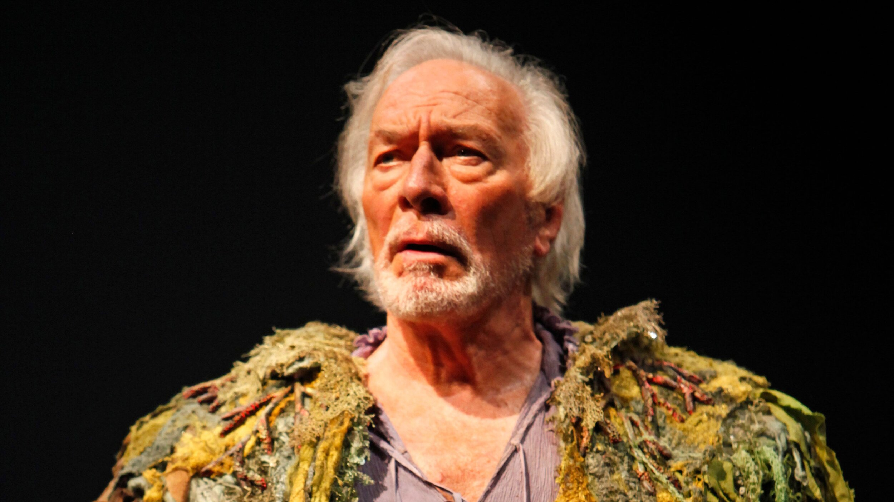

Christopher Plummer may have been the first internationally recognised Canadian actor. I say “may have been” because there were probably some lurking in Hollywood before he appeared in the 1950s. Nobody was talking about them in those terms, though. But as early as 1958 Kenneth Tynan in the New Yorker was describing Plummer as this “saturnine” young Canadian, in reviewing his Broadway breakthrough as the Devil in J.B., Archibald MacLeish’s update of the Book of Job. It was just a couple of years after his Henry V at the Stratford Festival, another breakthrough, to homeland stardom, that was also a debut. And it was just a year before his Stratford Hamlet.

Just a couple of years after that he was headlining at another Stratford, the English one. Note that the Royal Shakespeare Company at this time was rigidly hierarchical and that young Plummer was billed second only to Dame Edith Evans, who played Margaret to his Richard III. He also played Benedick in Much Ado About Nothing, directed by Michael Langham: an arrangement that had been very successful in Canada but proved less so in England. His crookbacked Richard though was generally reckoned a triumph, prompting comparisons with Laurence Olivier. He was slated to play Mercutio in Romeo and Juliet but that didn’t happen; instead he was whisked to the RSC’s London outpost to be King Henry II in Jean Anouilh’s Becket: a role for once that he got to before Olivier and the first in which I ever saw him. Even as premonition the Olivier resemblance persisted: both actors were light-heavyweights, both swashbucklers. Every part Plummer played at this time had an element of self-mockery, sometimes as part of the character, sometimes as commentary on it. It led him, back at Canada’s Stratford, to the ultimate swashbuckling role, and also the ultimate in self-satire, the long-nosed cavalier and poet Cyrano de Bergerac.

I can’t speak personally to his early Stratford performances, a dozen years of them, but it seems that he grew increasingly his own man (though I can testify that he could still do a barking and wickedly accurate Olivier impersonation in conversation, switching it unpredictably on and off). He was then absent from the Festival, and essentially from Canada, for some thirty years. His career was mostly American and, most prolifically, Hollywood. The catalyst, as all the obits have testified, was the film of The Sound of Music about which he was famously (and rightly) disparaging for many years. It’s probably true that his Captain von Trapp is still the performance by which he’s best known. But it’s far from the best; and, by the way, all those renditions of Edelweiss that have been played in tribute, are fraudulent; his singing was dubbed. His great movie work came at the end of his career when he, an ageing lion, was playing other ageing lions. It started with his graceful Mike Wallace in The Insider, followed by his fearsome Tolstoy in The Last Station. Almost at the end came his mischievous dying author in Knives Out, much the best performance in an otherwise overrated film. While all the actors around him were striving mightily and noisily for wit, he alone offered the real unforced and authoritative thing.

Maybe that’s because he was still a creature of the theatre and had returned, intermittently but in spectacular fashion, to Stratford. He was always the Festival’s favourite son – as I, having by this time moved to Canada, was able to bear witness. There was a way-station in the form of a Macbeth, with Glenda Jackson as his Lady, that played in Toronto and New York; the role had been his only failure in his earlier Stratford years and was scarcely more successful now. But it did show him to be still a masterful verse-speaker or, better, verse-actor. Then, both on Broadway and at Stratford, (not to mention a try-out in Boston where I first interviewed him) came Barrymore, virtually a one-man show, that allowed him to pay tribute to the grand-daddy of all the “two-fisted theatrical drinkers” (his own term) in whose company he had once belonged and from which, uniquely, he had been able to escape. It showed off his undiminished theatrical chops and - above all - his roguishness. From now on, as I have written before, everything he did would be done with a twinkle, even Lear and Prospero.

That “even” shouldn’t really be necessary; I don’t know of a great tragedian who wasn’t also a great comedian. But he took the double identity further than most: witness the supreme urbanity of his Julius Caesar in Caesar and Cleopatra, a Stratford Shaw between the two Shakespeares. If I may be permitted one more invocation of Olivier: the only time Sir Laurence actually moved me – really made me cry - was with his frail late-life King Lear on television. Plummer, more than anyone, made me laugh. His harrowing “howl, howl, howl, howl” at the end of the play was balanced by his knowing “heh, heh, heh” at its beginning. He went on to propose a loyalty test from his daughters that was practically a set-up, and to forget the name of one of the suitors for his youngest. These intimations of Alzheimer’s in no way diminished the house-stilling impact of his fury when she refused to play ball, which in turn did not inhibit him from interpreting the “authority” to which the faithful Kent pays homage as “a homespun off-handedness”. The fact that his director, Jonathan Miller, was both a doctor and a comedian probably helped with the mood-swings. Anyway this wasn’t just the Return of Christopher Plummer. It was a very complete and human performance.

His Prospero in Des McAnuff’s production of The Tempest was more the Plummer Show; switches from tenderness to anger in the play’s succession of expositions were very impressive, though the later scenes lacked an acknowledgment of the banished duke’s urge for revenge or of the psychological cost of relinquishing it. Technically though, it was still impeccable. Far-flung theatre star and movie star, Christopher Plummer was Canada’s thespian ambassador to the world.

*For my longer assessment of Christopher Plummer’s life and career, here's a link to an award-winning article I wrote for the Walrus when he was a mere 80 years old

https://thewalrus.ca/such-stuff-as-dreams-are-made-on/
