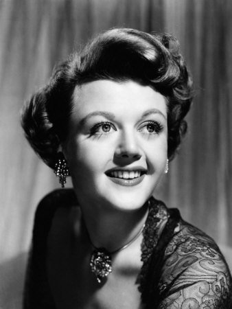

Angela Lansbury taught me the meaning of star quality. I had read about it, wondered about it, but never felt the white heat of it until I saw her play Mama Rose in Gypsy at the Piccadilly Theatre in London in 1973. She had been building the character, solidly and wittily, through the evening, and her singing voice, in a score constructed for Ethel Merman’s wall-shattering belt, seemed to grow stronger with each song. But the real greatness came in her closing number, “Rose’s Turn” , in which Rose, the ultimate showbiz mother, lets out all her frustration about standing in the background, watching her two daughters basking in a spotlight that she thought should rightfully have been hers. She goes into a show-stopping routine of her own which Lansbury performed with an intense unforced authority unlike anything I had ever seen in a musical before. Naturally she got an ovation. But through it all she kept staring at us, bowing for us, the theatre audience, as if we were the imaginary audience for whom her character had been performing. Nothing broke that spell until her daughter, the star stripper Gypsy Rose Lee, walked on for their last scene together; it snapped and she snapped out of it, briskly and unsentimentally (“If I could have been I would have been, and that’s show business”) It was the crown of a great performance, one that won her that year’s London critics’ award for Best Actress. Not just Best Actress in a Musical: Best Actress.

I was one of the reviewers who voted for her. 1973 was my first year as theatre critic of The Observer and Gypsy was one of the first shows I covered. Flushed with my new position, I decided I wanted to meet this lady. I wrote inviting her to lunch; she wrote back, asking if she could phone me. When she did, she began by saying “I believe we have a mutual friend, Stephen Sondheim”. That seemed like a good start, and lunch – at an old-fashioned Soho bistro – was duly arranged. We met as strangers and left as friends.

I’d always known I’d like her, just from seeing and reading about her, and she turned out to be what I’d expected: brisk and warm and unpretentious without being mock-modest. Her down-to-earthness had, I like to think, something to do with her London roots; her grandfather was the great Labour politician George Lansbury. Angela’s voice, in person and on the phone (she never had to identify herself) was warm, clear, bell-like. At some point in that first meeting, it transpired that she and my girlfriend (now my wife) had interests in common. So, a meeting between the two of them was set up. Angela told me afterwards that they had “merged.” Arlene came back from their meeting saying “Angela Lansbury must be the nicest person in the world”.

She certainly was to us, she and her husband Peter Shaw. Once, when we were visiting New York and a hotel was out of our reach she offered us her apartment – well, actually her daughter’s apartment - to stay in. (“Forget the Algonquin” she commanded by air-mail.) When she and Peter were back in London, they hosted us at a memorable dinner-party, and were liable to surprise me by phoning and inviting me out for an impromptu meal. The occasion of their return was Angela’s venture into Shakespeare, as Gertrude to Albert Finney’s Hamlet at the then-new National Theatre, under the direction of Peter Hall for whom she had previously given a fine ice-glittering performance in a sepulchral Edward Albee play, All Over. (This, a couple of years before Gypsy, had been, amazingly enough, her British theatrical debut). Her Gertrude didn’t work out as well; whether it was her or Hall’s interpretation or simply discomfort with the verse, she seemed to be sleep-walking, not to mention sleep-talking, through the role. She laughed about it afterwards. She said, affectionately, that the National Theatre cafeteria reminded her of the MGM commissary of her days as a Hollywood starlet in the 1940s: “Every time the door opened , heads would turn to see if somebody important was coming in.”

Her career had pretty much begun in Hollywood. As a teenager, evacuated from wartime London by her actress mother, she caught the lightning with screen-stealing supporting performances in Gaslight and The Picture of Dorian Gray. (Pauline Kael called her a picture-redeemer.) MGM being the home of musicals, she got to appear in several of them, most notably as the bad girl in The Harvey Girls; she said in an interview with Rex Reed that people had booed her for being mean to Judy Garland. She insisted in later years that her singing voice in these pictures had been dubbed. In the case of one number I have my doubts; I’m fairly sure that it’s her voice singing while swinging (she’s actually sitting in a swing) on “How’d You Like to Spoon with Me”, Jerome Kern’s first song, in the highly untrustworthy Kern biopic Till the Clouds Roll By.

These films were before my movie-going time but I was in the right demographic, come 1955, for Angela’s appearance with Danny Kaye in The Court Jester. She was the good girl in this one: not the most rewarding role to have in a picture in which everyone else was wicked or hilarious or both. It slew me when I was 12, and I’m pleased to say that when it came time to show it to my own kids it slew them too. (And me, all over again. Get it? Got it! Good.) Angela’s greatest movie role came some seven years later, a chance to be as evil as heart could wish, playing the demonic mother of The Manchurian Candidate, planning a coup “that will make martial law seem like anarchy”. It was a great picture, one that allied her with a superb script and direction, and a formidable line-up of co-stars - though she was said to me, gleefully, “People ask me what it was like to work with Frank Sinatra. And I can’t tell them, because we were only in one frame together.”

She was, thankfully, in London when Arlene and I got married (something she’d firmly encouraged), and was able to come to the wedding-party. She gave us a present of some hand-blown Irish crystal wine-glasses (she had a house in Ireland for years) that were so beautiful we’ve never dared use them.

Angela’s stage career started surprisingly late; she didn’t make her Broadway debut until 1957, playing opposite the great Bert Lahr in the prime Feydeau farce Hotel Paradiso. Her musical stage career began seven years after that, in Sondheim and Arthur Laurents’ Anyone Can Whistle I suspect that it was her Manchurian Candidate performance that inspired them to cast her as the imperious small-town mayoress, roundly and rightly hated by her constituents As she sings in the musical’s opening lines “Everyone hates me, yes, yes/Being the mayoress, yes/All of the peasants/Throw rocks in my presence/Which causes me nervous distress, yes”. That kind of brazen declaration, at once self-pitying and self-glorifying, reached a level of irony new in the American musical, new even in Sondheim. It can be savoured on the original cast album; Hollywood may have distrusted her young singing voice but it rings out here – on all of her songs – with wit, power and total confidence.

And that of course was only the beginning. Whistle was a cult musical, meaning it had a very brief original run but it paved the way for her big success in Mame: a career-transforming triumph for her but a fairly terrible show with anyone else (as proved in the London production and, I gather, in the movie). Then there was Gypsy and, some years after that, her legendary Mrs. Lovett in Sondheim’s Sweeney Todd ; the London roots were certainly well in evidence on that one. I am grateful to have been there for the first night of that one. We lost touch when she went out to California to do Murder She Wrote but re-connected when she returned to Broadway as Madame Armfeldt in A Little Night Music, a performance in which she nailed the wit and the eccentric wisdom of every line. And, wonderfully, in 2015 she came to Toronto to give a magical performance as Madame Arcati, the happy medium of Noel Coward’s Blithe Spirit. We were afraid she wouldn’t remember us (she was 89 after all) but, with a little nudging, she did. And we were able, once again, to go out with her to dinner and, this time, to have her meet our children. And to receive a beautiful phone message the next day.

Quite early in our friendship, when she was doing Gypsy in Toronto post-London and en route to New York, and I was visiting and in need of counsel, she said to me “remember, I’m always here”. She was.
