At various times, over the last two and a half years on this website and elsewhere, I have celebrated the lives and mourned the deaths of three theatrical giants whom I was fortunate to know as friends: Stephen Sondheim, Martha Henry, Angela Lansbury. But in the preceding few years, and since, we have lost many others to whom I have never paid tribute. I would like to rectify that now.

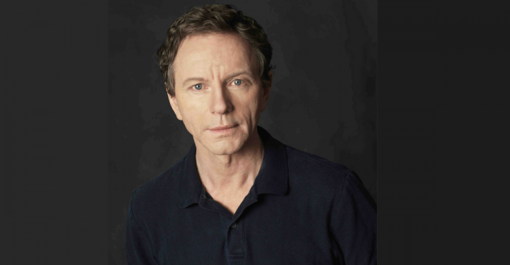

Brent Carver (1951 - 2020)

This story has been told before but it bears repeating. One night during the New York run of the musical Kiss of the Spider Woman Brent Carver, playing the leading role of the gay window dresser Molina, spotted a famous face in the second row. It was the face of Barbra Streisand, and the sight left Carver understandably unnerved as he went into his first song. A dialogue scene followed and, as it progressed, the lady was heard to exclaim “Jesus! And he can act too.”

She was a hundred percent right of course. But she still didn’t do the object of her admiration full justice. The point about Brent Carver in musicals, and especially in that musical, was not that he could both act and sing but that he did both at the same time. And I don’t just mean that he acted his songs or even that he stayed in character while singing them. As it happens that opening number (“Dressing Them Up”) creates the character; Carver’s task for the rest of the show was to build on and develop what he and the song had established. Which he did, superbly. But it wasn’t just the psychology of the song that informed the rest of his performance; it was its rhythm. Molina starts out as a cheerfully apolitical movie-freak, both bemused and amused at finding himself sharing a South American prison cell with a passionate revolutionary. By the end of the evening he will have fallen in love with his cellmate, will tend to him after torture, will finally die for him; his companion, who is straight, will never quite reciprocate those feelings but he will come to respect Molina and even, where sex is concerned, to at least go through the motions.

Carver’s performance went seamlessly from speech to song, and from very funny to deeply moving. What remained constant was its quicksilver quality. It was a performance that could only have been given in a musical though equal with any that might be given in a play. Among the musical performances I’ve seen I’d rank Carver’s Molina alongside Angela Lansbury in Gypsy, Bernadette Peters in Sunday in the Park with George and Kelli O’Hara in The Bridges of Madison County: the only male contender – apart perhaps from Len Cariou’s Sweeney Todd - in a pantheon traditionally, and overwhelmingly, dominated by women

A few years later he did it again. He wasn’t obvious casting for Tevye in the Stratford production of Fiddler on the Roof, a role traditionally associated with burly comedians. And there were aspects of the part, like telling jokes directly to the audience or singing If I Were a Rich Man (much the same thing really), in which he couldn’t compete with Zero Mostel. He did, though, have his own quieter reserves of wit, both self-deprecating and sharply timed, and when the moment offered, he could bring the house down. (He did the same as Gandalf in the musical of Lord of the Rings when getting abruptly impatient with one of the hobbits, a lightning flash of asperity in an otherwise strangely neutral performance.)

The unforgettable parts of his Tevye, though, were his moments of heartbreak. More precisely, there was the one sustained moment when this man, who had begun the show by celebrating the glories of Tradition, was faced with the one departure from that tradition that he couldn’t countenance. He had already consented to the marriage of two of his daughters to, by shtetl standards, unconventional suitors but at least both boys had been Jewish. (“On the one hand…on the other hand.”) His third ran off with a Gentile, testing his tolerance beyond its limits. (“There is no other hand”.) He was conflicted, and he was in agony; and the agony intensified through the speech-and-dance that followed, in which he recalled and re-imagined the growing-up of the child he had lost. I had never known this sequence to be so moving before; in truth I had never really registered it before. Brent was the greatest Tevye I have seen. And, to the best of my knowledge, he wasn’t even Jewish.

Though, some years later, in the musical Parade he triumphed playing another Jew: Leo Frank, the Atlanta man railroaded and lynched in 1915 as the alleged murderer of a 13-year old girl. He played the role at Lincoln Centre in New York and was fine. But what I remember most is his appearance at the Tony Awards singing “It’s Not Over Yet”, Leo’s song when, after his trial, he’s given reason to believe that the guilty verdict may be overturned. It’s a song of hope against hope, and Carver sang it with a kind of giddy desperation. He was, again, immensely moving. It was an award-worthy performance. But of course the results were already in and the Tony went to another Canadian, Martin Short.

Carver’s musical performances brought him the most public acclaim (he must have been a wonderfully slinky m.c. in Stratford’s Cabaret) but he wasn’t even primarily a musical-theatre actor. His Stratford Hamlet was before my Canadian time but I’m intrigued by what I’ve read of it, and even more by what seems to have been his manic self-parody in the concurrent and complementary Stratford production of Tom Stoppard’s Rosencrantz and Guildenstern Are Dead. Also manic, and less happily, were two performances that I did see, Tartuffe at the Tarragon and Oronte in The Misanthrope in Soulpepper’s inaugural season. (Moliere seems to have brought out the worst in him.) So he wasn’t always great. But he often was. In that same first Soulpepper season, in fact in its first production, he had the title role in Schiller’s Don Carlos and made of it a twisted Hamlet. Some years later, he returned to Soulpepper to play a marvelous Gregers Werle in The Wild Duck, oozing with misdirected good intentions. I can still hear him muttering to the young Hedwig, with an urgency that belonged to him alone “oh yes, the wild duck, the wild duck”, encouraging her to destroy the creature that meant the most to her, and so provoking her to destroy herself instead. Back at Stratford, there was his doomed player-of-women in Timothy Findley’s Elizabeth Rex , haunted and haunting. He could be supremely vulnerable; he could also be unreachable.

Brent was 68 when he died: something that’s hard to believe on two counts. It seems a cruelly young age for him to have departed. But it also seems too old for someone who, on stage and in person, always seemed young. (Well, nearly always. In one of his last performances, as the counselor Antigonus in The Winter’s Tale for Toronto’s Groundling Company – the one who exits pursued by a bear – he did seem to be acting his age, or nearly. It was also the most detailed and affecting performance of this character I have seen.) Richard Monette said that Brent marched to the sound of his own drum, and that its beat was different to everyone else’s. There was always a glaze there, a courteous one, but I think I can truthfully say that we were friends. And, at the risk of self-praise, one of the thrills of my life was when I gave an illustrated talk at Stratford on the American musical, a talk in which the illustrations consisted of me singing. I invited Brent to it, and he sat there, leaning forward, listening intently, whether in fascination or in horror I couldn’t quite decide. The next time our paths crossed he said that I had taught him a lot that morning about interpreting lyrics, lessons that he was already beginning to apply. And this was the year in which he was playing Tevye. Imagine how generous that was and how incredible it made me feel.

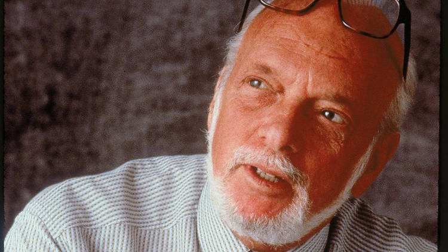

Harold Prince (1928 - 2019)

Brent’s two great victim performances - in Parade and Spider Woman – were given under the direction of Harold Prince. At least that was the name printed in the shows’ programs or anything else official. In all other contexts – as director, producer or both – it was Hal Prince, perhaps the most dynamic creative force in the American musical over the last 45 years. In the middle of his collaboration with Stephen Sondheim – an alliance of director-producer with composer-lyricist that presided over the 1970s – I wrote that it was hard to name a major musical since the mid-50s in which one or both of them hadn’t been involved. (at the time I could think of only three: My Fair Lady, How To Succeed in Business Without Really Trying and A Chorus Line. Since then of course there’s been Hamilton - which, as its creator Lin-Manuel Miranda has been more than willing to acknowledge, was a direct descendant of Sondheim-Prince.)

Prince’s producing career began in the 1950s when he was in his twenties, making him in William Goldman’s words “the last of the boy-wonder producers.” Before that he had been a stage manager, working for the nearly indestructible director George Abbott, whose signature virtues of pace and lucidity he was to preserve in his own work, though generally to more complex ends. His achievements as “just” a producer were pretty staggering (they ran, chronologically, from The Pajama Game to Fiddler by way of West Side Story); when, after about a decade of waiting and watching, he began to direct as well, they verge on the unbelievable.

The first Prince-directed musical I saw was Cabaret which came to London in 1968, two years after its New York premiere, and with the decisive advantage of having Britain’s own Judi Dench playing what many consider to have been the best Sally Bowles ever. What really hit me, though, was the show’s singular mix of subtlety and shock. Subsequent highly-praised (read overpraised) productions have foregone the subtlety and ratcheted up the shock: a self-defeating exercise in an increasingly unshockable era. Prince’s production let the horror of the last days of Weimar and the first of Fascism, creep up on you; it was, as a friend of mine once said, “a seduction”. It lulled the audience into enjoyment with its domestic scenes and nightclub routines, then shattered it at the Jewish greengrocer’s engagement party. I wrote at the time that “with pogroms the in-subject for musicals this year, that one stone through Herr Schultz’s window counts for more than all Fiddler on the Roof’s carefully-choreographed furniture-smashing.” (I was horribly condescending about Fiddler back then; blame it on my youth.) Then, shortly afterwards, came the famous Gorilla song; the nightclub’s master of ceremonies waltzing his simian sweetheart while serenely serenading her: “If you could see her through my eyes – she wouldn’t look Jewish at all”. You want to talk about shock? Smiles, at that moment, disappeared from faces, bodies were enveloped by chills. And you want to talk about shocking: in those innocent days, the line, both in New York and London, had to be cut and replaced shortly after opening night, because people thought it was anti-Semitic, a fairly spectacular case of missing the point.

Hal knew that giving in to the protesters was artistically wrong (Fred Ebb, Cabaret’s lyricist, was furious) but it wasn’t a hill he wanted the show to die on. Regardless, it was the boldest, most intelligent musical on a political or historical subject that Broadway had yet seen. The same daring, the same thoughtfulness, the same theatricality – the simultaneous appeal to eyes, ears and mind – were to be the hallmarks of the half-dozen Prince-Sondheim shows of the 1970s. Of these now-classic musicals the two most conceptually ambitious were also the most dazzlingly staged: Follies and Pacific Overtures. Neither production is ever likely to be equalled.

Hal brought the same showman’s flair, the same visual command, even the same artistic rigour, to his two Lloyd Webber stagings, Evita and The Phantom of the Opera. He could also do comedy, turning his customary strengths on their head for On the Twentieth Century, a gorgeous spoof that I will yield to the temptation of calling an over-the-toperetta. Betty Comden and Adolph Green, who wrote the book and lyrics, specialised in creating sacred show business monsters and they were gorgeously played in New York and (especially) in London. The music was by the brilliant Cy Coleman, the only major composer of what I would call the Sondheim generation – the brilliant bunch who came to prominence in the late 1950s and early 60s - with whom Prince had not yet worked. He had already produced and/or directed shows with scores by John Kander and Fred Ebb, Charles Strouse and Lee Adams, and – most significantly and prolifically – Jerry Bock and Sheldon Harnick. Bock wrote the music and Harnick the lyrics for Fiddler, and before that for Fiorello! and Tenderloin, two strangely neglected but highly revivable shows. Fiorello! – the saga of New York’s legendary Mayor LaGuardia – is a particularly perplexing absentee; it won a Pulitzer, for God’s sake, and is the only political musical to take us right inside those notorious smoke-filled rooms. (“Politics and Poker” is a song you can really choke on. It includes the immortal line “Nobody likes a candidate whose name they can’t spell”.)

In Canada, Fiorello! would be a natural for the Shaw Festival. As it happens, it was at the Shaw that I met Sheldon Harnick for the first and only time; it was in the intermission of She Loves Me, Bock and Harnick’s most enchanting show, given a delightful production (it also happens to be the first musical that Hal directed on Broadway). It was a great Canadian year for the team, the same year in which Brent Carver gave his Tevye at Stratford. As I write this, Harnick’s death has been announced. Both Prince and Sondheim were 91 when they passed; Harnick was even more of a survivor, dying at the age of 99. He had the reputation of being one of the theatre’s nicest men, and he was certainly very pleasant when accosted by me.

Prince wasn’t known as an actor’s director but actors still seemed to enjoy working with him. And they gave him some great performances; Follies, on Broadway in 1971, seemed to me the all-around best-acted musical I had seen up to that time. And it had a huge cast.

Hal was known to be impatient. And there must have been a healthy streak of ruthlessness in him to have got where he got and remained there. But he was, on the whole, very well liked, certainly by me. There was a graciousness in him, and a tolerance and an unsentimental kindness; whenever we met, either by design or accident (he was one of the people I seemed likeliest to run into, in theatres or on the sidewalk outside them), I went away feeling warmed. I loved when he replied to the card my wife and I sent him on the birth of our triplets “Congratulations hardly seem adequate”. We had lost touch in recent years but had agreed to meet the next time I was in New York. That next time never happened, and I bitterly regret it.

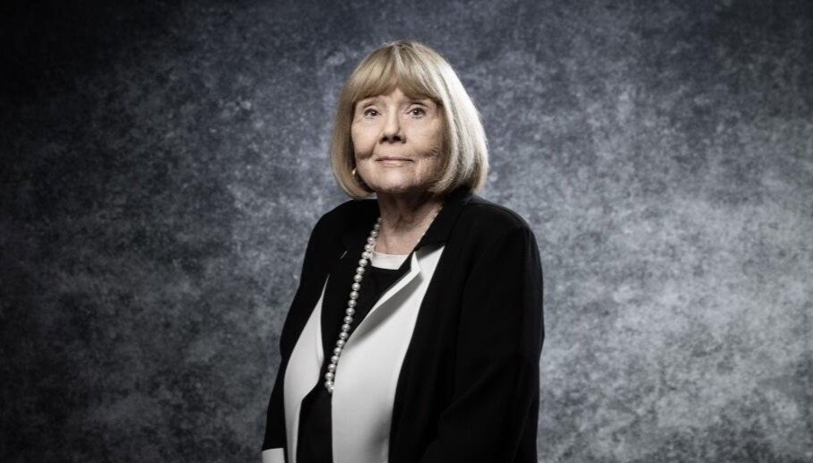

Diana Rigg (1938 - 2020)

Hal did have his failures. One of them, as I think he would have confessed, was the film version of his and Sondheim’s theatre success, A Little Night Music. This was a leaden-footed affair that had just two saving graces: some new Sondheim lyrics, either replacements for or additions to existing numbers, and the delivery of the tartest and most pointed of them by Diana Rigg. She played the disillusioned Countess Charlotte and it’s worth sitting through the movie, or at least playing the soundtrack album, just to hear her contribution to the catalogue of dubious delights that constitute A Weekend in the Country: “and the gnats!” I gather that she and Sondheim got on very well, and I’m not surprised.

I don’t know that I can claim Rigg as a friend – our meetings, though cordial, were few – but I treasure the memory of sitting in a West End theatre, feeling a pair of hands coming from behind me and covering my eyes, and hearing a velvety voice say “It’s Diana!” I was able to follow her career from her early days with the Royal Shakespeare Company where in the first half of the 1960s she progressed smoothly from walk-ons to leads. Much of her stage work after that was done with the National Theatre or in the West End. What I always admired about her was her willingness to have a bash: to meet comedy head on (in The Misanthrope, Pygmalion, and a couple of Stoppard premieres) and to do the same for tragedy. She became the premier English actress of Racine: first at the National in Phaedra Britannica, an adaptation set in the British Raj, then years later in the West End as more a textually authentic Phedre and as Agrippina in Britannicus, the rare French classical tragedy with a Roman rather than a Grecian setting. (So she went from Phaedra Britannica to Phaedra and Britannicus) The same clarity and directness made her one of the best Lady Macbeths I have ever seen, though they weren’t quite enough for her to conquer Cleopatra: this despite the text itself having given her a rave review some three hundred years in advance: “The holy priests Bless her when she is Riggish”.

Talking of reviews: the lady herself edited an anthology of, supposedly, “the worst reviews ever written” entitled No Turn Unstoned. It turned out to be a surprisingly gentle collection, leaving most of us guys on the aisle feeling that we never knew we were so nice. As for what Riggish might mean in the present context, I’d suggest “cheerfully beautiful.”

Of course it wasn’t her classical or modern theatre roles that made her a star. It was her casting as the saucily named Emma Peel in the roguish television spy series The Avengers, an immensely successful show of which I never saw a single episode. It was an Avengers tradition (inaugurated by Rigg’s predecessor Honor Blackman) that after her departure the leading lady would move into movies as a James Bond girl. Or, in Diana’s case, the one and only James Bond wife, appearing in On Her Majesty’s Secret Service, opposite the once-and-once-only George Lazenby. Just one Bond earlier and she could have been playing Mrs. Sean Connery.

Sean Connery (1930 - 2020)

It may be hard to believe but some of us were Connery fans before he was Bond. No, I didn’t know him – I never even met him – but he was part of my growing up. In the late 1950s and early 60s he was a constant presence in British television drama, which in those days largely consisted of transplanted stage plays. It was a great way to get educated. Back then Connery, with his Doric ruggedness, was often cast as a puritan. He was my first ever John Proctor in The Crucible and was especially memorable as a shy young idealist, embittered by love, in Jean Anouilh’s Colombe (a great production by a great TV and theatre director Michael Elliott, father of Marianne). Most of all, there was his Hotspur, in a 1960 cycle of Shakespeare’s history plays – eight of them, each divided into two parts, broadcast live at fortnightly intervals – entitled An Age of Kings. 1960 was a pivotal year for British Shakespeare, the point at which the dominant mode began to shift from vigorous Old Vic barnstorming to brow-furrowed RSC textual analysis. An Age of Kings drew enthusiastically on the old tradition while intelligently anticipating what was to come. It was the best TV Shakespeare ever; its release on DVD, decades later, drove that point home, and Connery’s performance looked and sounded even better.

Knowledge of his future stardom makes his appearance as the brash, eager young Harry Percy of Richard II especially engaging; and when, as the Hotspur of Henry IV Part One, the character comes into his full outrageous glory, Connery was perfect. His native Scots tones do excellent service for the Percy family’s Northumberian, and he captures the insecurity that underlies the young warrior’s overpowering self-confidence, the sense that among all the courtiers and schemers, he will always be at a disadvantage. (The historical Hotspur was actually older not only than his rival Prince Hal but than Hal’s father Henry IV, but if Shakespeare knew this he wisely kept quiet about it.) Hotspur was, as far as I know, the only Shakespearean role Connery ever played, and such stage career as he had was already over. Shortly after, of course, came Bond, to whom he brought a welcome glint of imperturbable self-mockery. And then the years of post-Bond, where his performances in The Untouchables (that bridge scene!) and The Russia House made me think him perhaps the greatest actor in movies.

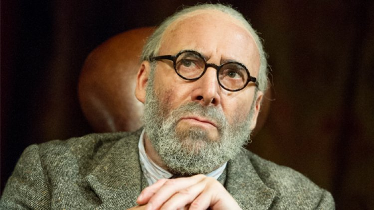

Antony Sher (1949 - 2021)

There is a poster hanging up in my house for a show that, in 1979, I devised and appeared in at the King’s Head Theatre in London, a show entitled Nashville New York. (It wasn’t about country music; it was a celebration of Ogden Nash, light-versifier supreme and accomplished musical-comedy lyricist.) I have sometimes challenged visitors to identify the most famous actor’s name on that poster. (It certainly isn’t me.) Nobody has ever got it right. Nobody has spotted the artist’s signature in the bottom right-hand corner: A. Sher. Yes, Antony, later Sir Antony, Sher was an accomplished visual artist as well as a superb actor. At the time he designed that poster he was a coming man, but not yet an established one; he had made his London debut as everybody’s favourite imitation Beatle, playing Ringo Starr in a play-of-sorts called John, Paul, George, Ringo…and Bert. Over the next few years he emerged as a major force. In 1978, he starred at the Royal Court in The Glad Hand by Snoo Wilson, playing a South African tycoon (Sher himself was South African) who, with apocalyptic intent, charters a boat to sail through the Bermuda Triangle with a troupe of actors as crew. This was one of the best British plays of its decade, the cool and loopy political piece that it seemed everybody else had been trying to write, and Sher struck exactly the right note of obsessed insouciance. Then there was his extraordinary turn as an Arab in Mike Leigh’s Goose Pimples, communicating in a ceaseless flow of what most of the audience took to be gibberish but what he indignantly (and I’m sure truthfully) insisted was genuine Arabic, painstakingly learned.

Sher, it was becoming clear, was an all-conquering virtuoso, and he sometimes seemed a little too determined to prove it. Playing the reminiscing Henry Carr in Stoppard’s Travesties he seemed so intent on looking and sounding like an authentic old man that all the laughs disappeared. He played an acclaimed Richard III for the RSC doing acrobatically spectacular things with the crookback’s crutches: too spectacular, I heretically felt. For me, he only connected with the character at a point where most Richards fail, in his guilty nightmare before his last battle. It’s a turgid, rather mechanical speech but he somehow found his way to the despair that lies beneath it. The perverse gymnastics of his Richard found a more agreeable echo, for me at least, in his later Stratford performance as Christopher Marlowe’s Tamburlaine the Great in the company’s glorious new Swan Theatre. Tamburlaine is a Scythian shepherd who triumphs over and humiliates all the potentates of Asia; Sher, crawling or leaping all over the stage, embodied the impishly sadistic glee that carries him from one victory to the next.

The performance that had first established him, with the RSC and with the British theatre at large, was his Fool in King Lear. The reviews, and the theatre’s own poster, treated him as an equal partner with Lear himself. Michael Gambon played the king, and I think he may have felt that things were getting out of hand. At any rate he told me, in a radio interview, that when the production (a dumbfoundingly exciting one, by the way) transferred from Stratford to London, the Fool had to be reined in a bit. “Tony was a bit unhappy about that” he admitted, but he himself thought it was for the best.

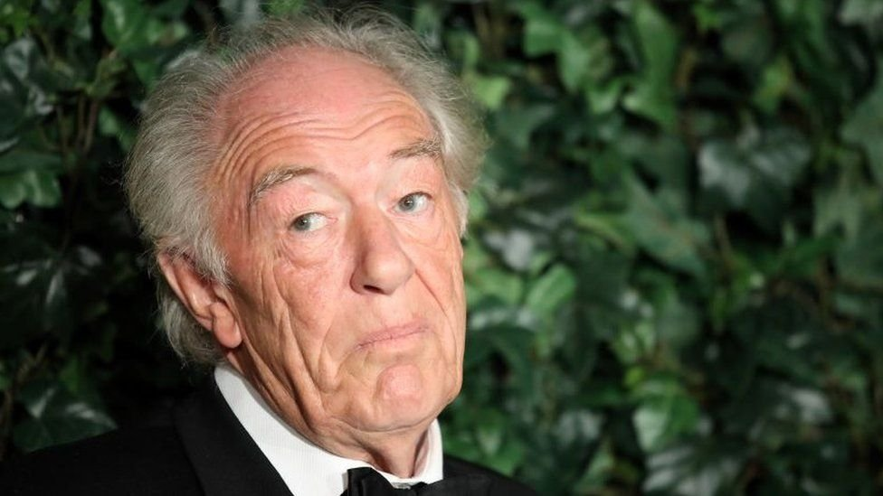

Michael Gambon (1940 - 2023)

Gambon, whose death was announced just as I thought I was finishing this piece, was an extraordinary actor: cheerful, even bland at first glance but suggesting silent depths, sometimes quite frightening ones, beneath. (In this he was the natural heir to Ralph Richardson, who famously dubbed him “the Great Gambon”.) His rise was steady rather than meteoric. It started in 1963 in the very first season of the National Theatre, then housed under Laurence Olivier’s direction at the Old Vic. He stayed there for three years, years about which I feel rather proprietorial, since they coincided with my own time as an undergraduate. I was able to watch Mike Gambon (that’s how he was billed in those days) proceed from crowd parts and walk-ons to substantial supporting roles in Brecht’s Mother Courage and O’Casey’s Juno and the Paycock, respectively exhibiting his tough and tender sides. Then, apparently at the urging of Olivier, he left for larger parts in smaller theatres, mainly in the provinces. On his return, as the full Michael, he made his presence felt most forcefully in Alan Ayckbourn’s comic trilogy The Norman Conquests, though “forcefully” may not be the most appropriate word. He played a hapless vet, continually out of his element socially and romantically; it drew on the squashy aspect of the Gambon persona, the hard side well out of sight. At one point in the proceedings, the characters settled down for an alfresco lunch. The only seat available for Gambon’s genial bulk was a low stool, from which he smiled hopefully at all the others so far above him. At one point Tom Courtenay, as the eponymous Norman, referred to him as “my friend the dwarf”, making the line sound like a pat on the head. You had to be there; but if you were, it was a sublime comic moment, with the glory shared between the actors, the author, and the director Eric Thompson (father of Emma).

In The Norman Conquests Gambon became, you might say, an unofficial star. He strode into the official category when he appeared at the National as Brecht’s Galileo, a performance that changed his professional life. The visionary scientist, forced into denying his vision, drew on Gambon’s intelligence, his acidic wit, his passion, and his brute – not brutal – strength. That said, there were rough edges around the performance that were not necessarily those of the character. The great Gambon performance, for me, was given a year or so later for the same company. It seems to have been forgotten; at least I haven’t seen it mentioned in any of the obituaries.

The play was Tales from Hollywood by Christopher Hampton. Gambon played Odon von Horvath, the brilliant Austro-Hungarian playwright whose career came to an abrupt end in 1938 when, as an exile in Paris, he was struck by a falling branch on the Champs-Elysees. Only in Hampton’s telling it didn’t. He imagined Horvath emigrating to America, as historically was his intention, and finding work of a kind as a screenwriter. Gambon, at once suave and rumpled among the fleshpots, was his own raconteur, and his rapport with the audience was sublime. So, and arguably more importantly, was his rapport with the other actors. He had some especially bracing scenes with his brother-in-exile Bertolt Brecht (him again) and was enchantingly sceptical about his colleague’s vaunted alienation effect, aimed at making the audience remember that they’re in a theatre: “I asked him, Brecht, what makes you think they ever forget?... He didn’t like being asked questions he couldn’t answer.”

John Shrapnel (1942 - 2020)

The name John Shrapnel may not mean very much outside the United Kingdom but for some of us he ranked among the best British actors of his generation. That generation happened to be my own, more or less; in 1963/4, when I was in my first year at Cambridge, he was in his third and last, part of an intimidatingly accomplished senior line-up that also included Richard Eyre, future director of the National Theatre; Jonathan Lynn, future creator of Yes, Minister; and the brilliant actor-scholar Michael Pennington. John’s roles in his final year ranged from a gentle and moving Aston in The Caretaker to a commandingly funny Doctor in A Month in the Country (played with a brisk Scots accent for reasons mysterious even to his fellow-actors, of whom I was privileged to be one). But the performance I remember best from that year was given, for one Sunday night only, as the loquacious, mocking, ultimately suicidal vagrant in Albee’s The Zoo Story, with Johnny Lynn playing his hypnotised auditor, under the direction of Eric Idle. (You read that right.) John was spellbinding. Here, we felt, was a future great actor; at the very least, the next Albert Finney.

It wasn’t to be. He had a very solid professional career, including honourable service with the RSC and the National Theatre. He was a recurring presence on television, and his very individual voice – a sensitive rasp – kept him in constant and I’m sure lucrative offscreen employment in commercials. It may even be that this last source of security blunted his ambition. Good as he nearly always was, he never scaled the heights we had anticipated or got the parts that might have allowed him to.

Except once. He had always, it seemed, had an affinity for the Greeks. He had played Sophocles’ Oedipus at Cambridge and he was, against heavy odds, a fine Pentheus in a disastrous National production of The Bacchae. Later, whenever there was a production of Oedipus, on stage or TV, John was always the man they called to play Creon. His Athenian apotheosis, though, was reached in 1980 in a show called, simply, The Greeks. This was an all-day marathon (now there’s a good Greek word) assembled by RSC scholar-director John Barton from the extant Greek tragedies depicting the Trojan war, its origins, and its aftermath. (Bits of the Homeric narrative that the tragedians never got around to were filled in by Barton himself.) Shrapnel began his day as Agamemnon, sacrificing his daughter to secure a fair wind to carry the Greek ships to Troy; a monstrous deed but somehow he kept our respect, if not exactly our sympathy. Then, a few plays later, the war over, the victorious general came back to his kingdom in the Aeschylus play that bears his name. There his wife murders him, partly because she has taken a lover but mostly as retribution for what he did to their daughter. A ceremonial carpet is spread, to lure him to his doom. Stepping on this carpet was always taken to be a sign of overweening pride, an insult and challenge to the gods; and when Shrapnel mounted it, one really felt in touch with the ages. It was a performance of heroic stature. At the other end of the day he reached into the other, comedic side of his talent to play a legitimately camp version of the god Apollo who appears at the end of Eurpides’ Electra to promise that, after all the bloodshed, all will be made well: “But. Not. Yet”. The inhumanly taunting way in which he measured out those three words, conclusively denying a conclusion, was pure John. (It was pure Euripides as well, though too many critics failed to recognise it).

Great actor or not, Shrap (as everybody, including Tony Sher, called him) was universally acknowledged to be a great guy: kind and warm and funny and sharp. That certainly is how I always knew him. And I treasure his crisp summary of the actor’s life: “You spend a lot of time working in crap, for fools.”

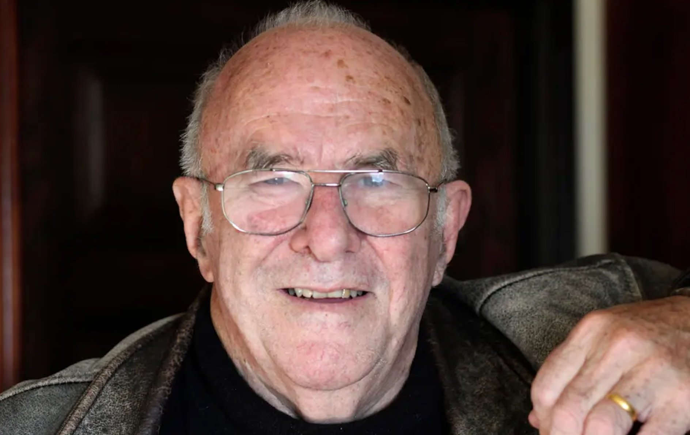

Clive James (1939 - 2019)

In my second undergraduate year, the Cambridge English Faculty, and with it the Cambridge theatrical scene, experienced – and benefited from - an Australian invasion. A sharp-tongued and awesomely articulate lady from down under arrived as a post-grad student; her name was Germaine Greer. An ebullient male compatriot signed on as a (decidedly) mature undergrad; his name was Clive James. I think it’s fair to say that, between the two of them, they took the place over.

Clive’s path and mine crossed twice. Some seven years after university, I was appointed theatre critic of The Observer, the revered British Sunday newspaper at which Clive was already the TV columnist and, beyond a doubt, the top one in the country. He was super-intelligent, polymathically informed, and – the thing that really kept everybody reading – hilarious. Anyone else had to settle for being, at best, the second funniest writer on The Observer.

One thing Clive always made clear in his post-graduate days (actually I’m not sure that he ever did graduate) was that he hated the theatre. Well, at Cambridge, he could have fooled me. I don’t think he ever acted in a play but he seemed to take in every one that was staged. (He was also a regular presence at classical concerts and jazz gigs.) He found his niche at the Footlights, the university’s fabled home of revue, whose alumni had already formed half of Beyond the Fringe and would later furnish a third of Monty Python. Clive wrote sketches and appeared in them, wrote songs (but didn’t sing them), and wound up as president of the club and director of the annual revue. Meanwhile he was writing unstoppably for every university paper or magazine that was wise enough to have him; as he wrote in his memoir of the period “they had the demand; I had the supply”. As a critic, he tended either to love or to hate. To be caught up in his enthusiasms could be a heady experience. Though we were never especially close, we bonded over our shared admiration for the lyrics of Lorenz Hart (“the only poet among them” said Clive who, as I almost forgot to mention, wrote poetry himself). And when he liked your work, he really let you know it. He once sat beside me at a play I had directed, and delivered what amounted to a joyous running commentary. I didn’t know where to look.

His later distaste for theatre didn’t translate into a dislike of all drama. He claimed to read all of Shakespeare (whom he called Top Swan though I wish he hadn’t) every year and, after having been lured into attending a performance of Travesties, wrote an extended eulogy of Tom Stoppard that may have been the first solid essay on the subject; Stoppard himself certainly thought so.

But then Clive was an insatiable, and indefatigable, autodidact. While at Cambridge he taught himself Italian so that he could read Dante in the original; years later he used the time left to him after a terminal medical diagnosis, to write his own translation of The Divine Comedy . He had a successful career as a high-end television presenter, though I confess that this was the aspect of his work that I liked the least; his commentaries always sounded over-hearty and overly enthusiastic, reminding me of the movie-theatre newsreels of my (and probably his) immediate post-war youth. His real monuments will be his uproarious volumes of autobiography ( the first of them called Unreliable Memoirs) and his many collections of essays, composed of pieces written for magazines in Britain, America, and, yes, Australia. These reveal him as a humane, sceptical liberal in the best Orwellian tradition. (Orwellian here is meant as a compliment, a high one.) He wrote especially well on the Holocaust and atrocities generally; I’ve been told that he was drawn to these subjects by the loss of his father in the war against Japan. In a review of the tendentious book Hitler’s Willing Executioners, he wrote that there was nothing to be learned about the gratuitous refinements of cruelty except “the adamantine fact of human evil.”

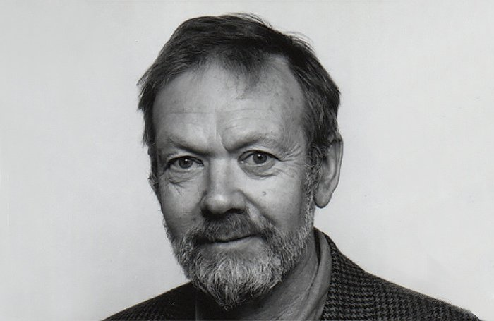

Irving Wardle (1929 - 2023)

The critical colleague I most admired during my ten-year term on The Observer was Irving Wardle of The Times. I wasn’t alone. As a theatre-struck teen I had followed his early career, writing reviews for the punchy magazine Encore, and then covering TV drama for the BBC’s weekly publication The Listener. His assessments of An Age of Kings especially impressed me; he was the first to salute the productions’ sharp sensitivity to text, to how the different plot-lines reflected and illuminated one another. He was just as acute on modern plays, whether TV originals (there were fewer in those days) or adapted from the stage. He was fair and judicious, lively without being flashy, and he maintained those qualities, under demanding overnight deadlines, when he moved to The Times in 1973 as “Our Dramatic Critic”. (He was allowed to reveal his name a couple of years later when The Times finally relaxed its centuries-old tradition of anonymity.) I was glad to learn that he had a happy retirement, with plenty of time to indulge his real passion of playing the piano. He also apparently joined an improvisational drama troupe, news that astonished me since he also seemed so shy and reserved. I will always envy him his concluding words about the greatest production I have ever seen, the Uncle Vanya that contained the greatest performance I have ever seen, Michael Redgrave in the title role, summoning laughter and tears simultaneously. Laurence Olivier directed, and the cast included, at one time or another, several other certifiably great actors: Olivier himself, Rosemary Harris, Joan Plowright, Max Adrian, Sybil Thorndike. I say “at one time or another” since the production played two seasons at the then-new Chichester Festival before coming to London as part of the opening line-up at the equally new National Theatre, and there were some cast changes along the way. But it was never less than magnificent. Reviewing the National opening, Irving signed off with “This was a great production. It has improved.”

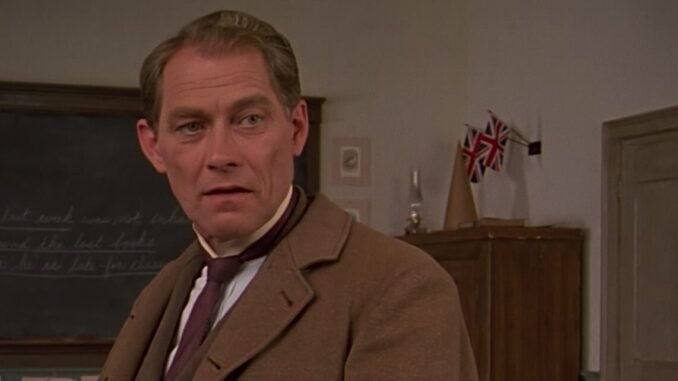

David Fox (1941 - 2021)

One of the first Toronto plays I got to review as critic of the National Post was The Drawer Boy by Michael Healey. It was a beautiful surprise: a really good new Canadian play, the first I had ever seen. (And there have been few since to equal it; the only ones to have had a comparable first-night effect on me are John Mighton’s Half Life and Kristen Thomson’s I Claudia.) The people involved - author, actors, director - were all new to me, though I was to encounter them gladly and often in subsequent years. The incontestable stand-out was David Fox, the gentle giant who played the title role, an Ontario farmer whom a wartime brain injury had robbed of both his artistic talent and his memory while leaving him with an awesome capacity to do complex math in his head. In later years Fox gave wonderful performances in a couple of American classics directed by Diana Leblanc; in Edward Albee’s A Delicate Balance he went from a placid beginning (I wrote that had “a shambling grace”) to a climactic tour-de-force of bitter self-abnegation; as the nonagenarian Jewish furniture-dealer of Arthur Miller’s The Price he was sublime, not to mention hilarious. It was obvious that he could be the best Canadian King Lear since William Hutt, and mercifully he got the chance to prove it, even if it was in a cut-rate production that few people noticed or saw.

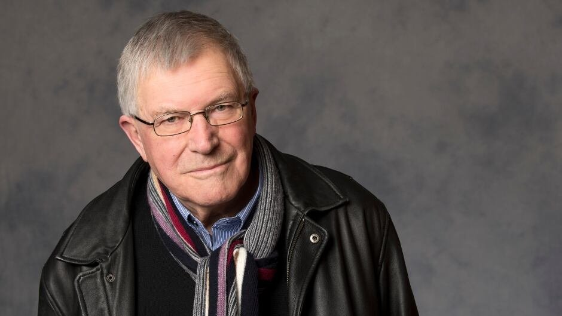

Christopher Newton (1936 - 2021)

A footnote to my Drawer Boy experience: That Theatre Passe Muraille production was the first show I ever reviewed long-distance via computer. The day after it opened, I had to fly to Calgary to cover its annual new-play festival. Once arrived, I unloaded my enthusiasm onto my laptop and dispatched it to Toronto, still not quite believing this would actually work. “Isn’t technology wonderful?” I said to my editor, on learning that it had. (Hey, it was 1999.) Coming down to breakfast the next morning, I found that one of my fellow-guests was Christopher Newton; he invited me to join him, and I poured out to him my enthusiasm for the Michael Healey play. He nodded sagely, saying that this proved how right the Shaw Festival had been not to hire Healey as an actor, thus leaving him time to pursue his true vocation. I still don’t know if he was having me on.

By this time of course Chris was well into his record-setting tenure as the Shaw’s artistic director. He had given the festival a lustrous identity by exploiting what might have seemed a limitation: the confinement of the repertoire to plays written during the conveniently long lifetime of Bernard Shaw himself. Within these borders he explored widely; along with the plays of the patron saint himself and of his canonical contemporaries and successors, a Shaw season could include an Ibsen or a Chekhov, a vintage American comedy, a West End boulevard piece (Noel Coward more often than not), a musical, even an Agatha Christie thriller. One ended up with a portrait of an era that was eclectic but also surprisingly unified. That was one facet of the revolution at Niagara-on-the-Lake; the other was Newton’s formation and promotion of the Festival ensemble, a strong, varied, and remarkably durable company of actors.

Under his successors, the constraints of play selection have been loosened and the personnel of the company has, inevitably, altered. But the principles remain; the Shaw Festival is still the house (or houses, there now being four of them) that Christopher built. One thing of course that is necessarily missing is the suave and genial presence of the man himself, as the face of the organisation and, on occasion, as a solid and stylish actor with a marked gift for portraying loneliness. He was especially fine in The Marrying of Ann Leete, the play with which the Shaw launched its exhaustive exploration of the works of GBS’s friend and champion Harley Granville Barker, all of them brilliantly directed by Newton’s colleague and protégé Neil Munro. His own directing was generally less flamboyant, but where Shaw’s own plays were concerned he was notably adept at bringing out the visual poetry inherent in the argumentative prose. I think especially of his staging of The Doctor’s Dilemma with its chorus of medical skeletons performing their own dance of death. But his greatest triumph as a director was his rediscovery of another Edwardian master St. John Hankin who collected his acrid social comedies under the ironic title Plays with Happy Endings. Newton directed all three of them: The Return of the Prodigal, The Cassilis Engagement and The Charity That Began at Home, the last as Director Emeritus under his successor Jackie Maxwell. It was a series that started fine and grew progressively finer.

Marti Maraden (1945 - 2023)

And while on the subject of actors who became directors who became runners of theatres: I recently stumbled across an old Observer column from 1980 in which I reviewed the debut productions of what proved to be a short-lived company at the Brooklyn Academy of Music in New York. One of their shows was The Winter’s Tale. It wasn’t very good, but I’m pleased to note that I cited as a saving grace the authoritative performance as Hermione of Marti Maraden “from Stratford, Ontario”. (I hadn’t yet moved to Canada, but I was already a frequent visitor.) It's especially pleasing in that when Marti turned to directing, her best production that I saw - at Stratford in 2010 - was also of The Winter’s Tale, with the magical final scene beautifully orchestrated. Before that, she had been the much-loved artistic director of the English company at the National Arts Centre in Ottawa. Her death, also after I had begun writing this article, was a shock.

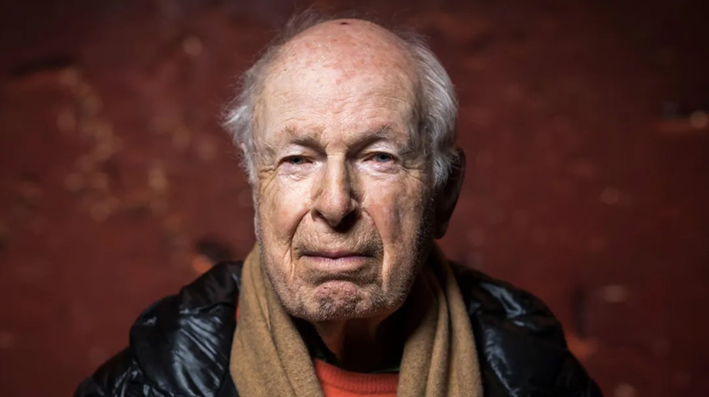

Peter Brook (1925 - 2022)

Peter Brook. I first met him in 1974 in his office at the Bouffes-du-Nord, the old Parisian music-hall, gifted to him by the French government as a base for the cosmopolitan troupe of actors known as the International Centre of Theatre Research (ICTR). I was there to interview him, and my tape recorder broke down: not the kind of thing you want to happen in front of, conceivably, the most illustrious director in the western world. Brook, without a fuss, got down on his hands and knees and fixed it. Now that was a director.

It must also count as an example of what the British critic Michael Ratcliffe, in a magnificent obituary in The Guardian, called “Brook’s sweet patience”. (There was a startling absence of obituaries in the Canadian press.) His move to France meant that I only got to review one of his English productions – a rather disappointing Antony and Cleopatra for the RSC – but I grew up on his work. He directed the first Hamlet I ever saw, at the Phoenix Theatre in London where it arrived, in 1956, after a much-publicised trip to Moscow. That, to be honest, was disappointing as well; Paul Scofield played the prince, and my recollection is that he sang, or at least chanted, large chunks of the text. It was a matinee; maybe he was bored. I expected more because the previous year I had read about, but not seen, Brook’s Stratford-on-Avon production of Titus Andronicus with Olivier in the title role: a play then so neglected (understandably) that this counted practically as a world premiere. He apparently dealt with the play’s horrors by ritualising them, a forecast of much of his work in future decades. That production too came to London a couple of years later, and I’ve never stopped kicking myself for missing it. Brook designed the sets and costumes himself and composed the incidental music (he had expert help in all departments), and he did the same for his next Shakespeare, The Tempest, which I saw at Stratford and greatly enjoyed. John Gielgud was an ascetically impressive Prospero, but the most memorable things, at least the ones I remember best, were the evocation of the opening shipwreck by a madly-spinning wheel atop the proscenium arch, and the funniest clown scenes I have ever beheld in this play, courtesy of two stellar Shakespearean comics, Patrick Wymark and Clive Revill. A sceptical cast member whom I worked with years later said that Brook had had nothing do with these and that all the credit should go to the actors; still Brook must have approved what they did and, at the very least, stayed out of their way. And in his next production, the West End musical Irma la Douce, he cast Revill as the barman-narrator, which is the best role in the show. (I know; I’ve played it.)

Peter Brook directing musicals? He did several, though Irma was the most successful, and a very good show. He also directed drawing-room comedies. His roots, or some of them, were in the West End commercial theatre, and in the 1950s he was one of its most in-demand directors. You can trace a direct line from there to his more socially conscious – or, perhaps better - artistically conscious – work of the 60s and thereafter. The Marat/Sade (at the RSC and then, significantly, on Broadway) was really a musical, at least in his virtuoso staging; the dialectical confrontations of the two title figures counted for far less than the choreographed movements of the Charenton asylum inmates and their surging, threatening vocal choruses.

I think Brook would have claimed, not perhaps that it was all showbusiness, but that it was all theatre and that theatre could happen anywhere. That was the philosophy behind the ICTR, whether it was performing in its rundown (actually, quite expensively rehabilitated) Paris HQ, in an African village, or on a Persian mountainside. It’s there in the very title of his famous book The Empty Space. And it’s implicit in an earlier and shorter manifesto, and one that I prefer, an article entitled “Don’t Be Bamboozled by Theories” - his own, I like to think, included. It ends with the unchallengeable statement: “A performance lives or dies – in performance.”

I was able in the 1970s to see quite a few of his Bouffes-du-Nord productions, most of them spare, limber stagings of classics: Timon of Athens, The Cherry Orchard (“La Cerisaie”) with his wife Natasha Parry as Madame Ranevsky, Ubu Roi. Most impressive, if also most contentious was The Ik, depicting a Ugandan tribe of secluded hunter-gatherers whom the play presented as in imminent danger of extinction; though in fact, they’re still there. This trifling inaccuracy apart, the performance by a multi-ethnic cast was a quiet triumph of discipline – or, more likely, self-discipline. It did create, as we’re always told theatre should, a world of its own. (I unhappily never saw what seems to have been the ICTR’s greatest triumph in this even vein, its day-long staging of the Indian epic, The Mahabharata.) My only disappointment at the Bouffes-du-Nord was Brook’s production of Measure for Measure, since his earlier staging of it, at Stratford in 1950, was legendary, establishing this previously neglected play at the heart of the modern Shakespeare repertory.

“Legendary” is also the word for two of his later RSC Shakespeares. In 1970 there was A Midsummer Night’s Dream: loved by most, hated by a few, and quite liked by me. I didn’t find the comic treatment of the lovers very revelatory (they’re always funny) and I wasn’t enchanted by the mechanicals (they weren’t funny enough or endearing enough) but the fairies were enchanting with their juggling and their high-swinging trapezes, practical theatrical magic standing in for the supernatural. And it looked lovely, bright costumes and accessories on a big white stage.

Eight years earlier Brook had filled a similarly empty space to shattering effect in his production of King Lear. This was widely hailed for its critical presentation of the king himself; Paul Scofield’s Lear may have been a man more sinned against than sinning but it was a close-run thing. He was certainly a terrible house-guest; everybody who saw it remembers Lear‘s followers – his hundred knights, or a representative selection of them – gleefully and insolently overturning his daughter’s dining-table as they departed her house. The metaphorical turning of the tables was less revolutionary than it may have seemed but it was certainly powerful. It paid off brilliantly with Irene Worth’s Goneril, initially quite reasonable, hardening before our eyes and ears. “Pluck out his eyes” was spoken with a desperate steely insistence, as of a woman consciously renouncing her humanity. Other lines still ring down the years: Lear’s Fool (the brilliant Alec McCowen) soothing his master with an improvised lullaby; Kent (Tom Fleming) shouting “vex not his ghost, oh let him pass”, recognising Lear’s death as a kind of mercy-killing. If you saw the production more than once, you found yourself fixating on the increasing impatience of Cornwall (Tony Church) and on the golden spurs on his boots, knowing that they would be used (“upon those eyes of thine I’ll set my foot”) for the blinding of Gloucester. I have never seen or heard storm scenes to compare with those here; three huge thunder-sheets were lowered from the flies, and left to wrinkle and rumble, dwarfing the actors without ever drowning them out. You felt the elements. Here and throughout, the cavernous mostly unfurnished stage made its own statement, summoning a pitiless universe. The physical impact of this production, with Scofield at its heart, remains I think more starkly imprinted on my memory than that of any other I have seen.

Brook brought off something similar a few years later with the National Theatre; the only time he worked there. The play was Seneca’s Oedipus (a starker and less personalised rendering of the Theban legend than the more familiar Sophocles), in an adaptation by Ted Hughes. The chorus were placed among us, bound to pillars in the Old Vic auditorium; “the gods hate Thebes-s-s”, they intoned with scary sibilance, and indeed the whole theatre seemed to be, like the city, in the grip of a plague. Gielgud, immutably civilised, had the title role, coming off, as was surely his director’s intention, as a noble sacrificial offering. Late in rehearsals, Brook asked each of the actors to name the most frightening thing they could think of. When it came to Sir John’s turn his reply was “Peter, we open next week”.

In person and off duty, Brook, in my experience and in that of those who knew him far better than I, was anything but frightening, unless smiling equanimity can be accounted unsettling. “Unswervingly even-tempered” was an assistant’s description, “a short genius who always directs standing up” wrote an actor. “A great gossip” said someone, and I absolutely believe her. Yes he was a visionary, and yes he was showbiz.

Joss Ackland (1928 - 2023)

A Sondheim anecdote. I sent him, with some trepidation, a tape of the lunchtime version of my Ogden Nash show. (This was a year or so before its full-length evening incarnation, the one with the poster by A. Sher). He wrote saying that, though he wasn’t a Nash fan, he thought the show sounded “smooth and entertaining” and begging me, if it was revived, to re-cast some of the actors, “especially the man who messes up the rhyme of ‘populace’ and ‘metropulace’”. I responded, somewhat diffidently, that the actor in question was Joss Ackland who, just a couple of years before, had played the leading role of Frederik in the British premiere of A Little Night Music, and was even now playing Juan Peron in Hal Prince’s production of Evita. (We had to start our lunchtime performances a quarter-hour earlier than was customary, so that Joss could get to his matinee.) “I honestly thought” I said “that if he was good enough for you and Hal, he was good enough for me.” Steve wrote back that he was deeply embarrassed – but not surprised.

And yes Joss, who has just died at the age of 95, could be a slapdash actor – but not, I think, a careless one. He liked broad strokes, but he was also sensitive and could be disarmingly gentle. I would guess that he took time to master the complicated lyrics of Night Music, thereby exasperating their author. But he got there; by the first night his performance was beautiful. He did, he told me, complain amiably to Prince that for two shows in succession he had to stand silent on stage while his leading ladies delivered the two biggest show songs of the decade: “Send in the Clowns” and “Don’t Cry for Me Argentina”.

I hope that Nashville New York was some compensation, allowing him to sing two superb ballads with Nash lyrics: “Speak Low” (music, Kurt Weill) and “Round About” (music, Vernon Duke) and to sing them beautifully. He also did very well by a couple of bitter-sweet poems. And of course, it was a thrill for me to find myself on a professional stage alongside an actor I had admired since my school days. I had seen him at the Old Vic playing a Restoration fop (Lord Froth in The Double Dealer), a brutal baron (Northumberland in Richard II), a properly swaggering Ancient Pistol (Henry V) and a couple of Falstaffs. The first was in The Merry Wives of Windsor, a production that the critics despised but that I, encountering the play for the first time, enjoyed; Joss was both funny and residually dignified. He then took over as Sir John in Henry IV Part One, a dispiriting production but one in which he was at least able to sketch out the character. The sketch was to fill out, decades later, into a full portrait in the RSC’s production of both Henry parts as their inaugural production in their new home at the Barbican: a disappointing event as it turned out, even though directed by Trevor Nunn at his peak, but boasting at least a superbly watchful performance by Joss, cynically observant of the politicking around him. He should have been given another crack at the part, maybe for the same director in less daunting circumstances.

He'd done musicals before too. He played, rumbustiously and endearingly, the title role in Jorrocks, based on Victorian stories about a fox-hunting squire. This was not perhaps the most distinguished of shows but it was still an uncommonly well-acted musical, boasting some of the top English character guys, with Joss endearing and Paul Eddington sublime. Getting more serious: I still treasure, from the year 1974, the memory of Joss as Mitch in a very fine West End Streetcar Named Desire, asking his date Blanche DuBois, apparently out of nowhere, “do you want to know how much I weigh?”. Claire Bloom played Blanche, magnificently, and Joss remained loyal to her, and concerned for her, ever after. They played wonderfully together of course as C. S. Lewis and his wife in the TV play Shadowlands.

So Joss could play a scholar, a roisterer, and much in between. In a sense he was always the same, defined by a rich voice and an imposing physique, but that self had many facets. He could play bold and he could play shy, the two co-existing as they often do in life. He was himself a nice, kind man. Once, when I had a spell in hospital and at a time when I still didn’t know him very well, he turned up at my bedside with immensely cheering effect. Many years later, he phoned me out of the blue and inquired with mock plaintiveness “why have you deserted us?” He was on a provincial tour of The Dresser, which I hadn’t been to see. So I did, and was happily able to give him a good review. He played the booming actor-manager in this virtual two-hander; it occurs to me now that he could have played the title-role, alternately supportive and resentful, equally well.

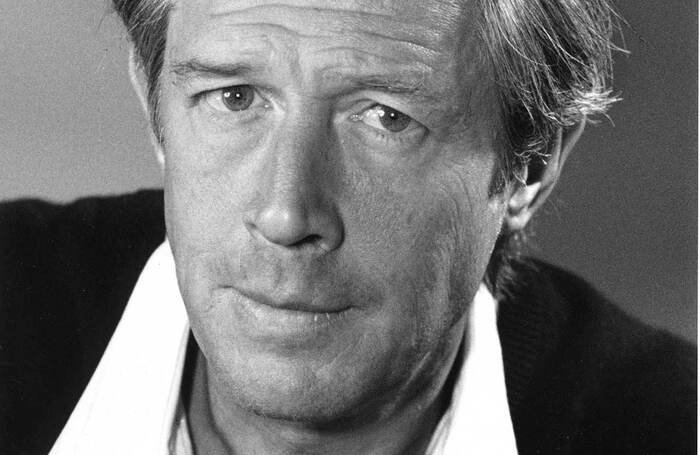

Michael Rudman (1939 - 2023)

Michael Rudman might be called an international director: at least, he was born and grew up in America, but went to college in Britain and was based there throughout his career. Late in life he wrote an autobiography called I Joke Too Much; I don’t know about “too much” but humour was certainly the front he presented to the world. It was generally a wry understated humour, rather English I thought, though physically he was always the lanky Texan. (And he did have the remnants of a drawl.) I never knew his jokes to be unkind.

He once phoned me on a Friday morning, which just happened to be the time I wrote my weekly Observer column: not that he had any reason to know that. He wanted, first, to thank me for my review of his production of the musical Camelot. More precisely, he wanted to thank me for the last sentence of what was otherwise a thoroughly negative piece. Commenting on the heart-warming last scene of an otherwise chaotic show, I had written “But still”. He called me to say that “but still” was exactly right. He then went on to rebuke me for what he thought were uncharitable and inaccurate remarks about his wife, the lovely Felicity Kendal, who had just opened in Tom Stoppard’s The Real Thing. I thought he had confused comments on the actress with comments on the character, also an actress, but I dare say it was my fault for not expressing myself more clearly. Anyway, I respected his honesty and his friendship in confronting me with it in person. Some years later we were having lunch together in New York and I asked him why we seemed to be talking about critics. (I was out of the game myself at the time.) He said that was all that people in the theatre ever talked about.

Rudman was an undergraduate at Oxford at roughly the same time I was at Cambridge, and I first remember hearing of him as one of the top student directors at that other place. He made it in the outside world pretty quickly. I first encountered him as the artistic director of the Traverse, the leading fringe theatre in Edinburgh and therefore one of the hubs of the annual Festival. He came to London as director of the Hampstead Theatre, where his productions included Alphabetical Order, Michael Frayn’s first important play. He said that Frayn’s plays were infused with the author’s own personal good qualities, and that he himself was a nicer person when directing a Frayn play. He then went to the National Theatre as an associate director, in charge of the proscenium Lyttelton Theatre. It was there that he did his best work, specialising in reclamations of plays from the mid-century commercial theatre: Somerset Maugham’s acidic and surprisingly powerful For Services Rendered and Terence Rattigan’s classic double bill The Browning Version and Harlequinade. He was, all told, a mainstream kind of guy. Another of his Lyttelton successes was Death of a Salesman in which Warren Mitchell, hitherto best known as a Cockney loudmouth (Alf Garnett in Till Death Us Do Part, the inspiration for America’s All in the Family) pulled off a miraculous feat of self-transformation, not to say self-abnegation, as Willy Loman; I have seldom seen an actor so completely inhabit his character. Rudman warned him ahead of rehearsals that he would be a hard taskmaster - after which, Warren told me, “he never gave me a single note.” Both men were tennis freaks, and they played a lot of games together, mainly on the actor’s private court. And when Rudman missed a stroke or lost a point, he threw a tantrum, said Warren, “worse than McEnroe or Connors.”

For reasons I cannot explain, but cannot regret, Mike was one of the few people in whom I confided about my impending fatherhood. His face lit up and he said “that will be really, really good for you, the best thing that could happen.” He was right. What I didn’t tell him was that the expected birth was of triplets. A few weeks after they had arrived, and cards had been sent out, he saw me in the National Theatre lobby, murmured “competitive fucker” and passed on. After my wife and I had moved to Canada – or I had moved there and she had returned – she told me that, of all our friends in the English theatre, he was the one she missed the most.

Finally, the loss that, to me, is the most grievous of all.

Arlene Gould, my wife of 47 years, my partner for even longer, died last March. She was Canadian; I’m British. Our first sixteen years together were spent in London, the remainder in Toronto. There were various reasons for our move, but the most crucial was that just over a year before we had become the parents of triplets and Arlene, wielding the privileges of motherhood, wanted them to grow up in her home country. Which they have done, amazingly. Arlene once said, with tears in her eyes, that we must be the luckiest parents in the world, and I’m not about to contradict her. Our shared joy in them, in their talents and personalities, was the great bonding factor in our lives.

But there were many others. Like, I imagine, all long-lasting couples, we developed a repertoire of shared jokes; remembering them now, as I constantly do, is peculiarly bitter-sweet. Many of them derived from plays we’d seen together. We actually met in a theatre. It was the Royal Court in London in 1971, at a play called One at Night, and it may be the only romantic thing ever to have happened at the Royal Court. It was the second night, and we were both there, unaccompanied, on press comps, with just one empty seat between us. At the second intermission (it was rare even then for a play to have more than one; fate must have been at work) this young lady, all bundled up but discernibly pretty, leaned across and asked if she could borrow my program. I spent most of the last act wondering whether to ask her out for a drink afterwards. But I did, and I wish there were some other way of saying that the rest is history.

It turned out to be prophetic, us meeting at the theatre. Two years after that first date I became theatre critic of The Observer, and after our transatlantic move, I got the equivalent job on the National Post. During those critical years – not to mention before, between and after them – we obviously saw a lot of shows together. She was the ideal theatre companion. Our tastes, I think, converged, or maybe they rubbed off on one another And when we saw something we both loved, a palpable current of delight passed between us; it didn’t have to be spoken. She was an especially shrewd and enthusiastic judge of acting. And when I made my own occasional forays into performing or directing, she was very supportive, though far from uncritical.

She had ambitions to be a theatre producer herself and went to the London Business School hoping to learn the financial ropes. But while she was there her focus changed. She became fascinated by design: industrial, urban, environmental. (Her visual sense was always superb.) She went on to work for cutting-edge consultants in London, and in Toronto where she became one of the city’s most eloquent advocates. I hope that I never took Arlene, and all that she accomplished, for granted. Looking back, I am in awe.
