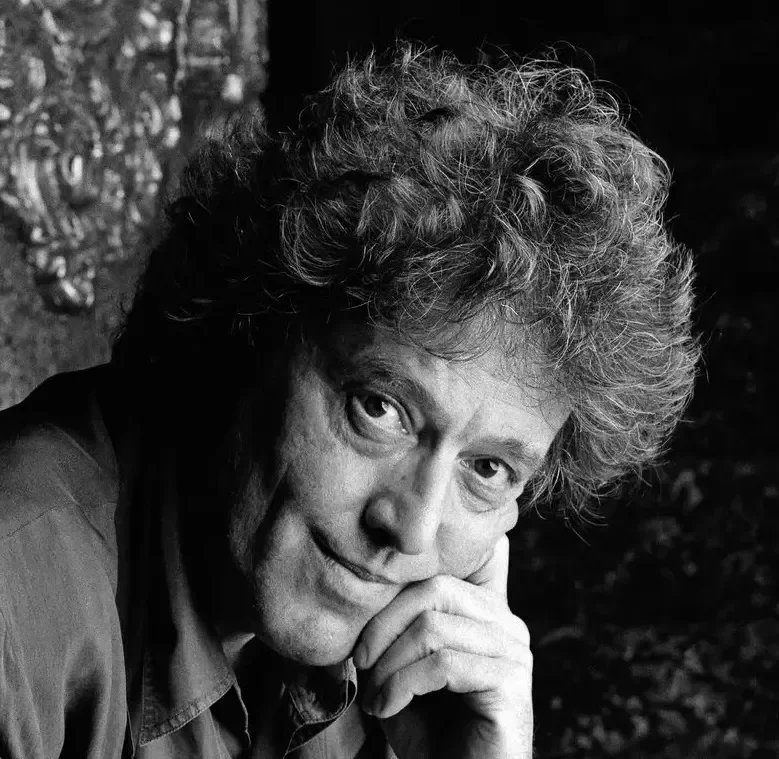

A. E. Housman, poet and academic, has died and, as befits a classical scholar, is being ferried across the River Styx by the mythological pilot Charon. He remarks that the afterlife may allow him to discuss some fine textual points with a rather obscure predecessor not usually high on anyone’s wants list. “Still,” he says jovially, “I don’t suppose I’ll have time to meet everyone”.

“Oh yes you will” says Charon.

That, from The Invention of Love, is my favourite funny line in a Tom Stoppard play, even beating out the bit in Jumpers about the phenomena associated with the Bristol train leaving Paddington Station being equally compatible with Paddington leaving the train, or with Guildenstern (or was it Rosencrantz?) listing all the possible familial and political motivations for Hamlet’s melancholy and then asking “now why exactly are you behaving in this extraordinary manner?”

One might add, to this collection of thought-and-laugh-provoking quotables, the reply in Arcadia of the tutor Septimus to his pupil Thomasina who has asked whether sexual intercourse is the same thing as love: “Oh no, it is much nicer than that”. Arcadia is a play that alternates between scenes set in the nineteenth and twentieth centuries. Septimus’ line comes in the “past” section; it has a counterpart in the present, as it then was, when a man advises a woman to give sex a try: “it’s very underrated”. That, to adapt Septimus’ terminology, is one of the nicest things about a Stoppard play: however wild it may seem, everything rhymes, everything echoes, everything adds up.

I can fairly claim to have been in at the start of the Stoppard phenomenon. I saw the original 1966 production of Rosencrantz and Guildenstern Are Dead, brought to the Edinburgh Festival fringe by a student theatre group from Oxford. (I was there with a production from the other place.) I went largely because I was intrigued by the title. I wish I could say that I immediately felt myself to be in the presence of genius but truth will out. The production, plagued by crises including the premature departure of the director, was muffled; also I arrived late which can’t have helped. I remember that one of the two leads was okay (naturally I can’t remember which) and I laughed a few times; there seemed to be a sense of humour here that I could respond to, even identify with. But I certainly wasn’t as enthusiastic, or as perceptive, as Ronald Bryden who wrote a rave review in The Observer that came to the attention of Kenneth Tynan at the National Theatre, thus ensuring that the rest would be history.

R&G entered the National repertory in 1967, this time in a very good production, and remained there for four years, weathering many changes of cast. I had graduated from college and was living in London, so I was able to check up on all of them; keeping tabs on the National company was a hobby, or obsession, of mine. They were all good, though none of their successors were quite able to match the original leads: John Stride’s Rosencrantz, enchantingly bewildered, and Edward Petherbridge’s Guildenstern, trying excessively hard not to be. This, in traditional and highly relevant double-act terms, makes Guildenstern the straight man of the pair, so of course it’s Rosencrantz who has all the best lines: I can still hear Stride, on learning that the two of them had been deputed to take Hamlet to his death, exclaiming in shock “But we’re his friends!” or – my favourite moment – his response to the misunderstood suggestion that the gloomy prince might be in love with his own (non-existent) daughter: “We’re out of our depth here”.

Despite its success, or likely because of it, not everybody loved the play. There was an articulate faction that derided it as an intellectual confidence trick, flattering its audience on their knowledge of the Shakespearean original. Actually any play on any remotely serious subject flatters its audience by assuming they will be interested, so the objection doesn’t mean very much. Still it was pervasive enough at the time for me to try and find room for it in my own head. But it wouldn’t stick. I enjoyed the play too much, every time I saw it.

“And then the monsoons came, and they couldn’t have come at a worse time, bang in the middle of the rainy season.” That isn’t a Stoppard joke but it’s one he cited as a favourite and a lodestar. It comes from the radio comedy series The Goon Show, a formative influence on anyone who grew up in Britain in the 1950s. That would include me, and Stoppard, and the creators of Monty Python’s Flying Circus. Stoppard and the Pythons have a blessed amount in common: a commitment to a literate comedy that relishes the absurd while worshiping logic.

This equation may be found in its purest Stoppardian form in the early one-act play After Magritte (1970) in which a succession of apparently outlandish phenomena each turn out to have a perfectly reasonable explanation. That includes the title. The characters, or some of them, have just returned from a Magritte exhibition. Fitting as that maestro of poker-faced incongruity must be the world’s only legitimately funny painter.

“Mr Stoppard’s gaiety is a moral quality in itself.” I wrote that, apparently, in reference to Every Good Boy Deserves Favour, his 1977 piece for actors and symphony orchestra (!) about the consignment to mental hospitals of dissidents in Soviet Russia, a practice dismissed by a government doctor in the play as a vile rumour “spread by people who ought to be locked up.” I say that I ‘apparently’ wrote it because I had completely forgotten having done so until, to my gratified surprise, I found it quoted by Michael Billington in his Stoppard appreciation in The Guardian. (Thank you, Michael.) Having been reminded, I certainly stand by it. Intellectually Stoppard’s plays are always, as literary critics of the F. R. Leavis persuasion used to say, on the side of life. In their texture and their spirit, they make you feel that life is worth being on the side of.

And one reason for that is the presence of death. Rosencrantz and Guildenstern, after all, are dead, cut off in their primes by the arguably unfeeling decisions of a prince and a playwright. Jumpers (1972), the next major play, begins with a murder, though admittedly not of anyone we know. The killing propels the plot but it has no emotional impact, at least not on the audience. We are caught up instead in the endeavours of our hero George, professor and insistently moral philosopher, to complete his scheduled and controversial speech on the divine basis of that philosophy or, in his own superb summation, “what is so good about good?” What does move us, at the other end of the play, is George’s discovery that he accidentally impaled his beloved pet hare Thumper, immediately followed by his stepping on and crushing his beloved tortoise Pat. This, coming just after George had carefully removed Pat to what he thought was a safe distance, may be the most emotionally wrenching moment in all of Stoppard.

I wrote the program note for the original National Theatre production of Jumpers. It was a commission I was flattered and gratified to receive but it came with a daunting restriction: I was forbidden to give anything away about the play itself. Nothing about George and his doggedly unfashionable beliefs and his looming deadline; nothing about Dotty, his former student and present spouse, now in early and neurotic retirement from a career as a musical comedy star; nothing about Sir Archibald Jumper, vice-chancellor of George’s university and his implacable intellectual opponent, not to mention being the director of the troupe of academic acrobats who give the play its name and its governing image. Nothing either about the Radical Liberals, the gang of joke-fascists (Stoppard’s own description) who at the play’s start are celebrating their victory in Britain’s general election and have appointed (anointed?) a former veterinarian as Archbishop of Canterbury.

I was of course allowed to read the play, and I have vivid memories of doubling up with laughter on the sofa at home, pausing only to share the choicest bits with my future wife. The downside of this was that I never got to hear all those wonderful jokes fresh and new in the theatre. Anyway I ended up building the article around the recurrence in Stoppard’s one-act plays and radio plays – quite a corpus by this point – of characters named Boot or Moon or variations thereof. They are all hapless individuals, though the Boots tend to be more assertive than the Moons who are endearingly wistful losers. You might even claim – I did – that Stoppard’s Rosencrantz was really a Danish Moon and his Guildenstern a Boot. His one and only novel, a neglected delight, was called Lord Malquist and Mr. Moon, though it’s admittedly Bootless. The National’s literary department, Ken Tynan still presiding, did allow me to say in my concluding sentence that Jumpers was comparatively short on boots though less so on moons. Dotty, the former warbler, is obsessed, and depressed, by the fact of men having landed on that other moon, thereby taking all the romance and mystery out of the songs she used to sing. When, interviewing him for the article, I mentioned this to Stoppard, he dismissed it as “a semantic coincidence”. (Of course Stoppard, as I can never forgive myself for not having written at the time, was an incurable semantic.) I called my program note “The moon is on the other foot”. I may have been remembering that the cast of After Magritte includes a Police Inspector Foot. “Not” says one of the other characters, incredulously but inevitably, “Foot of the Yard?”

Jumpers is my favourite Stoppard play. It’s certainly the most effervescent. It also has a strong emotional content, expressed in George’s wryly passionate commitment to his own ideas and his frustration when events or other people conspire to challenge them, all flawlessly conveyed in Michael Hordern’s incomparable hands-in-pockets original performance. And it’s there too in his capacity for love, not just for hares and tortoises but for another person. Jumpers is, apart from everything else, a portrait of a marriage. Stoppard was an inveterate reviser of his own work, and when Jumpers was revived at the National, he added a particularly telling line to the penultimate scene: when George is leaving to deliver his big lecture (“Man: good, bad or indifferent?”) Dotty wishes him good luck. It may not sound like much but, after all the time we had spent watching them bickering, it shifted the whole balance of the play. I cared more about George and Dotty than I ever did about Henry and Annie, the more exhaustively drawn couple of his later play The Real Thing (1982). When I told Stoppard this, in a radio interview, he replied with typical grace “Well, what can I say? I’m happy that you were moved by Jumpers and sorry that you weren’t moved by The Real Thing.” I’ve come to like The Real Thing more in revivals than in the original production which was marred by miscasting and by a lack of passion in a play that was supposed to be about it. But it seemed to me, then and now, that Stoppard was being praised for finally writing the same kind of sober, naturalistic domestic play as everybody else. Whereas I treasured him for writing differently from everybody else.

Well, you have to like somebody and I like Tom Stoppard. That’s another line I wish I’d written at the time, the time being that of Travesties (1974), the first new Stoppard I reviewed as theatre critic of The Observer. It was his first major play after Jumpers and, as he admitted himself, very much the same kind of animal. This is the one set in a First World War Zurich inhabited, as it historically was, by James Joyce, Tristan Tzara and Vladimir Lenin though, as the play’s very unreliable narrator is at pains to point out, “he wasn’t Lenin then”. That narrator is Henry Carr, minor British consular official; and he’s sort-of-apologising for his failure to apprehend not-yet-Lenin and stop the Russian Revolution in its tracks, his excuse being that he was busy rehearsing for an amateur production of The Importance of Being Earnest. This production, organised by Joyce, really happened. It’s the cue for Stoppard to write his first act as a pastiche of The Importance with Carr and Tzara functioning, more or less, as Jack and Algy, and Joyce standing in for Lady Bracknell. The idiom affords a scorchingly funny, meaning deadly serious, debate on Art between Joyce (he’s for it) and the Dadaist Tzara (he’s very much against it). There was much criticism of Stoppard at the time for not continuing the Wilde parody into the second act; his defence was that by that time “we’ve rather had that joke.” I think he was right, and that the play’s texture rewardingly thickens when we get to listen to Lenin, who had his own views on art, speaking largely in his own words. The key moment, though, belongs to Mrs. Lenin, recalling the time when she went to catch a glimpse of her imprisoned husband at a pre-arranged time and place. “But something went wrong. I forget what.”

The ineluctable tendency of things to go wrong, and the human inability to come to terms with it. That’s what Travesties is about, and what Stoppard is about, and really what drama is about, whether tragedy or farce or – Stoppard’s own favoured genre – tragi-farce. There’s a flaw, however, in the way it’s worked out here. Tynan once decreed that all first-rate drama - again whether tragic or farcical - depicts a character driven by a logical process to a state of desperation. He restated this principle in a New Yorker profile, and said that Travesties, for all its delights, failed to qualify. He was right. Stoppard has always had a fondness for the people on the sidelines, whether they’re philosophy professors or Shakespearean nonentities or – taking this to extremes – the two theatre critics of The Real Inspector Hound (1968). But all these characters have something at stake; for them it’s a matter of life and death, sometimes literally. For Henry Carr, nothing’s at stake except his memories of rubbing shoulders with the great: the earnestness of feeling important. But he doesn’t seem too fussed about it. I enjoyed the first night of Travesties so much that I went back on the second. I would gladly see it again, any time. But it is, ultimately, unsatisfying.

The presence of Lenin means that Travesties is inescapably about politics. Lenin is actually treated with surprising sympathy, given that Stoppard was regarded at the time by the theatrical left as a dangerously amusing reactionary. (The group of self-defined revolutionaries who ran the Royal Court Theatre once described their policy as never putting on a play by Tom Stoppard.) In an interview around this time Stoppard said that Stalin had continued what Lenin began, and that to believe otherwise was “an absurd and foolish untruth”, one that “much of the left” insisted on believing. Times and beliefs have changed, and it’s now difficult to see Stoppard, who once described himself as a traditional conservative, as being anything other than a traditional liberal. It’s certainly hard to find fault with his claim in the same interview that political actions without a moral foundation are merely “attempts to put the boot on some other foot”.

Stoppard started his professional life as a journalist, quite a lowly one, and in Night and Day (1978) he paid tribute to his former calling: to its principles if not its practice. This half-successful play is set in an invented African country whose newly-booted president boasts of “a relatively free press”, meaning a press edited by one of his relatives. It’s also the first Stoppard play to have a woman as its presiding consciousness. Diana Rigg, the original Dotty in Jumpers, was here in rangy and needle-sharp form as a mine-owner’s wife, disowning a past encounter with a case-hardened left-wing reporter (“you think I’m the kind of woman who goes to bed with strange men in hotels just because I went to bed with a strange man in a hotel”) while dreaming of a future love with his starry-eyed opposite number. Her major relationship, though, is with the audience whom she treats to a running commentary on her states of mind. She also has a scorching grief-propelled denunciation of the idea that the principles of a newspaper – any newspaper – might be worth dying for. The tirade prompts a response from a photographer who says that he’s been around and that, yes, “people do terrible things” but that it’s worse in places where it’s all kept under wraps. “Information, all by itself, is light. That’s all you can say really.” In his profession he should know about light. He’s undoubtedly speaking for his author.

The shining of light onto darkness is very much the subject of the TV play Professional Foul (1977) which I take to be the turning point in Stoppard’s work, politically and emotionally. It’s a companion piece to Jumpers. Once again we have a philosophy professor who would like to stay above the fray but finds that he can’t. It’s also the play in which Stoppard, a self-described “bounced Czech” – born of Czechoslovak parents, he was brought to England as a child when his widowed mother married an Englishman – begins to reckon with his own heritage. His Professor Anderson (immortally incarnated by Peter Barkworth in the BBC production) attends an academic conference in communist Prague. Initially suave and unruffled, his composure is disturbed when a Czech former student, now reduced to cleaning lavatories, asks for his help and is thoroughly shattered when he meets the man’s son, who is shocked – as only a child can be - that there should be evil and injustice in the world. The death of George’s tortoise was shocking but still comic; this conversation with a questioning boy is moving, and not funny at all. Not that comedy has been banished: the dialogue sparkles, especially among the professors, and there is superb wit in the play’s structure, including its title. Anderson’s real reason for coming to Prague was to see a World Cup soccer match: Czechoslovakia vs. England. A professional foul in soccer is “a calculated risk where the potential benefit of stopping a certain goal outweighs the punishment”. (I googled it.) Anderson undertakes to smuggle the dissident’s banned thesis out of the country. He also rewrites his initially innocuous conference address so that it becomes a defence of free speech, smooth but barbed. This makes him an obvious candidate for a baggage-search on his way home. So he quietly plants the document in the luggage of a smugly unconventional leftist colleague (“I sail pretty close to the wind, Marx-wise”, a line unforgettably delivered by John Shrapnel) who is not pleased when this professional foul is revealed to him. It seems that the end may not after all justify the means when you are the means. This bit of petard-hoisting rounds the play off beautifully.

Stoppard used jokes to make points. But he also used jokes to make jokes. He could do it for a whole evening, almost to the exclusion of anything else. On the Razzle (1981) is his adaptation of a nineteenth-century Austrian comedy by Johann Nestroy, a play that in another line of descent begat Thornton Wilder’s The Matchmaker which in turn begat Hello, Dolly! In any form, it’s a piece rife with mistaken identities and cunningly engineered chance encounters. “One false move” says a character early on in Stoppard’s version “and we could have a farce on our hands”: a wonderfully brazen acknowledgment to the audience that it is going to get precisely what it came for. Actually it gets more; it gets a text as giddy as its action, a script in which every line is some kind of gag. “This”, I wrote of the original National Theatre production “is not how plays usually get written, though we might all be a lot happier if it were”. The hitch is that it requires a company of expert vaudevillians. Mere actors can have trouble measuring up. The strongest performance in the original was given by Felicity Kendal, the actress generally regarded as Stoppard’s most reliable muse. She played a male role, a young apprentice out on the town (or “on the razzle”), and the cross-gender casting lent just the right distancing effect. She was delectably insouciant. Cross casting was also, come to think of it, a major factor in Shakespeare in Love (1998), one of Stoppard’s two great movie screenplays (the other was The Russia House), whose climax is the premiere performance of Romeo and Juliet with an Elizabethan court lady self-shoehorned into the role of Juliet: a woman pretending to be a man (or boy) pretending to be a woman. Gwyneth Paltrow was in effect playing the Felicity Kendal role.

Unlike On the Razzle, Shakespeare in Love has an emotional component. Still, much of its delight comes from the jokes, especially the anachronistic ones where characters from England’s first Elizabethan age pre-echo the concerns and idioms of its second. (Stoppard shares his screenwriter’s credit with Marc Norman but I think we can assume the laughs are his.) One remembers the Thames boatman, an aspiring author, pressing a manuscript on his passenger Shakespeare with “hey, I bet you know all the booksellers”. Or of Will telling his outmatched contemporary Kit Marlowe “I loved your early stuff”. Or the stammering origin of the phrase “the show must…go on” (sorry, you had to be there). Or – the same pun shamelessly but irresistibly repeated – the Puritan’s denunciation of the players “Their business is show!” Or, moving the goalposts a bit, the same preacher’s being swept with the crowd into R&J’s Globe Theatre premiere and bursting into the same wild applause at the end, as if none of them had seen anything like it before. Which, on the surviving evidence of all earlier English love-tragedies, they wouldn’t have. The film, I now realise, is Stoppard’s love-letter to the theatre.

(It's also the counterpart, or counterpoint, to Rosencrantz and Guildenstern Are Dead. I once came across a scholarly reference to a talk Stoppard gave called “Is It True What They Say About Shakespeare?”. I’ve never been able to track it down. I would love to.)

“Whatever became” asked Rosencrantz (or was it Guildenstern?) “of the moment at which one first knew about death?”. As he says, the realisation of one’s own mortality – not to mention everybody else’s – should have been an unforgettable moment. But in fact nobody can remember it. The tragi-comic implications of this haunt nearly all of Stoppard’s major plays. (The exception, oddly enough in view of its title, is The Real Thing.) The most haunted of all, partly because of its double time-scheme, is Arcadia (1993), whose title proclaims it: by invoking Death’s legendary pronouncement “et in Arcadia, ego” – “even in Arcadia, I am here”. That’s on top of all the other information the audience has to absorb, on subjects from chaos theory to Regency landscape gardening to Fermat’s mathematical theorem to the works and loves of Lord Byron, a figure who is oft-referenced but never actually appears; like Oscar Wilde in Travesties. Here, as in his other plays, Stoppard supplies all the necessary information but has the teasing habit of wrapping it up in epigrams while simultaneously pushing the story forward. The play scintillates as its present-day characters, in the same room in the same English country-house as those from the past, conduct scholarly investigations into that past and get it all wrong, even while helping the audience get it right. This, in its lightness of touch and weightiness of subject, is Stoppard’s best play, though Jumpers remains his masterpiece. (Deal with it.) Its emotional climax is hauntingly understated. As past and present cunningly converge, the audience realises, without being explicitly told, that Thomasina, the teenage mathematical prodigy with whom it had been falling in love all evening, will perish in a fire, taking all her precocious discoveries with her and driving her besotted tutor Septimus to become the fabled Hermit of Sidley Park, the play’s Arcadia. It’s so neat and so heartbreaking.

Even more devastating, because more direct, is a single line in the next play The Invention of Love (1997). Housman, closeted homosexual, cries out to the absent and unknowing object of his affections, “I would have died for you if only I’d had the luck.” In Richard Eyre’s National Theatre production Housman was played by John Wood, generally regarded as the definitive Stoppard actor, taut and fast and intellectual; he had been Guildenstern on Broadway and the original Henry Carr in Travesties. His scathing delivery of Housman’s university lectures, merciless in their attacks on less rigorous Latinists, were as hilarious as Michael Hordern’s more benevolent manifesto in Jumpers. But I never expected to be as moved by Wood, or indeed by Stoppard, as I was in that one line torn from the heart. For the rest, The Invention of Love was another witty and invigorating panorama of feelings and ideas, late Victorian this time, past and present jousting again, as represented by the old Housman and his younger self. Oscar Wilde turned up, in person this time, as a voluble rebuke to AEH’s repression and so, as a passing surprise, did Three Men in a Boat (to say nothing of the dog). And there was that deathless, if that’s the right word, opening trip across the Styx.

The next big thing after The Invention of Love was The Coast of Utopia (2002): big conceptually and certainly physically, since it consisted of three full-length plays that could on occasion be seen on a single day. At the National, they were given a correspondingly massive production by Trevor Nunn (who had also directed Arcadia), its sets consisting of projections on an IMAX-sized screen. This certainly looked impressive and was a cunning way of taming the vast Olivier Theatre stage but in retrospect I think it was a mistake. It dwarfed the actors, making it harder on the characters, the action and the argument, all of which were complicated. And maybe the Olivier wasn’t the right platform for it anyway; it needed a more intimate space where both actors and audience could bear down on the text. The play depicts Russian radicals of the nineteenth century. In the centre, in many senses, is Alexander Herzen, identified in the trilogy’s successive cast-lists, as “a would-be revolutionary”, “a radical writer” and “a Russian exile”. He might also be a rueful self-portrait; someone tells him “you could be Minister of Paradox with special responsibility for Irony”.

The first play takes place in Russia, the second all over Europe, and the third in England. That’s where the “Russian exile” is self-exiled to, and the play could be seen as another chapter in Stoppard’s reckoning with his own roots, the “bouncing Czech” bounced into his ideal homeland. Herzen is perhaps more ambiguous about this than his author would be; he describes his adopted country as “the rock against which revolution breaks”. It tolerates you to death. Well, there are worse ways to die. Actual death, once again, occasions the play’s finest moment. Herzen has a deaf son called Kolya, who drowns. The bereaved father waves away the wrong kind of sympathy: “Because children grow up, we think a child’s purpose is to grow up. But a child’s purpose is to be a child.” As we already knew from Professional Foul, and before that from Every God Boy Deserves Favour, nobody writes more movingly and more acutely about children than Stoppard.

His birth-country and his home-country share the stage in Rock ‘n’ Roll (2003); or rather they take alternating possession of it. The action spans the years from 1968 to 1990. Half of the time we are in Czechoslovakia, first welcoming the Prague Spring and then recoiling from its repressive aftermath. For the other half we’re in England, specifically in Cambridge in the house and garden of Max, a professor who’s a die-hard Stalinist, sorrowfully disapproving of all that springtime liberalisation. Linking the two worlds is Jan, a Czech student of Max’s who returns home, joyously at first, though his enthusiasms are less political than musical; his idols are the Plastic People of the Universe, a Czech rock group who were banned after the Russian tanks had rolled in. They came under suspicion not, it seems, for having the wrong politics but for not being political at all, a more dangerous sedition. Rock music is the play’s vessel of liberation, and the choice of Cambridge as its English setting may owe something to its being both the birthplace and the final retreat of Syd Barrett, the pied piper of Pink Floyd. Jan is a Floyd fan, as were Stoppard himself and his friend and personal hero Vaclav Havel, playwright and eventual Czech Republic president. The play ends on a celebratory note with the characters, or some of them, attending a Prague concert by the Rolling Stones. This, though historically accurate, seems dramatically a bit of a cheat as the Stones have hardly been mentioned previously. It may, though, have autobiographical resonance; the young Stoppard, it was often noted, looked much like the young Mick Jagger and the two became friends.

It's ironic, but also gratifying, that Rock ‘n’ Roll received its premiere at the Royal Court, the London theatre that once defined itself as the place that would never do Stoppard. (This play, too, was directed by Trevor Nunn: somebody else of whom the Court’s ancient regime would likely have disapproved.) The Court was historically regarded as Britain’s foremost political theatre and Rock ‘n’ Roll was greeted as Stoppard’s most successfully political play; at least that’s how the British press greeted it. In fact his political and moral positions – he would have claimed, rightly, that they were the same thing – hadn’t changed since Jumpers. They had merely found a different, more concentrated focus, traceable to his reckoning with his roots. And even Rock ‘n’ Roll wasn’t a narrowly topical play; it opened nearly twenty years after the most recent events it depicted. Nor is it evenly successful. The Czech-set scenes are very good, with a rich flavour of the menacing-absurd when the police come to destroy Jan’s record collection while leaving him physically unharmed. But the play’s overarching musical metaphor seems sentimental (maybe you have to be a fan) and the English scenes merely dutiful. They have their moments; one has to respect Stoppard’s fairness towards Max, the unregenerate Marxist who admits that he’s “kicked in the guts by nine-tenths of anything you can tell me about Soviet Russia”. It’s impossible to recall that line without mentally re-hearing its throaty delivery by Brian Cox who played Max in London and New York. Max has a daughter who loves Jan and, in the penultimate scene, wins him; and it’s equally impossible to banish the smiling candour of Fiona Reid in the play’s Toronto production declaring that love as if it were the most logical unanswerable thing in the world. This was a magic moment but it was just a moment. Most Stoppard plays are about love and politics. In The Real Thing the love elbowed the politics off the stage. In Rock ‘n’ Roll it was the reverse.

There are few Jewish characters in any of these plays. Which may seem strange, given their preoccupation with persecution and injustice, and with Stoppard’s coming to terms, in the last thirty years of his life, with his own Jewish inheritance. Both his parents were Jews; it’s why their fled Czechoslovakia, on the day the Nazis invaded. His English stepfather was decidedly Gentile and his mother had tried as far as possible to forget and disown the past. It wasn’t until the 1990s that Stoppard discovered that members of his own family, including all four of his grandparents, had perished in the Holocaust. And though he spoke and wrote publicly about the discovery, it didn’t figure, at least explicitly, in any of his plays until the last one. It’s as if he had chosen, in Professional Foul and Rock ‘n’ Roll, to celebrate the Czech part of his identity before, in Leopoldstadt (2020), he honored the Jewish part.

And he kept them distinct. After all Leopoldstadt, which concerns generations of a European Jewish family living and dying through the first half of the twentieth century, might conceivably have been set in Prague, but he chose to place it in Vienna, the centre of an especially vibrant and prosperous Jewish community until its brutal termination. I wasn’t able to catch the play in London or New York, and its projected Toronto production was cancelled by COVID. (I was supposed to interview Stoppard for the program-note, a wheel I wish had come full circle.) I found reading the play, with its multiplicity of characters and subordinate actions, fairly confusing. It also seems in reading to have fewer jokes than any other Stoppard: hardly surprising perhaps, given its subject, though apparently it plays funnier than it reads, at least in the earlier celebratory scenes. It’s also of course the ultimate Stoppard play about death. I can certainly believe that the last scene, in which a young émigre survivor is brusquely informed of all of his elders’ fates, is as harrowing and moving in performance as everybody says it is. The survivor is generally thought to be a stand-in for Stoppard himself and that’s believable. He never denied his luck. If Charon is to be believed, this perpetually inquiring man, an auto-didactic non-University Wit, will have time to meet everybody he wants to meet. I know everybody will want to meet him.
