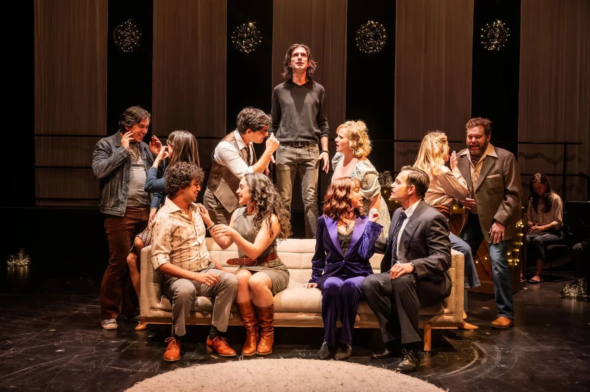

*Aidan de Salaiz, and the Company of Company. Photo by Dahlia Katz.*

Talk Is Free’s recent production of Company is the best I have ever seen.

It isn’t the best I’ve ever heard. That would be the cast album of the original Broadway production, which I heard in London way back in 1970. A friend recommended it to me; I hadn’t even heard of the show but I liked the title; it suggested a big-business satire, on the lines of How to Succeed in Business Without Really Trying. And it had a score by Stephen Sondheim whom I admired as the lyricist of West Side Story and Gypsy, and the composer and lyricist of A Funny Thing Happened on the Way to the Forum. So I bought the record and played it. And played it. It wasn’t what I had expected. It was better. The music was alive and the words were incomparable. I had never heard lyrics that shone so bright and cut so deep. They were thoroughly in the smart Broadway tradition but took it to psychological places it had never been before. There was something to savour in almost every line. And no, it wasn’t a satire on big business or anything else, but it was devastatingly witty, and it was set in New York which at the time I thought all musicals ought to be.

Sondheim, I decided, was somebody I wanted to meet and to write about. The following year I got my chance; a British newspaper commissioned me to interview him, at his house in Manhattan. The hook was the London opening of Company, scheduled for early in 1972. The show was still running in New York so of course I went to see it. I tried hard to love it but had to admit, if only to myself, that I was disappointed. The show was in its last week on Broadway and, almost literally, on its last legs. Most of the performers I had admired on disc had departed, several of them to London for the imminent transfer. Probably, too, I had come to know the album too well; inevitably I had formed my own ideas of what it would be like on stage and was frustrated when Harold Prince’s production didn’t agree with me. And of course I had heard the score but not the script. George Furth’s book seemed to me to get in the way of the songs.

I saw another Sondheim-Prince musical that week: Follies which had opened the year after Company and was still in its prime. I knew the cast album of this too, but not nearly as well. This time I was knocked out. Whatever expectations I had were exceeded in a production (co-directed by Prince and his choreographer Michael Bennett) that reminded me, in scale and assurance, of the grandest Shakespeare productions I had seen back home. Maybe the show’s conceit was strained; it tried to paint a picture of American disillusion by contrasting the feelgood Broadway ethos of pre-war years with the real-life later experiences of a couple of former showgirls and the two stage-door Johnnies who married them. As an idea this seemed a bit glib. But the staging was magnificent and the score as good as that of Company. It started out alternating the sophisticated angst of its predecessor with pitch-perfect pastiche of the old forms and then, in its closing section, combined them: the characters sang of their present confusions in the rhymes and rhythms of the past. It was also the best-acted musical I had seen up to that time. And, as Prince himself predicted at the time, it has never been equalled. It would cost too much and the old-time talent that brought authenticity and historical weight to the flashback numbers is no longer around.

When Company opened in London I enjoyed it far more than I had in New York. There was more energy, more precision, and there was Elaine Stritch, playing a role that might have been written for her and to a large extent was. She played Joanne, the acerbic half of the oldest of the five married couples who offer friendship and support to Robert, the show’s thirty-five year old bachelor protagonist. We know he’s thirty-five because the show ostensibly takes place on his birthday. My love for the score remained, even deepened. But I still couldn’t help resenting the book. The scenes seemed to be repeating what we already knew from the songs, only less wittily and at greater length.

The shining virtue of Dylan Trowbridge’s Talk Is Free production is that it makes the script work. Most of the scenes, especially in the show’s first half, show Robert paying calls on those good and crazy people his married friends and being variously intrigued, amused and repulsed by what he finds there. It seems like half the time they’re telling him that he too should get hitched, the other half they’re providing ample demonstration of why he shouldn’t. The scenes can sometimes play like half-baked Albee, and most productions skate through them, as if anxious to get to the next wisecrack or, better yet, the next song. This one takes its time, digs into what the characters are going through, and carefully charts the effects on Bobby himself. (Yes, they do call him Bobby. And Bob. And Robbie. And even, God forgive them, Robbo.)

What it makes clearer than any previous production I have seen is that it all takes place in Bobby’s head. Ostensibly all five couples have gathered in his apartment to wish him a happy thirty-fifth. This seems unlikely. These people, as far as we can tell, don’t even know one another. And by the end of the first number – the title number – they’ve been joined on stage by three girls whom our hero has been dating, and who are most unlikely to have converged. No, he’s imagining it, fantasising about it, totting up what these people may have meant to him and how useful, practically and emotionally, he is to them. “Who”, they ask (and sing) rhetorically, “changes subjects on cue-oo? Who takes the kids to the zoo-oo?” By the way, what kids? They’re barely mentioned again, and frankly it’s hard to imagine any of these people having them.

George Furth originally wrote a set of one-act plays, in each of which a different married couple interacted with a different single guy. Hal Prince had the idea of turning the plays into a musical and combining the various bachelor interlopers into one who thus became, by default, the central character, the observer as protagonist (I wonder if it’s a coincidence that Prince had recently directed Cabaret, a musical based on a play whose hero proclaimed that He Was a Camera.) Aidan de Salaiz, the current Bobby, may not be vocally the strongest ever but he is, at least in my experience, the most observant, not least of himself. He’s even at it during the intermission which he spends with the audience in the lobby, seated and silent and wearing a party-hat which could be doubling as a dunce’s cap.

He’s already been exposed to Sorry-Grateful, the husbands’ exploration of their mixed feelings about marriage, and maybe the best song ever written on the subject. Its counterpart is Being Alive, the show’s last song and in some respects a recap of the earlier one, with the ambiguities separated and laid out flat. Its first half is about being sorry for all the sacrifices and pains inherent in a relationship, the second about being grateful for the risks and rewards of having somebody with whom to share them, culminating in the wonderful plea “vary my days”. Bushy-browed, de Salaiz has wonderfully expressive eyes and you can read the song’s – and the character’s – transition point in them before has sung a note.

Company is full of company numbers, nearly all of them excellently and infectiously done. The exception is the lonely-in-a-crowd number Another Hundred People whose singer Sierra Holder, playing one of Bobby’s frustrated flames, is obscured, both visibly and audibly, by having the other performers rampaging around the stage in front of her, undercutting the song by trying to illustrate it. It doesn’t need the help.

Sondheim himself used to claim that the song was the only one in the score that wasn’t about Relationships. I can’t see that, given lines like “they meet each other in the crowded streets and the guarded parks.” I would think it was truer of The Ladies Who Lunch, Joanne’s showpiece number, which Elaine Stritch performed as acidic social commentary; Gabi Epstein makes it a powerful hymn of self-hatred. That song and Another Hundred People are the numbers that are most explicitly about New York. That was one of the original production’s selling points, with Boris Aronson’s set a marvel of glass and chrome with a functioning elevator thrown in. But it was, of necessity, not colourful; it was grey and I’ve come to believe that this contributed to my dogged feeling of disappointment back then; it didn’t lift my spirits as even the most serious musical should. As Follies, gloriously designed by Aronson, did and as Pacific Overtures – the crowning collaboration of Prince-Sondheim-Aronson – did even more.

The show’s New York identity has not, in fact, worn especially well. Or maybe I should say its Manhattan identity. Nowadays most of the characters are likelier to be living in Brooklyn. They all seem fairly well-heeled, but none of them, except Joanne and spouse, come across as what you’d call rich. We never learn what any of them, Robert included, does for a living. The only one with an identifiable job is the flight attendant whom Bobby takes to bed and whose attempted morning-after departure occasions perhaps the greatest opening exchange of any number in any musical: “Where you going?” “Barcelona”. That song Barcelona also makes history in being a musical number that does the work of an entire scene without benefit of dialogue. It also contains Sondheim’s single funniest line, Bobby’s impassioned “June!”. Her name is April.

Done in a small space on a small budget, Trowbridge’s production can let the New York setting slide; he only has to evoke particular rooms, which he does with fleet and ingenious manoeuvring of tables and chairs. Untethered to place, the show can also break somewhat free of time. When it was new, Company was widely taken, despite its creators’ protestations, to be a satire on marriage, even an attack on it. Today it’s likelier to be condemned for being a craven surrender to it. But the show really leaves the matter open. Subsequent revisions suggested that its hero might be, at the least, bisexual. The recent gender-reversed production in London and New York didn’t move the needle much; the inevitable implication that Bobbie, as she now was, worried about running out her biological clock added an element that didn’t jibe with the rest of the show; the issue became physical rather than psychological. Yes, the show strongly suggests – well no, proclaims – that “alone is alone, not alive” but the final choice has to be the hero’s own. “Want something, want something” says one of the voices in the crowd, or in his head, as he blows out the (imaginary?) candles on his (imaginary?) cake. Maybe his decision is that what he wants is to be alone. But at least it will be his decision.

A much later Sondheim show, Into the Woods, tells us that No One Is Alone, and we’re meant to believe it. But that affirmation is like John Donne’s “no man is an island”; it’s about social relationships, not personal ones. (Nor is it a comforting Rodgers and Hammerstein kind of song, though it’s often described that way.) When they first appeared Company and Follies were hailed as Broadway breakthroughs; Sondheim himself claimed that Company was the first consistently ironic musical and that’s the truth. On its own terms the show is just about perfect. In Follies the irony, though on a grander scale, is only part of the mix; the show is less formally satisfying but also more stirring. At the time, the general feeling on those two shows was that Sondheim and the musical in general had, in the words of Oklahoma!, gone about as far as they could go. It turned out that Sondheim – working first with Prince, then with others – was just getting started. The canvases got broader, the subjects more challenging. Pacific Overtures. Sweeney Todd. Into the Woods. Assassins. Even the comparatively conventional A Little Night Music has turned out to have remarkable muscle and staying power. All those shows got out in the world. And perhaps that’s what Robert – I confess that the name, so often repeated, was part of what first drew me into the show - was wishing when he blew out the candles.
